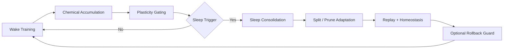
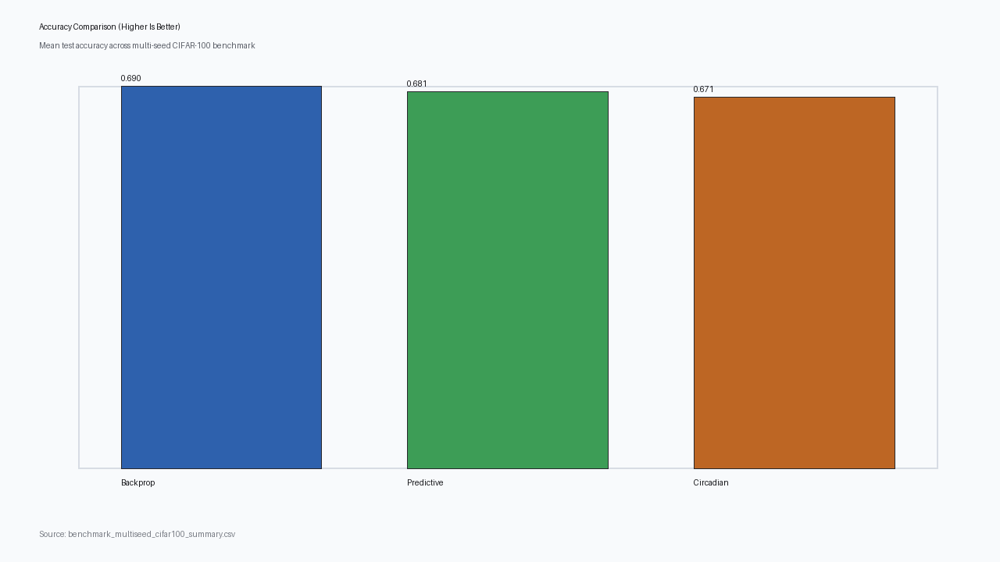
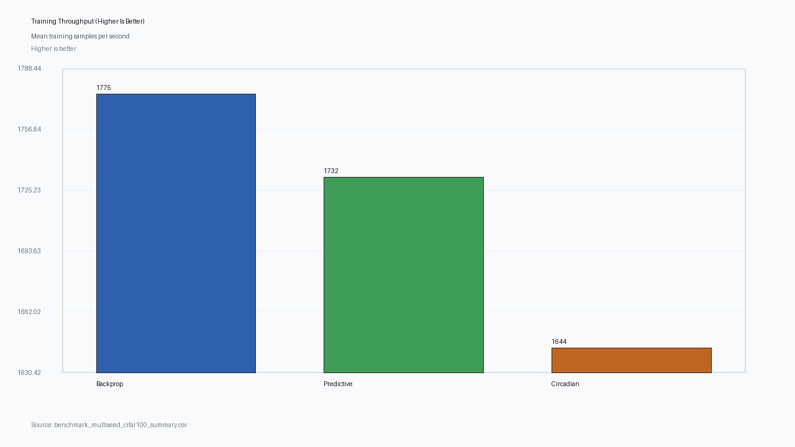
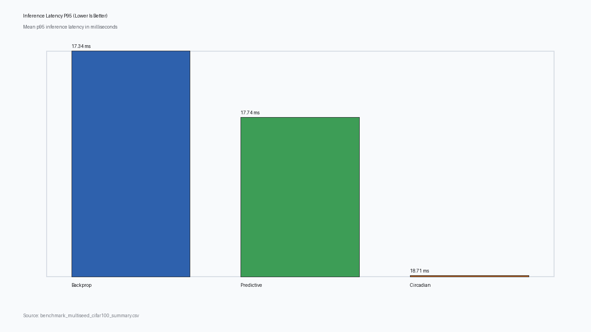
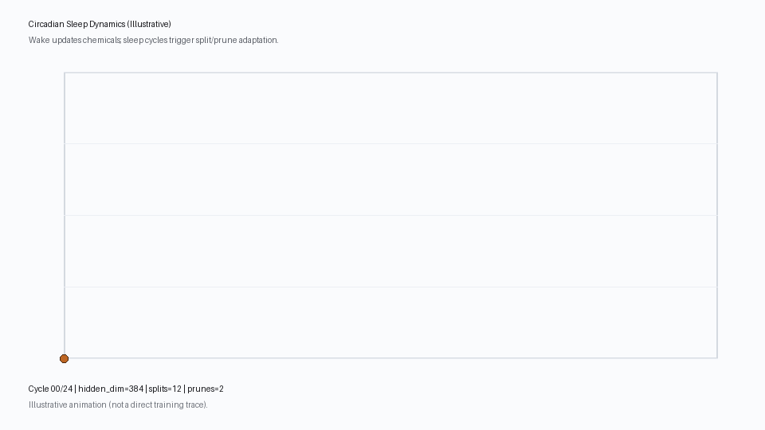

# Circadian Predictive Coding

[](https://github.com/OptimumAF/Circadian-Predictive-Coding/actions/workflows/ci.yml)
[](LICENSE)
[](https://www.python.org/downloads/)
[](https://github.com/OptimumAF/Circadian-Predictive-Coding/releases)

Circadian Predictive Coding is a research-first repository focused on biologically inspired learning where models adapt their own structure over wake and sleep cycles.

## Why This Repo

This project is built around one central idea:

- **Circadian Predictive Coding** should be compared rigorously against
  - traditional backpropagation
  - traditional predictive coding

The baseline models stay in the repo as stable references, while circadian behavior is the primary innovation surface.

## Circadian Loop

The circadian model is the primary focus of this project. Backprop and predictive coding baselines are kept to ensure fair comparison and reproducible evaluation.



## Core Idea

The circadian algorithm models wake and sleep phases:

- Wake: train with predictive-coding updates while each neuron accumulates a chemical usage signal.
- Sleep: consolidate with architecture updates (split high-usage neurons, prune low-usage neurons), optional rollback, and homeostatic controls.

This lets model capacity adapt over time instead of staying fixed.

## Features

- NumPy circadian predictive coding baseline for small-scale experiments
- Torch ResNet-50 benchmark pipeline for speed and accuracy comparisons
- Adaptive sleep triggers, adaptive split/prune thresholds, dual-timescale chemical dynamics
- Reward-modulated wake learning and adaptive sleep budget scaling (NumPy + ResNet circadian head)
- Function-preserving split behavior and guarded sleep rollback
- Multi-seed benchmark runner with JSON/CSV output

## Visual Results

### Multi-seed CIFAR-100 Snapshot (3 seeds, subset benchmark)





Interactive dashboard:

- [Benchmark Dashboard (GitHub Pages)](https://optimumaf.github.io/Circadian-Predictive-Coding/)
- [Dashboard Source](docs/index.html)

Interactive Plotly chart files:

- [Accuracy (interactive)](https://optimumaf.github.io/Circadian-Predictive-Coding/figures/interactive_benchmark_accuracy.html)
- [Training speed (interactive)](https://optimumaf.github.io/Circadian-Predictive-Coding/figures/interactive_benchmark_train_speed.html)
- [Inference latency P95 (interactive)](https://optimumaf.github.io/Circadian-Predictive-Coding/figures/interactive_benchmark_inference_latency_p95.html)
- [Interactive chart source files](docs/figures/)

Note: GitHub README pages do not execute custom JavaScript, so Plotly interactivity will not run inline inside README itself.

### Circadian Dynamics (Illustrative)



## Results Snapshot

### Multi-seed subset benchmark (`benchmark_multiseed_cifar100_summary.csv`)

| Model | Accuracy Mean | Train SPS Mean | Inference P95 (ms) |
|---|---:|---:|---:|
| BackpropResNet50 | 0.6901 | 1775.3 | 17.34 |
| PredictiveCodingResNet50 | 0.6810 | 1732.1 | 17.74 |
| CircadianPredictiveCodingResNet50 | 0.6715 | 1643.6 | 18.71 |

### Hard full CIFAR-100 run (single-seed, 48 epochs, 2026-02-27)

| Model | Accuracy | Train SPS | Inference SPS | Notes |
|---|---:|---:|---:|---|
| BackpropResNet50 | 0.706 | 1350.7 | 4672.4 | fixed head |
| PredictiveCodingResNet50 | 0.723 | 2093.4 | 4839.0 | fixed head |
| CircadianPredictiveCodingResNet50 | 0.734 | 2059.9 | 4831.4 | hidden 384->394, splits=12, prunes=2, rollbacks=7 |

### Latest master verification run (single-seed subset, 2026-02-28)

Command:

```powershell
python resnet50_benchmark.py --dataset-name cifar100 --classes 100 --dataset-train-subset-size 20000 --dataset-test-subset-size 5000 --epochs 12 --device cuda --target-accuracy -1 --backprop-freeze-backbone --backbone-weights imagenet
```

| Model | Accuracy | Cross-Entropy | Train SPS | Inference P95 (ms) | Notes |
|---|---:|---:|---:|---:|---|
| BackpropResNet50 | 0.678 | 1.7144 | 981.3 | 23.03 | fixed head |
| PredictiveCodingResNet50 | 0.692 | 1.1175 | 965.2 | 20.77 | fixed head |
| CircadianPredictiveCodingResNet50 | 0.685 | 1.1082 | 874.2 | 23.27 | hidden 384->384, splits=0, prunes=0, rollbacks=0 |

Raw benchmark output: [`docs/benchmarks/benchmark_master_cifar100_subset_2026-02-28.txt`](docs/benchmarks/benchmark_master_cifar100_subset_2026-02-28.txt)

## Strengths and Weaknesses

Strengths:

- Strong retention/adaptation balance under hard continual shift.
- Hardest-case balanced score: circadian `0.922` vs predictive coding `0.916` vs backprop `0.889`.
- Hardest-case retention ratio: circadian `0.994`.
- Source: [`docs/benchmarks/benchmark_continual_shift_hardest_case_2026-02-28.txt`](docs/benchmarks/benchmark_continual_shift_hardest_case_2026-02-28.txt).
- Dynamic capacity adaptation is observable and measurable (for hardest-case: mean splits `6.29`, hidden size `8 -> 14.29`).
- Competitive behavior in moderate continual-shift stress tests with stable multi-seed performance.

Weaknesses:

- Not best on every benchmark; on the latest CIFAR-100 subset master check, predictive coding accuracy (`0.692`) was higher than circadian (`0.685`).
- Extra algorithmic machinery (sleep scheduling, replay, split/prune controls) adds tuning burden and implementation complexity compared with fixed-width baselines.
- Speed overhead can appear depending on configuration; in the latest CIFAR-100 subset master check, circadian train speed (`874.2` SPS) was lower than predictive coding (`965.2` SPS).
- Results are regime-dependent; claims should be tied to specific benchmark settings and seeds instead of treated as universal.

## Repository Layout

```text
src/
  core/       # Learning rules and model definitions
  app/        # Experiment and benchmark orchestration
  adapters/   # CLI entrypoints
  infra/      # Dataset and dataloader construction
  config/     # Environment-backed defaults
  shared/     # Small cross-cutting runtime helpers
tests/        # Unit/integration tests
docs/
  adr/        # Architecture decision records
  modules/    # Module responsibility docs
  figures/    # Generated and static figures for documentation
scripts/      # Reproducible benchmark scripts
```

## Quickstart

```powershell
python -m venv .venv
.\.venv\Scripts\Activate.ps1
pip install -r requirements.txt
```

Optional torch benchmark dependencies:

```powershell
pip install -r requirements-resnet.txt
```

For NVIDIA GPUs (example CUDA wheels):

```powershell
python -m pip install --upgrade --force-reinstall torch torchvision --index-url https://download.pytorch.org/whl/cu128
```

## Main Commands

Toy baseline:

```powershell
python predictive_coding_experiment.py
```

Toy baseline with review-driven circadian controls:

```powershell
python predictive_coding_experiment.py --adaptive-sleep-trigger --adaptive-sleep-budget --reward-modulated-learning --reward-scale-min 0.8 --reward-scale-max 1.4
```

Continual shift stress test (retention vs adaptation):

```powershell
python scripts/run_continual_shift_benchmark.py --profile strength-case --seeds 3,7,11,19,23,31,37
```

Hardest continual-shift stress test (small starting capacity + heavy drift):

```powershell
python scripts/run_continual_shift_benchmark.py --profile hardest-case --seeds 3,7,11,19,23,31,37
```

ResNet benchmark (all 3 models):

```powershell
python resnet50_benchmark.py --dataset-name cifar100 --classes 100 --dataset-train-subset-size 20000 --dataset-test-subset-size 5000 --epochs 12 --device cuda
```

Multi-seed benchmark export:

```powershell
python scripts/run_multiseed_resnet_benchmark.py --dataset-name cifar100 --seeds 7,13,29 --dataset-train-subset-size 20000 --dataset-test-subset-size 5000 --epochs 12 --device cuda --output-prefix benchmark_multiseed_cifar100
```

Regenerate README charts:

```powershell
python scripts/generate_readme_figures.py --summary-csv benchmark_multiseed_cifar100_summary.csv --output-dir docs/figures
```

Deploy dashboard via GitHub Pages:

- Workflow: `.github/workflows/pages.yml`
- Hosted entrypoint: `docs/index.html`

## Quality Commands

```powershell
ruff check .
mypy src tests scripts
pytest -q
```

## Open Source Standards

- License: [MIT](LICENSE)
- Contributing: [CONTRIBUTING.md](CONTRIBUTING.md)
- Architecture: [ARCHITECTURE.md](ARCHITECTURE.md)
- Changelog: [CHANGELOG.md](CHANGELOG.md)
- Security policy: [SECURITY.md](SECURITY.md)
- Code of conduct: [CODE_OF_CONDUCT.md](CODE_OF_CONDUCT.md)
- Governance: [GOVERNANCE.md](GOVERNANCE.md)
- Support process: [SUPPORT.md](SUPPORT.md)
- Model Card: [docs/model-card.md](docs/model-card.md)
- Review Notes: [docs/circadian-model-review-notes.md](docs/circadian-model-review-notes.md)

## Citation

If this repository contributes to your work, cite it using [CITATION.cff](CITATION.cff).
