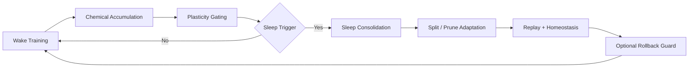

# Circadian Predictive Coding

For active work, start with the [research roadmap](RESEARCH_ROADMAP.md).
The [R0 baseline audit](docs/r0-baseline-audit.md) records the checkout delta,
platform-specific checks, supported test environments and remaining gates.

Later Phase 6 progress notes and their “exact next action” passages record
historical handoffs. Use the active roadmap and the latest
[development log](docs/development-log.md) for current work. The owning-with
guard repair is user-deferred; its counterexample keeps scientific admission
closed. The supported local Linux baseline now passes; see the audit for exact
counts, skips and remaining limits. The [first local pilot preflight](docs/local-pilot-budget.md)
checks fixed CPU/simulation resource plans before any new pilot is dispatched.

```powershell
python -m scripts.run_local_pilot_preflight
```

[](https://github.com/OptimumAF/Circadian-Predictive-Coding/actions/workflows/ci.yml)
[](LICENSE)
[](https://www.python.org/downloads/)
[](https://github.com/OptimumAF/Circadian-Predictive-Coding/releases)

Circadian Predictive Coding is a research-first repository focused on biologically inspired learning where models adapt their own structure over wake and sleep cycles.

The [model card](docs/model-card.md) distinguishes the matched frozen-feature
head track, practical image references and descriptive NumPy studies. It records
data-access rules, training-energy limits, backend capabilities, resource scope
and retained negative or unresolved results. Use the named
[evaluation protocol](docs/evaluation-protocols.md) and
[original publication evidence](docs/published-experiment-register.md) when
interpreting a comparison.

## Why This Repo

This project is built around one central idea:

- **Circadian Predictive Coding** should be compared rigorously against
  - traditional backpropagation
  - traditional predictive coding

The baseline models stay in the repo as stable references, while circadian behavior is the primary innovation surface.

## Circadian Loop

The circadian model is the primary focus of this project. Backprop and predictive coding baselines are kept to ensure fair comparison and reproducible evaluation.


```mermaid
flowchart LR
    A[Wake Training] --> B[Chemical Accumulation]
    B --> C[Plasticity Gating]
    C --> D{Sleep Trigger}
    D -- No --> A
    D -- Yes --> E[Sleep Consolidation]
    E --> F[Split / Prune Adaptation]
    F --> G[Replay + Homeostasis]
    G --> H[Optional Rollback Guard]
    H --> A
```

### Hardest-Case Dynamics (Train + Inference)


This checked-in animation is historical. Its generator scored phase-B test
labels at intermediate epochs, and its original execution settings are not
fully recoverable. New runs of `scripts/generate_hardest_mode_dynamics.py`
default to protocol `validation_dynamics_v1`: they reserve deterministic
phase-local validation splits, plot intermediate phase-B **validation**
metrics, and score final test only after training. The default output names
include `validation_v1`, so the historical figures are not overwritten. The
explicit `--protocol-id legacy_test_informed_v0` option preserves the earlier
test-informed behavior for reproduction and also uses distinct output names.
The validation dynamics protocol is an offline visualization: it shows
phase-B validation data during phase A, but those scores do not control
training or sleep. It does not establish a strict-online continual protocol.
New dynamics figures and interactive payloads label their NumPy algorithm
versions and descriptive comparison scope. The default three-hidden-layer
comparison uses unmatched PC and circadian update rules, so its plotted
ranking does not isolate a circadian mechanism. The checked-in historical
animation remains unchanged.

For a bounded output check, add `--tiny-smoke` and point
`--gif-output-path`/`--interactive-output-path` at new local files. This
fixed 40-row, four-epoch fixture preserves the chosen validation or explicit
legacy evaluation route, prints its full config, and uses separate default
smoke filenames. Its scores describe the tiny fixture only.

Interactive version (Plotly, with internals replay):

- [Hardest-Case Dynamics Interactive](https://optimumaf.github.io/Circadian-Predictive-Coding/figures/interactive_hardest_mode_dynamics.html)

## Core Idea

The circadian algorithm models wake and sleep phases:

- Wake: train with predictive-coding updates while each neuron accumulates a chemical usage signal.
- Sleep: consolidate with architecture updates (split high-usage neurons, prune low-usage neurons), optional rollback, and homeostatic controls.

This lets model capacity adapt over time instead of staying fixed.

## Features

- NumPy circadian predictive coding baseline for small-scale experiments
- Torch ResNet-50 benchmark pipeline for speed and accuracy comparisons
- Adaptive sleep triggers, adaptive split/prune thresholds, dual-timescale chemical dynamics
- Supervised difficulty modulation of wake learning and adaptive sleep budget scaling (NumPy + ResNet circadian head); the reward proxy uses labeled training error.
- Function-preserving split behavior and guarded sleep rollback
- Multi-seed benchmark runner with JSON/CSV output

Sleep defaults to `legacy` budget-gated behavior. Set
`sleep_mode="components"` in a NumPy or Torch circadian config to run
enabled consolidation even with zero split/prune budgets, and use its
component switches for ablations. `sleep_mode="disabled"` makes sleep a
true no-op. NumPy supports replay during sleep; the Torch head does not.
The vision CLI exposes `--circ-sleep-mode` and `--circ-disable-*` switches.
See [ADR-0033](docs/adr/ADR-0033-independent-sleep-components.md).

After a guarded sleep rejection, `components` mode waits one completed
epoch and at least one new successful wake batch before another due sleep
attempt. `legacy` keeps its prior no-cooldown schedule. Set
`--circ-sleep-rollback-cooldown-epochs N` to override either mode (zero
disables the retry gate). Reports include the resolved cooldown, actual
sleep attempts, and due attempts suppressed by cooldown. See
[ADR-0051](docs/adr/ADR-0051-sleep-rollback-retry-gate.md).

An interval schedules a sleep attempt after that many completed runner
epochs. In component mode, adaptive-ready sleep can also be attempted
between intervals; a forced periodic call bypasses the adaptive check.
The configured warmup and guarded retry cooldown still apply.
Disabled mode schedules no attempts. See
[ADR-0034](docs/adr/ADR-0034-sleep-attempt-scheduling.md).

Runners pass completed epochs separately from each model's wake-batch
clock. `get_sleep_clocks()` reports successful wake batches/examples,
replay updates, and performed events; NumPy replay does not advance the
wake clock. See [ADR-0035](docs/adr/ADR-0035-typed-sleep-clocks.md).

NumPy and Torch `sleep_event()` results now include `telemetry` with resolved
core budgets, stable split/prune IDs, chemical summaries, widths, duration,
and an applied or skipped reason. NumPy counts exact replay examples and
updates; Torch reports zero replay. Timing is excluded from sleep-result
equality and model snapshots. The toy NumPy runner now attaches one typed
decision per epoch, including unscheduled and disabled epochs, to its report
and checkpoint. Supported vision and arrived-role routes record guarded outcome decisions.
See the [structured observation audit](docs/structured-observation-audit.md),
[ADR-0088](docs/adr/ADR-0088-numpy-core-sleep-facts.md),
[ADR-0089](docs/adr/ADR-0089-torch-core-sleep-facts.md), and
[ADR-0090](docs/adr/ADR-0090-toy-sleep-event-history.md).

Component-mode adaptive sleep restarts its plateau window after an actual
hidden-width change and uses the minimum structural budget scale while
the new-width window fills. Legacy mode keeps its original history rule.
See [ADR-0036](docs/adr/ADR-0036-width-sensitive-sleep-history.md).

NumPy circadian models can copy and restore their full model-owned state
in memory with `snapshot_state()` and `restore_state(saved)`, including
replay and local random state. Snapshot APIs support current rollback and trusted local checkpoint routes.
Core sleep and guarded vision sleep restore rejected or invalid events.
Continuation formats and boundaries differ by route; see
[checked v14 trial-prefix resume](docs/v14-checked-resume.md).
See [ADR-0037](docs/adr/ADR-0037-numpy-in-memory-full-snapshot.md) and
[ADR-0049](docs/adr/ADR-0049-atomic-core-sleep.md).

Torch circadian heads also copy and restore their in-memory adaptive state,
including the model-owned noisy-split generator. The current ResNet sleep
guard still snapshots the head; see
[ADR-0038](docs/adr/ADR-0038-torch-head-snapshot-rng.md).

For a Torch circadian classifier, `snapshot_full_state()` and
`restore_full_state(saved)` additionally copy the backbone's parameters,
buffers, and train/eval modes. This explicit in-memory API leaves the
head-only sleep guard unchanged; see
[ADR-0039](docs/adr/ADR-0039-classifier-full-state-boundary.md).

NumPy external neuron proposals now reject invalid or over-budget
structural requests before changing the model. Explicit prune requests
take precedence over overlapping split candidates; see
[ADR-0040](docs/adr/ADR-0040-numpy-external-proposal-preflight.md).
The same typed policy proposal is checked against the active phase's
split/prune budget: a request for both actions is rejected when either
budget is zero, and can run in a phase that permits both. Scoring,
candidate selection, budget checks, and tensor mutation stay separate;
Torch retains its different post-split prune planner (ADR-0110).

Built-in NumPy sleep proposals are likewise checked together before
structural mutation; overlapping prune requests take precedence and
pending gradual prunes count toward minimum-width protection. See
[ADR-0041](docs/adr/ADR-0041-numpy-builtin-structural-preflight.md).

Torch built-in sleep also checks structural proposals before changing the
live head. A detached candidate preserves its existing post-split prune
selection, including eligible new children; see
[ADR-0042](docs/adr/ADR-0042-torch-post-split-preflight.md).

NumPy and Torch adaptive neurons expose persistent IDs and split-parent
references through `get_neuron_lineage()`. Pruning changes positions while
surviving IDs stay stable; see
[ADR-0043](docs/adr/ADR-0043-numpy-neuron-lineage.md) and
[ADR-0044](docs/adr/ADR-0044-torch-neuron-lineage.md).
Executed sleep results also retain immutable lineage before and after
the event, so removed IDs remain identifiable even when positions shift;
see [ADR-0045](docs/adr/ADR-0045-sleep-event-lineage.md).

Isolated single and repeated splits conserve the represented function
within float64/float32 tolerance when other sleep components are off.
Seeded noisy splits retain outgoing-row conservation; see
[ADR-0046](docs/adr/ADR-0046-isolated-split-conservation.md).

Executed sleep results now separate stable IDs requested for pruning,
marked for gradual removal, and actually removed. NumPy wake results
also report delayed finalization. Existing `pruned_indices` and runner
`total_prunes` counts retain their historical request meaning; see
[ADR-0048](docs/adr/ADR-0048-prune-outcome-timeline.md).

## Visual Results

The figures and result tables below are historical snapshots. The reviewed
vision runner used test labels for early stopping and sleep rollback, and its
backprop/PC heads and backbone states were not matched. The source CSV for
several charts is absent. See [historical benchmark provenance](docs/historical-benchmark-provenance.md)
before interpreting a ranking; these outputs are not corrected-protocol
results. The [development plan](DEVELOPMENT_PLAN.md) tracks the validation and
matched-baseline work.

### Multi-seed CIFAR-100 Snapshot (3 seeds, subset benchmark)


Interactive dashboard:

- [Benchmark Dashboard (GitHub Pages)](https://optimumaf.github.io/Circadian-Predictive-Coding/)
- [Dashboard Source](docs/index.html)

Interactive Plotly chart files:

- [Overview (interactive, compact)](https://optimumaf.github.io/Circadian-Predictive-Coding/figures/interactive_benchmark_overview.html)
- [Accuracy (interactive)](https://optimumaf.github.io/Circadian-Predictive-Coding/figures/interactive_benchmark_accuracy.html)
- [Training speed (interactive)](https://optimumaf.github.io/Circadian-Predictive-Coding/figures/interactive_benchmark_train_speed.html)
- [Inference latency P95 (interactive)](https://optimumaf.github.io/Circadian-Predictive-Coding/figures/interactive_benchmark_inference_latency_p95.html)
- [Interactive chart source files](docs/figures/)

Note: GitHub README pages do not execute custom JavaScript, so Plotly interactivity will not run inline inside README itself.

### Circadian Dynamics (Illustrative)


## Results Snapshot

### Multi-seed subset benchmark (`benchmark_multiseed_cifar100_summary.csv`)

| Model | Accuracy Mean | Train SPS Mean | Inference P95 (ms) |
|---|---:|---:|---:|
| BackpropResNet50 | 0.6901 | 1775.3 | 17.34 |
| PredictiveCodingResNet50 | 0.6810 | 1732.1 | 17.74 |
| CircadianPredictiveCodingResNet50 | 0.6715 | 1643.6 | 18.71 |

### Hard full CIFAR-100 run (single-seed, 48 epochs, 2026-02-27)

| Model | Accuracy | Train SPS | Inference SPS | Notes |
|---|---:|---:|---:|---|
| BackpropResNet50 | 0.706 | 1350.7 | 4672.4 | fixed head |
| PredictiveCodingResNet50 | 0.723 | 2093.4 | 4839.0 | fixed head |
| CircadianPredictiveCodingResNet50 | 0.734 | 2059.9 | 4831.4 | hidden 384->394, splits=12, prunes=2, rollbacks=7 |

### Historical master verification run (single-seed subset, 2026-02-28)

Recorded historical command (running it on the current code will use a new
validation holdout and need not reproduce the table):

```powershell
python resnet50_benchmark.py --dataset-name cifar100 --classes 100 --dataset-train-subset-size 20000 --dataset-test-subset-size 5000 --epochs 12 --device cuda --target-accuracy -1 --backprop-freeze-backbone --backbone-weights imagenet
```

| Model | Accuracy | Cross-Entropy | Train SPS | Inference P95 (ms) | Notes |
|---|---:|---:|---:|---:|---|
| BackpropResNet50 | 0.678 | 1.7144 | 981.3 | 23.03 | fixed head |
| PredictiveCodingResNet50 | 0.692 | 1.1175 | 965.2 | 20.77 | fixed head |
| CircadianPredictiveCodingResNet50 | 0.685 | 1.1082 | 874.2 | 23.27 | hidden 384->384, splits=0, prunes=0, rollbacks=0 |

Raw benchmark output: [`docs/benchmarks/benchmark_master_cifar100_subset_2026-02-28.txt`](docs/benchmarks/benchmark_master_cifar100_subset_2026-02-28.txt)

## Strengths and Weaknesses

The observations in this section describe the retained February 2026 runs;
“latest” refers to that historical master check. The corrected September 30
hardest-profile reproduction reports PC `0.786122` and circadian `0.768163`.
That tuned profile is descriptive. The retained H1–H4 confirmation leaves
105 simultaneous intervals including zero and 11 statements ineligible;
advantage and equivalence remain unresolved. See the
[corrected profiles](docs/p62-corrected-profile-results.md),
[current findings](docs/p612-current-findings-publication.md), and
[model card](docs/model-card.md) for current claim scope.

Strengths:

- Competitive retention/adaptation behavior under hard continual shift.
- Strong balance in the moderate strength-case stress test (circadian balanced score `0.949` vs predictive coding `0.947` vs backprop `0.946`).
- Sources:
  - [`docs/benchmarks/benchmark_continual_shift_strength_case_2026-02-28.txt`](docs/benchmarks/benchmark_continual_shift_strength_case_2026-02-28.txt)
  - [`docs/benchmarks/benchmark_continual_shift_hardest_case_2026-02-28.txt`](docs/benchmarks/benchmark_continual_shift_hardest_case_2026-02-28.txt)
- Dynamic capacity adaptation is observable and measurable (updated hardest-case: mean splits `48.57`, hidden size `24 -> 72.57`).
- Competitive behavior in moderate continual-shift stress tests with stable multi-seed performance.

Weaknesses:

- Not best on every benchmark; on the latest CIFAR-100 subset master check, predictive coding accuracy (`0.692`) was higher than circadian (`0.685`).
- In the updated ultra-hard hardest-case setting, the margin between circadian and predictive coding is small (`0.812` vs `0.808`) with high variance, so ranking can flip across seeds/configurations.
- Extra algorithmic machinery (sleep scheduling, replay, split/prune controls) adds tuning burden and implementation complexity compared with fixed-width baselines.
- Speed overhead can appear depending on configuration; in the latest CIFAR-100 subset master check, circadian train speed (`874.2` SPS) was lower than predictive coding (`965.2` SPS).
- Results are regime-dependent; claims should be tied to specific benchmark settings and seeds instead of treated as universal.

## Repository Layout

```text
src/
  core/       # Learning rules and model definitions
  app/        # Experiment and benchmark orchestration
  adapters/   # CLI entrypoints
  infra/      # Dataset and dataloader construction
  config/     # Environment-backed defaults
  shared/     # Small cross-cutting runtime helpers
tests/        # Unit/integration tests
docs/
  adr/        # Architecture decision records
  modules/    # Module responsibility docs
  figures/    # Generated and static figures for documentation
scripts/      # Reproducible benchmark scripts
```

## Quickstart

```powershell
py -3.14 -m venv .venv
.\.venv\Scripts\Activate.ps1
pip install -r requirements.txt
```

The audited Windows CPU `.venv` uses Python 3.14.7, NumPy 2.4.6,
Torch 2.14.0+cpu and torchvision 0.29.0+cpu. Original Python 3.11
environments remain in ignored `*-py311-snapshot` folders. The configured
Linux CI matrix targets Python 3.11, 3.12 and 3.14; minimum syntax and the
configured type target remain Python 3.11. At committed HEAD `1820775`,
[CI run 37511207519](https://github.com/OptimumAF/Circadian-Predictive-Coding/actions/runs/37511207519)
passed its eight-module Torch CPU job with Torch 2.14.1+cpu / torchvision
0.29.1+cpu. All three general jobs failed type checking and skipped testing;
the inspected 3.11 log reports eight Windows-only ctypes/msvcrt errors.
The subsequent uncommitted R0 platform repair has scoped local Linux/Windows
validation. Its expanded CPU and Windows-native jobs await remote execution.
R0.3 and G0 remain open after the general suites exceeded their storage
allowance and Linux emitted three unresolved failure markers. The
[R0 audit](docs/r0-baseline-audit.md) records exact scopes and environments.

For exact versions from the tested Windows CPU environment, use the dated
[dependency constraints and reproduction guide](docs/dependency-reproducibility.md).
Supported ranges remain in the requirements files; clean-install validation
is recorded separately from checks of the existing environment.

Optional torch benchmark dependencies:

```powershell
pip install -r requirements-resnet.txt
```

For NVIDIA GPUs, use the separate [recorded CUDA environment](#recorded-cuda-environment)
and [dependency guide](docs/dependency-reproducibility.md). Keep the exact
versions of a retained experiment with that experiment's environment record.

## Configuration defaults

The toy CLI reads integer defaults from the process environment before
applying explicit command arguments. [`.env.example`](.env.example) lists
those names; copying it does not load values automatically. Invalid integer
values raise a named configuration error.

| Variable | Default | Meaning |
| --- | ---: | --- |
| `PC_BASE_SEED` | 7 | Toy source/model base seed |
| `PC_DATASET_SIZE` | 400 | Toy sample count |
| `PC_EPOCHS` | 160 | Toy training epochs |

For example, set `$env:PC_EPOCHS = "2"` in PowerShell before invoking the toy
CLI. An explicit `--epochs` takes precedence over that valid default. The
versioned fixed studies retain their own sealed configurations; these variables
do not rewrite their requests or budgets. See
[configuration contracts](docs/configuration-entrypoint-audit.md).

## Main Commands

Toy baseline:

```powershell
python predictive_coding_experiment.py
```

The NumPy toy API can record and reverse model execution order for a small
reproducibility check:

```python
from src.app.experiment_runner import ExperimentConfig, run_experiment

result = run_experiment(ExperimentConfig(
    sample_count=80, epoch_count=6,
    model_order=("circadian_predictive_coding", "predictive_coding", "backprop"),
))
print(result.training_order, result.split_hashes)
```

The default order and `toy_validation_v1` data roles remain the same.

For a local JSON result with the complete typed sleep decision sequence:

```powershell
python predictive_coding_experiment.py --samples 80 --epochs 4 --json-result toy-result.json
```

The file is written only after training and final-test scoring and must not
already exist. `result.circadian_sleep.events` and the JSON `circadian_sleep.events`
contain one record for each epoch; `event_count` retains the legacy meaning
of sleep events that changed topology. New CLI JSON results also include
`resolved_config`: the full `ExperimentConfig` (including inherited baseline
rates and nested circadian settings), the mode, ordered seed/noise grid, and
explicit inputs. The toy route has no sleep guard.

The root toy CLI's `historical-toy` preset retains the original defaults;
`PC_BASE_SEED`, `PC_DATASET_SIZE`, and `PC_EPOCHS` still supply defaults
before flags. For either mode, add `--resolved-config toy-config.json` to
save a complete request after a successful run. Trial configs for indepth
mode are recorded in noise-level then seed order. Existing flags remain
available, and typed `--override FIELD=JSON` values apply after them
for their corresponding config fields. Overrides require `--json-result`,
`--resolved-config`, or a budgeted `--run-state`; unknown fields and invalid values reject before
training. The record contains no scores or winner choice (ADR-0128).

The toy API can resume all three NumPy models from a trusted local file,
including a partial model-order epoch or a sleep with structural replay:

```python
from src.app.experiment_runner import ExperimentConfig, run_experiment
from src.infra.circadian_checkpoint_files import TrustedLocalToyCheckpointStore

store = TrustedLocalToyCheckpointStore("local-toy.checkpoint")
run_experiment(ExperimentConfig(epoch_count=6), checkpoint_store=store)
# After an interrupted run, use the same config and store:
result = run_experiment(
    ExperimentConfig(epoch_count=6),
    checkpoint_store=store,
    resume_from_checkpoint=True,
)
```

The file binds the training and validation arrays, every runner setting,
the model order, progress counters, and the NumPy/Python random streams.
It also saves the complete typed sleep-event history at wake and sleep
boundaries. This runner payload is now version 2; older version-1 toy
checkpoints are rejected before restoring or training because they cannot
recover the missing earlier decisions.
Only the stateless default adaptation policy is supported for this durable
route. Do not load a pickle checkpoint from an untrusted source. Final-test
scoring still occurs after training. See
[ADR-0055](docs/adr/ADR-0055-toy-runner-file-resume.md).

Toy baseline with review-driven circadian controls:

```powershell
python predictive_coding_experiment.py --adaptive-sleep-trigger --adaptive-sleep-budget --reward-modulated-learning --reward-scale-min 0.8 --reward-scale-max 1.4
```

The reward-named switch uses supervised mean absolute output error
relative to an EMA baseline; it does not observe an environmental reward.
The [fixed signal audit](docs/difficulty-modulation-audit.md) shows that
one flipped label or feature outlier can saturate its update factor.
Clipped error and constructed loss improvement are diagnostic comparisons
only. Run the fixed, globally sealed NumPy/CPU-Torch learning comparison:

```powershell
New-Item -ItemType Directory -Force data | Out-Null
.\.venv\Scripts\python.exe -m scripts.run_difficulty_matched_comparison --result data/difficulty-modulation-v11-result.json
```

Use a new result path for each run; the adapter rejects an occupied path
before training and retains its exclusive write. The
[v11 comparison](docs/difficulty-modulation-comparison.md) records all
24 clean/label-flip/feature-outlier trials, equal work, train-only signals,
and held-out accuracy/forgetting. Modulation changed actual scales but no
matched accuracy or forgetting pair on this fixed small budget; no new
heuristic was selected (ADR-0112).

The [structural rank audit](docs/structural-reward-ranking-audit.md)
checks the existing reward-weighted importance EMA at fixed neuron
state and one-change caps in both backends. A changing reward factor can
switch split/prune candidate IDs, while a constant factor leaves the
normalized rank unchanged. The follow-up [v12 structural comparison](docs/structural-ranking-comparison.md)
separates wake scaling, reward weighting of importance history, and use
of importance in ranking. Run its train-only gate before the complete
locally sealed comparison, writing each result to a new path:

```powershell
New-Item -ItemType Directory -Force data | Out-Null
.\.venv\Scripts\python.exe -m scripts.run_structural_rank_comparison --train-only --result data/structural-ranking-v12-train.json
.\.venv\Scripts\python.exe -m scripts.run_structural_rank_comparison --result data/structural-ranking-v12-result.json
```

All 32 fixed cells used equal within-backend work and one split/prune
event. Reward weighting of importance history changed no selected ID or
held-out accuracy/forgetting pair in this small run. Existing importance
scoring changed two prune choices without consistent benefit. No new
reward-ranking heuristic was selected (ADR-0114); the documented weak
learning in some cells limits broader claims.
Both v12 CLI modes reject an occupied result path before training and
report the saved file's SHA-256; exclusive writes remain in place.

The [fixed v13 sleep-trigger timing study](docs/sleep-trigger-comparison.md)
compares periodic, unchanged adaptive, and no-sleep controls on
stationary noisy and axis-shifted A→B streams. It keeps model width and
wake work fixed, with chemical-reset-only component sleep. Write each
artifact to a new local path:

```powershell
New-Item -ItemType Directory -Force data | Out-Null
.\.venv\Scripts\python.exe -m scripts.run_sleep_trigger_comparison --train-only --result data/sleep-trigger-v13-train.json
.\.venv\Scripts\python.exe -m scripts.run_sleep_trigger_comparison --result data/sleep-trigger-v13-result.json
```

Use unused filenames when repeating either command; the adapter refuses
to overwrite an existing artifact.

All twelve trials passed train-only preflight before final release.
Periodic sleep executed four times per trial; adaptive executed zero
times under its unchanged thresholds and matched the no-sleep control.
Periodic outcomes were mixed across seeds and metrics. No new trigger
rule was selected. The separate full-stack v14 comparison below
subsequently addressed the broader sleep components (ADR-0115).

The [fixed v14 full-stack trigger protocol](docs/full-stack-trigger-comparison.md)
first records the same prediction-independent replay supply at every
arrived train-only wake epoch for both new seeds. It binds capacity and
guard budgets before model training. Its periodic subset exactly matches
the existing v9 replay schedule. The later guarded and scored v14 gates
are documented below.
To reproduce this schedule to a new local file:

```powershell
.\.venv\Scripts\python.exe -m scripts.run_continual_trigger_replay_schedule --result data/trigger-replay-v14-opportunities-new.json
```

The adapter refuses to overwrite an existing artifact. The schedule
records potential rows; guarded replay and scoring use separate gates
(ADR-0116).

The fixed v14 train-only guarded runner now trains all three NumPy
methods for both seeds and all three trigger arms. It checks the shared
selection before every decision and applies matched PC/backprop replay
only after circadian sleep passes its inner guard. Write its six-trial
unscored trace to a new local file:

```powershell
.\.venv\Scripts\python.exe -m scripts.run_continual_trigger_replay_training --result data/trigger-replay-v14-training-new.json
```

The recorded periodic arms accepted six sleeps per seed and pruned two
or three neurons; unchanged adaptive and no-sleep arms made no sleep
attempt. After all six train-only trials pass, the fixed v14 outcome
route releases common final roles and scores every method and contrast:

```powershell
.\.venv\Scripts\python.exe -m scripts.run_continual_trigger_replay_outcomes --result data/trigger-replay-v14-outcomes-new.json
```

All three fixed v14 raw-output CLIs reject an occupied `--result` before
scheduling or training; their exclusive writes still protect the final file.

The [full result table](docs/full-stack-trigger-comparison.md) retains
mixed periodic effects, zero adaptive-minus-no-sleep differences, and
the extra replay work and reduced circadian capacity. No new trigger
rule was selected (ADRs 0117–0118). The
[backend capability matrix](docs/backend-capability-matrix.md) and
[v14 result metadata](docs/result-backend-metadata.json) state that this
replay comparison uses NumPy only; Torch has no sleep replay in the
current head (ADR-0119).

For a new run with execution provenance, use the opt-in
[versioned manifest contract](docs/versioned-run-manifest.md):

```powershell
.\.venv\Scripts\python.exe -m scripts.run_versioned_v14_bundle --run-id p51-v14-local --preset fixed-v14
.\.venv\Scripts\python.exe -m scripts.run_versioned_v14_bundle --verify-run artifacts/runs/p51-v14-local
```

This writes an ignored local directory with the unchanged v14 train-only
and scored JSON plus a validated `manifest.json`. It records the executing
Git/workspace state, exact source-role hashes, seed derivations, runtime
versions, CPU hardware, float64 precision, and unmeasured timing scope.
`fixed-v14` is the only accepted preset and is also the default;
unknown preset names and setting switches fail before training. The
complete resolved fixed manifest remains in `manifest.json`.
The run ID must be new; a partial directory cannot pass verification
(ADR-0120).
The [P5.7 reproducibility scope](docs/reproducibility-scope.md) records
two verified separate-process repeats, exact deterministic payload hashes,
the model-order test boundary, and CPU/GPU and cross-version tolerance
policy (ADR-0139).

To inspect only the observations that v14 actually recorded, derive the
[P5.2a structured streams](docs/structured-observation-audit.md):

```powershell
.\.venv\Scripts\python.exe -m scripts.project_v14_observations --run artifacts/runs/p51-v14-local
.\.venv\Scripts\python.exe -m scripts.project_v14_observations --verify-run artifacts/runs/p51-v14-local
```

This adds exclusive JSONL sleep, topology, replay, validation, role,
and final-result files plus a CSV of final method rows. The raw v14
files remain unchanged. Wake rows explicitly label per-epoch training
metrics unavailable because the v14 runner did not record them
(ADR-0121).

For a descriptive table derived only from a completed, verified v14 bundle:

```powershell
.\.venv\Scripts\python.exe -m scripts.build_v14_artifact_report --run artifacts/runs/p51-v14-local
.\.venv\Scripts\python.exe -m scripts.build_v14_artifact_report --verify-run artifacts/runs/p51-v14-local
```

This writes an exclusive `summary-report-v1` directory with JSON/CSV rows
for every configured arm and method. Rows show both seed count and the
observed mean/minimum/maximum/range of four existing final metrics. The
report includes outcome protocol, source commit/dirty state, and the fixed
NumPy synthetic continual track. Its zero failed cells applies only to the
verified completed bundle; failed attempts outside that bundle were not
recorded. The table is descriptive across unmatched learning rules and
does not select a winner. It does not modify v14 result bytes or replace
the historical dashboard (ADR-0137; P5.6a).

To generate a static dashboard and four observed-range plots from that
verified table, run these commands after the report exists:

```powershell
.\.venv\Scripts\python.exe -m scripts.build_v14_dashboard --run artifacts/runs/p51-v14-local
.\.venv\Scripts\python.exe -m scripts.build_v14_dashboard --verify-run artifacts/runs/p51-v14-local
```

Open `artifacts/runs/p51-v14-local/dashboard-v1/dashboard.html` locally.
The exclusive directory contains that page, four PNGs for the existing
final metrics, and a hash manifest. Verification checks the source bundle
and table, then re-derives every page and plot byte; a stale report or
hand-edited figure is rejected. The page lists all nine arm/method cells,
seed count, observed mean/min/max/range, protocol, source commit, fixed
track, and the narrow failure scope. Bars show the observed two-seed
minimum–maximum, not uncertainty intervals. The historical
`docs/index.html` now displays the provenance warning alongside its
unchanged historical charts; it is not replaced by the new page
(ADR-0138; P5.6b).

For genuine metrics on a **new** bounded v14 run, use the
[measured wake workflow](docs/measured-wake-observations.md):

```powershell
.\.venv\Scripts\python.exe -m scripts.run_versioned_v14_bundle --run-id p52-measured-local --capture-wake-diagnostics
.\.venv\Scripts\python.exe -m scripts.project_v14_observations --run-measured artifacts/runs/p52-measured-local
.\.venv\Scripts\python.exe -m scripts.project_v14_observations --verify-measured-run artifacts/runs/p52-measured-local
```

Its separate sidecar records the existing train-update returns for
every method/epoch, and its measured projection adds JSONL and CSV
without changing fixed v14 outcomes (ADR-0122).

The [P5.3a publication boundary](docs/atomic-artifact-publication.md)
now stages these local directories under hidden sibling paths and
makes each complete bundle visible with one same-volume rename.
Interrupted stages remain labeled for inspection (ADR-0123). The
[P5.3b checked resume route](docs/v14-checked-resume.md) stores a
validated unscored trial prefix under a hidden run-state directory:

```powershell
.\.venv\Scripts\python.exe -m scripts.run_versioned_v14_bundle --run-id p53-local --resumable --capture-wake-diagnostics
.\.venv\Scripts\python.exe -m scripts.run_versioned_v14_bundle --run-id p53-local --resume --capture-wake-diagnostics
```

Resume requires the same source, runtime environment, fixed config,
protocol, and capture mode. The final roles stay sealed until all six
trials preflight; an interrupted trial restarts from its beginning.
The original v14 raw and measured bytes remain unchanged (ADR-0124).

Continual shift stress test (retention vs adaptation):

```powershell
python scripts/run_continual_shift_benchmark.py --profile strength-case --seeds 3,7,11,19,23,31,37
```

The configurable continual route also accepts repeatable typed
`--override FIELD=JSON` values after its named profile and existing
flags. Overrides require `--json-result` or `--resolved-config` so the
fully resolved settings are saved; unknown keys and changes to model
order, protocol ID, or baseline learning rates are refused before
training. See the [configuration workflow](docs/configured-continual-experiments.md)
(ADR-0125). This historical route is descriptive and does not alter
the fixed matched v14 comparison.
The [active CLI configuration audit](docs/configuration-entrypoint-audit.md)
records configuration contracts for fixed v14, configurable continual,
toy, and both descriptive ResNet routes.

For a local JSON artifact of a completed v0–v5 continual result, add
`--json-result continual-result.json`. It contains one typed circadian sleep
decision per completed phase A/B epoch for each seed, including skipped
epochs. These historical routes do not pass an inner sleep guard, so their
event `guard` is `null`; arrived v6 now records its own inner-guard history,
while v7 propagates candidate/trial/frozen-selection sleep history under
its current format-8 checkpoint (ADRs 0094–0095). The existing
`--output-file` continues to write the human
summary, and neither file is overwritten. See
[ADR-0091](docs/adr/ADR-0091-historical-continual-sleep-history.md).
The summary describes the configured Phase B noise and transform; zero
rotation/translation with equal noise is an identity-source control. The
v0–v5 generator uses the same source seed across phases, so use the
[v13 stationary-noise study](docs/sleep-trigger-comparison.md) when an
independently sampled stationary stream is required.

For a small continual order check through the Python API:

```python
from src.app.continual_shift_benchmark import (
    ContinualShiftConfig, run_continual_shift_benchmark,
)

result = run_continual_shift_benchmark(
    ContinualShiftConfig(
        sample_count_phase_a=80, sample_count_phase_b=80,
        phase_a_epochs=3, phase_b_epochs=3,
        model_order=("circadian_predictive_coding", "predictive_coding", "backprop"),
    ),
    seeds=[13],
)
print(result.seed_results[0].training_order)
```

The default order and corrected/legacy data roles are unchanged. This is a
local reproducibility check; it does not make the continual protocol
strict-online.

The continual Python API also accepts a trusted local checkpoint. The
default v1 route binds the ordered seed list, both training phases,
completed seed reports, and the phase-A model copies used for retention
scoring:

```python
from src.infra.circadian_checkpoint_files import TrustedLocalContinualCheckpointStore

config = ContinualShiftConfig(phase_a_epochs=3, phase_b_epochs=3)
seeds = [13, 17]
store = TrustedLocalContinualCheckpointStore("local-continual.checkpoint")
run_continual_shift_benchmark(config, seeds, checkpoint_store=store)
# After an interrupted run, reuse the same config, seeds, and store:
result = run_continual_shift_benchmark(
    config, seeds, checkpoint_store=store, resume_from_checkpoint=True
)
```

The file is a checksummed pickle and must come from a trusted local run.
The v0–v5 checkpoint now carries a separate sleep-history extension version
and complete typed events. Older files without that extension are rejected
before restoration because earlier decisions cannot be reconstructed from
aggregate counters. The protocol IDs and their existing main checkpoint
format numbers remain the same.
Each seed's final tests are scored only after both phases finish; their
content is bound when that seed result is committed. Checkpoint file work
adds runtime overhead and is outside the scientific compute comparison.
The CLI has no checkpoint flag. Fixed-feature and whole-image resume use
their separate runner APIs; see
[ADR-0056](docs/adr/ADR-0056-continual-runner-file-resume.md).

For a checkpoint that does not construct Phase B until Phase A finishes,
use `ContinualShiftConfig(protocol_id="continual_phase_arrival_v2", ...)`
with the same Python checkpoint API and a new trusted checkpoint path. Its
version-2 Phase A file binds only Phase A development roles; the Phase B
file adds Phase B development roles and the combined digest. Final-test
hashes are bound only after both training phases finish. The old v1 checkpoint
route and default remain available. The CLI also accepts
`--protocol-id continual_phase_arrival_v2` for runs without checkpointing.
This route still knows the full A+B sleep schedule and does not report a
retained-memory or label-arrival ledger, so it is not a strict-online result.
See [ADR-0066](docs/adr/ADR-0066-continual-phase-arrival-checkpoints.md).

For the next opt-in schedule-isolation increment, use
`ContinualShiftConfig(protocol_id="continual_phase_local_schedule_v3", ...)`
or `--protocol-id continual_phase_local_schedule_v3`. It inherits v2's
phase-arrival boundary and uses checkpoint format 3. Phase A sleep uses
only the Phase A epoch horizon, so changing the configured Phase B duration
does not change Phase A sleep decisions. Phase B uses its arrived A+B
horizon. This partial route still lacks the declared replay budget,
guard/selection arrival rules, and label/retention ledger required for a
strict-online result. See [ADR-0067](docs/adr/ADR-0067-continual-phase-local-schedule.md).

For bounded observed-example replay, opt in to
`ContinualBoundedReplayConfig(replay_max_examples=4, replay_max_bytes=96, ...)`
with `CircadianConfig(sleep_mode="components", replay_steps=1, ...)`.
For a small local CLI smoke:

```powershell
python scripts/run_continual_shift_benchmark.py --profile strength-case --protocol-id continual_bounded_replay_v4 --sleep-mode components --replay-max-examples 4 --replay-max-bytes 96 --seeds 17 --sample-count-phase-a 40 --sample-count-phase-b 40 --phase-a-epochs 2 --phase-b-epochs 2 --hidden-dim 4
```

V4 inherits the phase-local schedule and
phase-arrival boundary, uses checkpoint format 4, and reports retained
content IDs, example count, and copied input/label array bytes at both
phase boundaries. Its deterministic hash retention can keep an uneven
phase mix. It does not yet supply guard/outer-selection arrival or a
full label ledger, so its scores are not full strict-online evidence.
See [ADR-0068](docs/adr/ADR-0068-continual-bounded-observed-replay.md)
and the [fixed-data replay-retention audit](docs/replay-retention-audit.md)
for actual legacy batch/example/byte counts, priority aging, and A→B
content-ID survival under the current policies.
The NumPy core also has opt-in bounded `recent_fifo` and seeded bottom-k
`seeded_reservoir` retention controls for local comparison. They are not
selected by the existing v4 runner or CLI; see the
[core module example](docs/modules/core.md) and [ADR-0102](docs/adr/ADR-0102-opt-in-bounded-replay-policies.md).
In both v4 execution paths, final-test roles are hashed and scored only
after Phase B training ends. The v4 splitter also defers reading the
source's test fields until that boundary. The synthetic generator still
constructs their arrays earlier, and each seed is scored before later
seeds train. Global setting freeze and separate guard/outer selection
roles remain open; see [ADR-0069](docs/adr/ADR-0069-continual-final-label-seal.md)
and [ADR-0070](docs/adr/ADR-0070-defer-continual-source-test-release.md).

For an opt-in run that waits for every configured seed
before any final-test read, use `ContinualGlobalSealConfig(...)` or the
CLI protocol `continual_global_test_seal_v5` with the same replay flags.
V5 holds pending model states in memory until scoring, so memory grows
with the seed count. The Python checkpoint API uses format 5 to persist
trained, unscored seed states; after interruption, resume with the same
config, seed list, and trusted local store. The saved file has no
final-test hashes or scores. Guard and outer-selection roles, setting
selection, and label-arrival reporting remain open; these scores are
descriptive rather than full strict-online evidence. See
[ADR-0071](docs/adr/ADR-0071-continual-run-level-test-seal.md) and
[ADR-0072](docs/adr/ADR-0072-continual-unscored-checkpoints.md).

The four-role source splitter in `src/infra/continual_roles.py` declares
separate phase-local train, inner-guard, and outer-selection identities and
defers final-test field reads to an explicit release call. The opt-in
ordinary Python runner `continual_arrived_roles_v6` uses those roles and
checks each attempted circadian sleep on the arrived inner guard. It
records role access, source/label release, guard decisions, and each
method's available phase information; final tests are released after all
configured seeds train. Run its fixed two-seed audit smoke from the
repository root:

```powershell
python -m scripts.run_continual_arrived_smoke
```

Each v6 per-seed circadian report and the smoke JSON now includes one typed
sleep decision per phase A/B epoch. Attempted events include the inner-guard
role hash, pre/post accuracy, tolerance, scored-example count, core proposal,
and total attempt duration. Cross-entropy is absent because this guard does
not evaluate it. A rejected event keeps proposed structure and replay work
but records no applied changes after restoration. A failed guard or core
attempt restores the model, records known facts with an `error` reason, and
raises. A successful retry keeps that failed event followed by the final
decision for the same epoch. The existing guard ledger and all-seed
final-test release rules still apply. V7 selection history and provenance
are implemented; old format-7 files are rejected by format 8 (ADR-0095).
For the v6 history boundary, see [ADR-0092](docs/adr/ADR-0092-arrived-guarded-sleep-history.md)
and [ADR-0093](docs/adr/ADR-0093-arrived-failed-sleep-attempts.md).

Ordinary v6 raises on sleep errors by default. For a bounded local retry of
typed guard/core failures, use `sleep_error_retries=1` with
`run_continual_arrived_benchmark(config, [17, 19], sleep_error_retries=1)`.
The retry repeats only the restored sleep attempt, not wake training. If
the limit is exhausted, the original exception still raises. Checkpointed
runs use the explicit resume call below and do not combine it with local
retries.

V6 changes training data and is not score-equivalent to v5. For trusted
local checkpoint recovery through the Python API, pass a
`TrustedLocalArrivedCheckpointStore(path)` as `checkpoint_store`, then
repeat the same config and seed list with `resume_from_checkpoint=True`.
With a fixed `ContinualArrivedRolesConfig` named `config`:

```python
from src.app.continual_arrived_benchmark import run_continual_arrived_benchmark
from src.infra.circadian_checkpoint_files import TrustedLocalArrivedCheckpointStore

store = TrustedLocalArrivedCheckpointStore("local-arrived-v6.checkpoint")
run_continual_arrived_benchmark(config, [17, 19], checkpoint_store=store)
result = run_continual_arrived_benchmark(
    config, [17, 19], checkpoint_store=store, resume_from_checkpoint=True
)
```

Format 6 stores unscored completed seeds and the active A/B model, role,
guard, and event cursor after each model or sleep transaction. Its versioned
sleep-history extension validates active and completed attempts, including
multiple errors at a retryable `before_sleep` epoch, and their phase role
binding before restoration. Resume also validates arrived
development roles and replay provenance before the next
update; final tests remain sealed until all seeds finish. The outer role
is reserved but no setting search exists in this v6 API, so its scores are
descriptive. See
[ADR-0073](docs/adr/ADR-0073-continual-four-role-source-contract.md),
[ADR-0074](docs/adr/ADR-0074-ordinary-arrived-role-guard.md),
[ADR-0075](docs/adr/ADR-0075-arrived-continual-unscored-seeds.md), and
[ADR-0076](docs/adr/ADR-0076-arrived-continual-active-transactions.md).

The separate ordinary `continual_arrived_outer_selection_v7` Python API
predeclares two to four equal-work configurations, changing only each
method's learning rate. It trains every candidate and seed before scoring
the disjoint A/B outer roles, selects one setting per method by mean outer
balanced accuracy, and freezes all three choices before opening any final
source field. An exact tie chooses the first declared candidate. The
result retains the full candidate configs, every method/candidate/seed
trial, role IDs/hashes and access events, guard/outer exposure counts,
replay retention, the selection digest, and selected final scores. At most
eight candidate-seed trials per method are allowed. Run the fixed tiny
two-candidate example from the repository root:

```powershell
python -m scripts.run_continual_arrived_selection_smoke
```

`candidate_sleep_histories` exposes the typed phase A/B sleep attempts for
every candidate and seed. The selected final seed metric carries the history
of its chosen circadian candidate. Each circadian trial also carries that
history and a digest bound to the candidate's role ledger; baseline trials
have empty sleep histories. The freeze carries a separate digest of the
ordered candidate/seed histories. The local example prints these fields in
strict JSON. Measured durations are excluded from report equality, and the
original outer trial and choice digests still describe only score/work
facts. Ordinary v7 may opt into a nonnegative bounded
`sleep_error_retries` value; checkpointed v7 records a failed attempt and
requires an explicit later resume.

For a trusted local candidate-manifest checkpoint, use the distinct
format-8 store. With an ordered tuple of `ArrivedSelectionCandidate`
values named `candidates`:

```python
from src.app.continual_arrived_selection import run_arrived_outer_selection
from src.infra.circadian_checkpoint_files import TrustedLocalArrivedSelectionCheckpointStore

store = TrustedLocalArrivedSelectionCheckpointStore("local-selection-v8.checkpoint")
run_arrived_outer_selection(candidates, [17, 19], checkpoint_store=store)
result = run_arrived_outer_selection(
    candidates, [17, 19], checkpoint_store=store, resume_from_checkpoint=True
)
```

Format 8 stores the ordered candidate configs/seeds, unscored completed
models, all outer trial and exposure rows, a nested active v6 transaction,
and the frozen choice. It validates the manifest, arrived development
roles, replay, event cursor, trial/choice, and independent sleep-history
provenance against recomputation before another update or final release.
Earlier format-7 files are rejected because they lack that provenance.
Final values, hashes, and scores
stay outside the file. Use the single-setting v6 store only for the v6
API. The example's final scores are descriptive synthetic results; bounded
strict-online confirmation is available as a separate fixed local study.
Prepare its ignored request first, then run the unchanged request from the
repository root:

```powershell
python -m scripts.run_continual_arrived_confirmation prepare --request data/continual_arrived_confirmation_v1_request.json
python -m scripts.run_continual_arrived_confirmation run --request data/continual_arrived_confirmation_v1_request.json --result data/continual_arrived_confirmation_v1_result.json --checkpoint-dir data/continual_arrived_confirmation_v1_checkpoints
```

The runner refuses changed requests and existing result/checkpoint paths. It
uses the fixed two-candidate, two-seed, one-epoch-per-phase fixture, runs
both model orders, interrupts and resumes A/B wake checkpoints, asserts the
final source seal and state/order equality, and saves every outer trial and
signed final-score difference. Run it once per fresh artifact path. This is
a tiny synthetic protocol check, not a representative accuracy ranking. See
[ADR-0077](docs/adr/ADR-0077-arrived-outer-selection-before-final-release.md)
through [ADR-0079](docs/adr/ADR-0079-bounded-strict-online-confirmation.md).

The separate ordinary `continual_replay_policy_comparison_v8` API fixes one
arrived v6 role/training configuration, ordered seeds, and FIFO plus seeded
bottom-k reservoir policies before any source access. It trains every
policy/seed before opening either phase's final-test source fields. The local
result keeps all scores, role IDs/hashes and access events, policy identity,
declared replay caps, retained IDs/bytes at A and B, duplicate wake IDs,
distinct applied replay IDs, actual replay updates, and baseline state
hashes. Run the small fixed two-seed comparison from the repository root:

```powershell
python -m scripts.run_continual_replay_policy_smoke --result data/continual_replay_policy_v8_smoke.json
```

The CLI checks an existing result path before training. A fresh run with
`--checkpoint` also refuses an existing checkpoint; `--resume` may read that
checkpoint but requires a fresh result path. The two output paths must differ.
The checked local artifact has
different retained/exposed IDs but identical balanced scores for FIFO and
reservoir on both seeds; it is a tiny synthetic null result, not a policy
ranking. The audit's observed/exposed ID sets are reporting memory outside
the retained-array byte cap. The earlier v6/v7 config and checkpoint formats
keep their original meaning (ADR-0103). This v8 comparison retains wake-only
PC/backprop controls. The separate completed v9 schedule/training/outcome
routes below implement matched replay-capable PC/backprop controls (P4.4).

For trusted local continuation inside an active A/B trial or after a
completed v8 policy/seed trial, use its separate format-9 store with a fixed
`manifest`:

```python
from src.app.continual_replay_policy_comparison import run_replay_policy_comparison
from src.infra.circadian_checkpoint_files import TrustedLocalReplayPolicyCheckpointStore

store = TrustedLocalReplayPolicyCheckpointStore("local-replay-policy-v9.checkpoint")
run_replay_policy_comparison(manifest, checkpoint_store=store)
result = run_replay_policy_comparison(
    manifest, checkpoint_store=store, resume_from_checkpoint=True
)
```

The file binds the full policy/seed manifest, completed unscored trials, and
at most one active A/B cursor. Resume checks the policy, model order, arrived
development roles, model/sleep progress, retention, duplicate and
replay-exposure provenance before another update or final release. A saved
wake, before-sleep, or after-sleep cursor resumes only its remaining work;
the final-test fields remain sealed until all trials finish (ADRs 0104–0105).
Only load a checkpoint file from a trusted local source because it contains
pickle.
For the fixed local example, write a fresh checkpointed result and then
verify terminal resume into a second new result path:

```powershell
python -m scripts.run_continual_replay_policy_smoke --checkpoint data/continual_replay_policy_v9_terminal.ckpt --result data/continual_replay_policy_v9_fresh.json
python -m scripts.run_continual_replay_policy_smoke --checkpoint data/continual_replay_policy_v9_terminal.ckpt --resume --result data/continual_replay_policy_v9_resumed.json
```

For the matched replay-control track, a separate schedule-only v9
protocol plans the same retained rows and newest-retained selection for
circadian, PC, and backprop. It requires unprioritized periodic replay and
keeps Phase B closed until the Phase A schedule completes. The plan records
selected content IDs, both retention caps, and separate planned optimizer
and inference work. Run its bounded two-seed FIFO/reservoir check:

```powershell
python -m scripts.run_continual_matched_replay_schedule_smoke --result data/continual_matched_replay_schedule_v9_smoke.json
```

This artifact has no model training or scores. The separate train-only v9
runner now applies the same selected rows to PC and backprop after each
accepted circadian sleep. It checks retained IDs, order, caps, selected
contents, wake clocks, and no-refill behavior, and reports applied examples,
optimizer calls, and distinct PC/circadian inference iterations. A rejected
or failed guarded sleep leaves the baselines without replay. Run the fixed,
unscored two-seed/two-policy trace locally:

```powershell
python -m scripts.run_continual_matched_replay_training_smoke --result data/continual_matched_replay_training_v9_smoke.json
```

The train-only trace contains no outcomes. A separate v9 outcome runner
finishes both policies and both seeds, audits their applied work, releases
the same A/B final roles across policies, and scores all three methods
using the existing continual-shift metrics. Run the fixed local comparison:

```powershell
python -m scripts.run_continual_matched_replay_outcomes --result data/continual_matched_replay_outcomes_v9_smoke.json
```

This two-seed NumPy result is a bounded comparison, not a general model
ranking. Its JSON keeps every policy/seed score and separate replay work.
Circadian's aggregate balanced score is lower than both baselines under
both policies in this fixed run. No seed, baseline, metric, or guard
tolerance was changed in response (ADRs 0107–0108).

The three v9 CLIs reject an occupied `--result` before scheduling or training;
their exclusive writes still protect the final file. The schedule CLI's
printed SHA-256 identifies the saved file bytes, including the host's text
newline encoding. Its JSON contents and the fixed comparison are unchanged.

The [NumPy replay side-effect audit](docs/replay-side-effect-audit.md)
records which adaptive states replay currently advances and which clocks
remain wake-only. The opt-in `wake_only_adaptive_v1` policy keeps those
adaptive states fixed during replay while still updating weights and
train-row exposure. Historical runs remain the default. Run the fixed
two-seed, two-retention-policy ablation locally:

```powershell
.\.venv\Scripts\python.exe -m scripts.run_continual_replay_side_effect_ablation --result data/continual_replay_side_effect_ablation_v10_resolved.json
```

The v10 runner trains and audits all eight trials before final scoring.
Historical rows equal v9; the wake-only policy leaves this small study's
balanced scores unchanged (circadian 0.20, PC 0.625, backprop 0.65/0.70).
The CLI rejects an occupied `--result` before training and reports the saved
file's SHA-256; its exclusive write still guards the final file. It does not
select a policy or change the existing v9 result. See
[ADR-0109](docs/adr/ADR-0109-opt-in-replay-side-effect-policy.md).

Hardest continual-shift stress test (expanded hidden capacity + very heavy drift):

```powershell
python scripts/run_continual_shift_benchmark.py --profile hardest-case --seeds 3,7,11,19,23,31,37
```

The [P6.2 corrected-profile reproduction](docs/p62-corrected-profile-results.md)
runs the existing baseline, strength-case, and hardest-case settings with
`continual_validation_v1`, their original seven seeds, and exclusive local
request/result/config/text/audit files. Reproduce one fixed profile with
`python -m scripts.run_p62_profile_reproduction --profile baseline` (or
`strength-case`/`hardest-case`) into a fresh output directory. The corrected
hardest-case circadian mean balanced score was 0.768 versus PC's 0.786;
the result was retained without retuning. The historical text lacks per-seed
provenance, and this descriptive NumPy route is not a matched-head or strict
global-final-seal comparison.

The [P6.3 development-only gating pilot](docs/p63-gating-pilot-results.md)
uses three fresh seeds and matched ordinary/neutral PC heads to isolate the
existing wake chemical gate at fixed width and equal work. Run it into a
fresh ignored directory with
`python -m scripts.run_p63_gating_pilot --output-dir artifacts/runs/p63-gating-pilot-new`.
The two checked local runs have identical result bytes. Gating was active,
but final development mean task accuracy did not change on any of the three
seeds; a lower signed-forgetting number came from worse A accuracy immediately
after A training. Final test and ten reserved confirmation seeds remain unopened.

The [P6.3 replay factor pilot](docs/p63-replay-factor-pilot-results.md) uses
the same sealed arrived roles and three development seeds with replay-off/on
backprop, ordinary PC, and neutral circadian pairs at fixed width eight,
plus planned width-12 controls. Run the frozen, locally bounded public
adapter into a fresh ignored directory with
`python -m scripts.run_p63_replay_factor_pilot --output-dir artifacts/runs/p63-replay-factor-pilot-new`.
The two checked local processes produced byte-identical 24-cell results.
Ordinary PC replay improved final development mean by .020833 on two seeds
and tied on one; neutral circadian matched PC exactly, while backprop replay
tied on two seeds and worsened on one. Replay adds 12 optimizer updates per
on arm/seed, so this is a matched-memory, fixed-capacity factor rather than
equal-compute evidence of circadian superiority. The [Phase 6 metric
contract](docs/phase6-metric-contract.md) defines the two primary outcomes.
Confirmation seeds and final tests remain unopened.

The [P6.3 guarded sleep-factor preflight](docs/p63-sleep-factor-preflight-results.md)
trains nine no-replay arms on three fresh development seeds, including
structure-only, homeostasis-only, conditional chemical-reset, exact neutral
PC/sham and planned-width references. Run its bounded public train-only
gate into a fresh ignored directory with
`python -m scripts.run_p63_sleep_factor_preflight --output-dir artifacts/runs/p63-sleep-factor-preflight-new`.
Two checked processes produced byte-identical 27-cell train facts, with
all 15 A-inner guard attempts accepted and worker RSS below 256 MiB.
Neither outer-selection nor final accuracy was read in that preflight.
The [separate scored development route](docs/p63-sleep-factor-development-results.md)
now globally checks every train fact against the saved c3 result before
reading an outer role. Run it into a fresh ignored directory with
`python -m scripts.run_p63_sleep_factor_development --output-dir artifacts/runs/p63-sleep-factor-development-new`.
Two bounded public processes produced identical 27-cell results. Structure
had no final mean gain on two seeds and lost .041667 on one; isolated
homeostasis and gated reset were null at the outer accuracy resolution.
These remain exploratory development results, with confirmation seeds and
final roles unopened.

The [matched schedule train-only preflight](docs/p63-schedule-factor-preflight-results.md)
uses periodic, current adaptive and no-sleep policies with matched replay
across width-eight backprop/PC/neutral heads and planned width-12 references.
Run `python -m scripts.run_p63_schedule_factor_preflight --output-dir artifacts/runs/p63-schedule-factor-preflight-new`.
Two bounded 33-cell processes repeated exactly: periodic committed six
guarded events per seed; adaptive stayed inactive because chemistry
variance never reached its unchanged threshold. Executed work was 900
optimizer updates, with no outer or final score. Schedule development
scoring uses a separate gate against these saved train facts.
The [scored schedule comparison](docs/p63-schedule-factor-development-results.md)
now verifies all 33 train cells and checkpoint copies globally before
reading outer roles. Run `python -m scripts.run_p63_schedule_factor_development --output-dir artifacts/runs/p63-schedule-factor-development-new`.
On a clean checkout first produce its canonical reference with
`python -m scripts.run_p63_schedule_factor_preflight --output-dir artifacts/runs/p63-schedule-factor-preflight`.
Two scored processes repeat exactly. Periodic replay improves PC and neutral
final mean on all three development seeds, with identical outcomes and extra
replay work; backprop is null and inactive adaptive matches no-sleep. All
33 rows and 27 policy contrasts are published. These development results
leave combined/minus-one controls, confirmation and final release open.

The [combined/full-minus-one train-only gate](docs/p63-combined-factor-preflight-results.md)
now covers 17 cells on three fresh seeds, with exact neutral PC controls,
full-controlled replay references, periodic structure-only and planned
width-14 references. Run it into a fresh ignored directory with
`python -m scripts.run_p63_combined_factor_preflight --output-dir artifacts/runs/p63-combined-factor-preflight-new`.
Its frozen configuration permits no scientific overrides. Two bounded
51-cell results repeat exactly: 1,530 executed updates include 26 rejected
replay updates, and all 18 rejected sleep proposals restore complete state.
The default full/removal cells proposed no splits; the structure-only
control did. The report retains every work/capacity and rejected-proposal
row. Outer scoring uses a separate gate; scheduled/random growth controls,
confirmation and final release remain unfinished. No new dependencies or
environment variables are required.

The [combined development comparison](docs/p63-combined-factor-development-results.md)
now globally matches every c7 train fact and complete circadian checkpoint
before outer access. Run `python -m scripts.run_p63_combined_factor_development --output-dir artifacts/runs/p63-combined-factor-development-new`.
On a clean checkout first produce the canonical c7 reference with
`python -m scripts.run_p63_combined_factor_preflight --output-dir artifacts/runs/p63-combined-factor-preflight`.
Two bounded scored runs repeat exactly, retaining 51 score rows and 66
paired contrasts. Full-minus-matched-replay PC final-mean differences are
-.0625,+.020833,0; full trails backprop and planned-width PC on every seed.
All mixed, null and negative rows remain published with unequal costs and
capacity. These development scores select no confirmation treatment;
the separately scoped parent controls below preserve final-role seals.

The [explicit parent-control implementation](docs/p63-parent-control-implementation.md)
provides `ParentControlledCircadianNetwork` with immutable `usage`,
`scheduled` or `random` settings. Direct proposals and explicit-policy sleep
reuse the original eligibility, budgets and function-preserving topology
operations. Complete snapshots restore the separate PCG64 stream, stable-ID
cursor and decision record; incompatible selector settings are refused.
Run its bounded fixtures with
`python -m pytest tests/test_controlled_parent_selection.py`.
These core fixtures establish no comparative performance claim. No new
dependencies or environment variables are required.

The [paired parent train-only gate](docs/p63-parent-factor-preflight-results.md)
now verifies eight cells on three fresh seeds, with common explicit counts,
within-width initialization, neutral PC parity and complete selector/guard/
lineage rollback evidence. Run
`python -m scripts.run_p63_parent_factor_preflight --output-dir artifacts/runs/p63-parent-factor-preflight-new`.
Two official bounded results repeat exactly: 576 wake updates, zero replay,
45 committed splits and 54 guarded sleeps. Usage/cyclic/random cells choose
different parents, all reach the predeclared width thirteen, and the final
sleep requests zero under the unchanged phase budget. No outer/final score
was read by this train-only route. Its report preserves unequal capacity/
guard costs and local RSS scope.

The [paired parent development report](docs/p63-parent-factor-development-results.md)
adds separately frozen scoring after complete all-seed train facts and every
held parameter/width/selector/RNG checkpoint match c9b. Run
`python -m scripts.run_p63_parent_factor_development --output-dir artifacts/runs/p63-parent-factor-development-new`
with the recorded canonical c9b request/result/audit bundle present. The
[contract](docs/p63-parent-factor-development.md) binds its exact bytes;
fresh request timestamps/audit measurements cannot reproduce those bytes.
Fixture tests run without ignored canonical files:
`python -m pytest tests/test_continual_parent_factor_development.py tests/test_p63_parent_factor_development_cli.py`.
Two official bounded results repeat exactly, retaining all 24 accuracy rows,
60 pairs and costs. Usage ties random in final mean on all seeds and trails
scheduled on one; all growth cells trail fixed-eight references on that seed.
All null/negative/mixed outcomes remain; no development result selects a treatment.
The [original C9 acceptance audit](docs/p63-parent-control-acceptance.md) now
verifies all ten reserved confirmation seeds, eight arms and twenty paired
contrasts against the complete accepted train/scored/cost records. All forty
parent primary simultaneous intervals include zero under the original
116-statement scope. C9 is complete; the original P6.3c minimum matrix is
audited below. P6.3 and P6.7 remain open.

The [original full matrix audit](docs/p63-original-matrix-acceptance.md) now
verifies all eleven required variants across six frozen development and
confirmation families, with every matched reference and actual unequal cost.
All 375 unchanged focused tests pass with no skips. The complete development
reader rebuilds its exact ledger under its original 120-second gate; the
saved-input audit checks all 560 confirmation cells and both complete scored
payloads under a prospective 180-second cap. The original 116-statement analysis
retains 105 intervals including zero and eleven ineligible intervals. Inactive
structural/adaptive effects and negative/mixed outcomes remain. P6.3c is complete;
The [original staged-matrix audit](docs/p63-staged-matrix-acceptance.md) also
closes P6.3: all27 focused fixtures, complete original scope/development readers,
twenty actual requests and ten prelaunch ordering checks pass. Its preserved
tuple/list observer failure is repaired with complete original JSON serialization;
both audit attempts fit the shared180-second budget. P6.7 remains open for its
original pilot-variability/sample-size justification. No new experiment or
baseline, seed, metric, cap or production source change.

The [confirmation scope](docs/p67-confirmation-scope.md) preserves all six
factors and fifty distinct reserved source seeds (gating/replay reuse ten),
with 560 cells and a prospective maximum 15,620 updates. Inspect saved
development bundles without constructing new data/models using
`python -m scripts.inspect_p67_confirmation_scope --output-file artifacts/runs/p67-confirmation-scope-new.json`.
Scope fixtures run with
`python -m pytest tests/test_continual_confirmation_manifest.py tests/test_p67_confirmation_scope.py`.
This read-only record is complete. Both unscored confirmation runs are
verified below; independent final scoring and actual uncertainty reports
remain unfinished.

The [unscored training composition](docs/p67-confirmation-training.md) now
holds every family A checkpoint before any B source and binds complete
baseline/circadian/selector state. All six trajectories match their original
development fixtures exactly, with outer/final fields blocked. Run these
fixtures using `python -m pytest tests/test_continual_confirmation_state.py tests/test_continual_confirmation_training.py`.
Independent JSON, resource and artifact validation subsequently passed
before both 560-cell reserved runs below; this composition component has
no scientific CLI.

The [independent envelope validator](docs/p67-confirmation-validation.md)
now checks frozen scope, sealed role IDs and complete canonical checkpoint
schemas without constructing models/data or scoring. Its fixtures run with
`python -m pytest tests/test_continual_confirmation_validation.py`.
Checkpoints also carry explicit hashes for the three original parameter
contracts, with seeded initial and available raw endpoint/guard/epoch links.
All six normal and four forced-rejection development bodies pass these links.
The full pure train-fact API, `verify_confirmation_payload`, independently
checks all family costs, guards, supply, selector and held full state links;
run `python -m pytest tests/test_continual_confirmation_work_validation.py`.
The [bounded execution boundary](docs/p67-confirmation-execution.md) binds
the saved scope, complete local sources and request before data. Live update
counts retain rejected replay, and child wall/observed RSS stops plus
exclusive request/result/audit/failure and independent readback gates now
pass development fixtures. Run its checks with
`python -m pytest tests/test_continual_confirmation_execution.py tests/test_continual_confirmation_runtime.py tests/test_p67_confirmation_training_cli.py`.
The CLI uses `python -m scripts.run_p67_confirmation_training --output-dir <new-directory>`;
`--read-only` verifies a complete existing bundle. Both full 560-cell unscored
reserved runs and independent readbacks now pass with identical result bytes;
the [training results](docs/p67-confirmation-training-results.md) record all
seeds, costs, source/artifact identities and observed resource limits. Final
scoring and the exhaustive report subsequently pass the P6.7c/P6.11b gates
below. No seed, baseline, metric or budget override is exposed.

The [predeclared confirmation analysis](docs/p611-confirmation-analysis.md)
now has a pure seed-summary core and strict complete-scope app API. It keeps
every original cell/pair, computes within-seed differences, and declares
model-based marginal and all-116-primary-statement simultaneous intervals.
Missing/failure/constant vectors and optional retention have explicit
descriptive/null rules; no seed or family is pooled or selected. Run
`python -m pytest tests/test_seed_statistics.py tests/test_continual_confirmation_analysis.py`.
Its fabricated fixtures prove arithmetic/pairing, without final data or
scores. The subsequent P6.7c provenance/release gates and full scoring are
complete, as is the [exhaustive confirmation report](docs/p611-confirmation-report.md).
Original matrix/resource/hypothesis reporting criteria remain separate.

The [independent scoring state gate](docs/p67-confirmation-scoring-gate.md)
binds both complete train bundles and the full analysis declaration. Its
app API incrementally fingerprints every reproduced training fact and
checks all held A/B models and original sealed roles, before and after
future evaluation. Run development-only fixtures with
`python -m pytest tests/test_continual_confirmation_scoring_manifest.py tests/test_continual_confirmation_scoring_state.py`.
The state proof does not authorize final access or verify file/source/
resource provenance. Final-role/evaluation composition now passes the
development/fabricated fixtures below; complete scored process/artifact
gates remain required. No new scientific CLI is exposed.

The same [scoring gate](docs/p67-confirmation-scoring-gate.md) now has pure
final-role/count contracts, app orchestration and an infra adapter over
unchanged release/prediction. Every final view is bound before evaluation,
all three original endpoints are attempted at the same binary threshold,
and numerical failures retain raw counts/null cells. Whole training,
original/released roles and endpoint links are rechecked before return.
Run `python -m pytest tests/test_confirmation_final_roles.py tests/test_continual_confirmation_final_adapter.py tests/test_continual_confirmation_scoring.py`.
The 103 new/399 related checks use development training and fabricated final
fields; their full-scope delegation is not real reserved execution. Source
freeze history retains a repaired first-fixture failure. Actual final scoring,
external execution/resource observations and complete provenance/artifact
readback remain gated by c1c/c2; no scientific setting or baseline changed.

The [complete scoring readback gate](docs/p67-confirmation-scoring-readback.md)
independently links all saved roles/endpoints/cells/proofs and derives metrics,
failures and totals. A sequential reference reader composes the unchanged
complete training reader for both bound bundles; each large decoded body is
discarded before the next read. With the original local ignored bundles
present, inspect them without new training/final access using
`python -m scripts.inspect_p67_scoring_training_references --result-file artifacts/runs/p67-reference-inspection.json`
(choose a fresh output). Tests use `python -m pytest tests/test_continual_confirmation_scoring_validation.py tests/test_continual_confirmation_training_references.py tests/test_p67_scoring_training_reference_inspection.py`.
JSON/reference checks compose with the separately verified bounded worker and
scored artifact lifecycle described below.

The [final execution observer](docs/p67-confirmation-final-observation.md)
records actual source fields and model predictions separately from app counts.
It binds the intended held model/input and independently verifies each returned
correct count or declared numerical failure. Retained views support checks
after serialization; all owned guards restore on failure or cancellation.
Run `python -m pytest tests/test_continual_confirmation_final_runtime.py tests/test_continual_confirmation_final_observation.py`.
These development/fabricated component checks keep original final/outer fields
sealed. Their 92-source component freeze is extended by the full worker.

The [bound scored worker](docs/p67-confirmation-scored-worker.md) completes
c1c2/c1c/c1 correctness on a prospective 97-source request/command/environment
freeze. It composes unchanged training, independent optimizer/final observers,
complete state/JSON checks, original resource caps, exclusive publication and
complete independent readback. All 203 new/984 related tests pass, plus actual
two-reader metadata preflight and a bounded development child with fabricated
final fields. The [full confirmation and repeat](docs/p67-confirmation-scored-results.md)
subsequently completed all 560 cells and both independent readbacks; their
entire scientific result bytes match under unchanged caps. Safe public help is
`python -m scripts.run_p67_confirmation_scoring --help`; the worker report lists
the fixed execute/repeat/readback commands and acceptance. C2/P6.7c is
complete; the subsequent P6.11b report now publishes every actual seed/interval
with joined raw costs. No seed/metric/baseline/cap changes or partial scientific
overrides.

The toy and continual commands now default to `toy_validation_v1` and
`continual_validation_v1`. Each reserves 20% of the original NumPy training
split for validation and reports split hashes; the phase-B training fraction
is applied after that reservation. This changes training-set sizes relative
to historical runs. Use `--protocol-id toy_legacy_train_test_v0` on the toy
command or `--protocol-id continual_legacy_train_test_v0` on the continual
command to reproduce the former train/test routing. The continual output
command refuses to overwrite an existing file. Validation data in these
small NumPy runners are descriptive; their current sleep decisions use only
training-derived state. These v1 routes remain descriptive. The arrived
v6/v7 routes above implement local role isolation and outer selection;
independent fresh-source/native/runtime scientific admission remains open.
New toy, in-depth, and continual outputs also report NumPy algorithm IDs
and comparison scope without changing their evaluation protocol IDs.
One-hidden runs are descriptive because model seeds and controls differ;
multi-hidden runs additionally use unmatched PC and circadian update rules.
See the [NumPy scope contract](docs/evaluation-protocols.md#numpy-algorithm-and-comparison-scope).

The [cross-backend fixture](docs/evaluation-protocols.md#cross-backend-numerical-fixture)
maps a NumPy binary output to a Torch two-class output and confirms a
one-step hidden/chemistry boundary. It also finds a factor-two difference
in the equal-rate output-margin update, so the production trainers are not
declared numerically identical.

NumPy binary training calls now reject malformed, empty, nonfinite, or
out-of-range batches before changing model state; finite soft labels in
`[0,1]` remain accepted. The [input contract](docs/adr/ADR-0026-numpy-binary-training-input-contract.md)
describes the boundary.

Torch PC/circadian heads likewise reject malformed feature or class-index
batches before changing adaptive state; see the [Torch input contract](docs/adr/ADR-0027-torch-head-training-input-contract.md).

ResNet benchmark (all 3 models):

```powershell
python resnet50_benchmark.py --dataset-name cifar100 --classes 100 --dataset-train-subset-size 20000 --dataset-test-subset-size 5000 --epochs 12 --device cuda
```

The root ResNet command uses the named `historical-single-unmatched`
preset with its original 110 settings. To save the complete request after
a successful run, add `--resolved-config resnet-config.json`; to save the
completed report with the same request embedded, add
`--json-result resnet-result.json`. Both paths must be new. Existing flags
still work; repeatable `--override FIELD=JSON` values apply after them and
require one of those artifact paths. Invalid, unknown, and duplicate
settings reject before the runner opens data. The config artifact records
the fixed model order and labels this historical route as
`unmatched_reference` (ADR-0129).

The vision runner defaults to `vision_guard_separated_unmatched_v2`. It uses
disjoint training, guard, outer validation, and final test roles. Epoch
stopping and sleep rollback use guard labels; outer validation is measured
after training and used for tuning selection. The synthetic guard is an
independent generated set (`--guard-samples`, default 64). CIFAR reserves
`--dataset-guard-subset-size` examples (default 1,000) from the official
training source in addition to the 1,000 outer validation examples; both
holdouts use deterministic evaluation transforms. With a full CIFAR training
source, reserving the guard reduces the training count. Split hashes appear
in the report. `--protocol-id vision_validation_unmatched_v1` reproduces the
previous corrected route in which stopping, rollback, and selection shared
validation examples. Both current routes still compare unmatched heads and
backbone states, so their accuracy deltas are descriptive. Neither route is
the older test-informed historical protocol. The [evaluation protocol
contract](docs/evaluation-protocols.md) records label timing and guard cost.

Use `--protocol-id vision_guard_separated_seeded_unmatched_v3` for the
order-controlled image-level reference. It keeps the four split roles and
resets each model's initialization, training shuffle, and augmentation
streams; results record training order and trained-model hashes. A budgeted
CPU forward/reverse check matched state hashes and metrics within `1e-7`.
The v2 default remains available unchanged for reproduction. v3 still uses
unmatched heads and separately initialized backbones, so its deltas remain
descriptive. A local two-worker stochastic-image fixture replayed Torch,
NumPy, and Python draws. That CPU fixture covers neither CIFAR transforms
nor CUDA. The later saved seed-149 CIFAR/CUDA forward/reverse check below
supplies bounded order evidence; broader GPU/platform parity remains open.
The internal v3 training loader can also resume a bounded epoch/batch cursor
with zero or two workers, preserving the subsequent augmentation and process
draws (ADR-0057). The Python runner can persist the complete seeded v3 CPU
run, including all three models and mid-wake/pre-/post-sleep circadian state:

```python
from src.app.resnet50_benchmark import (
    ResNet50BenchmarkConfig,
    VISION_SEEDED_UNMATCHED_PROTOCOL,
    run_resnet50_benchmark,
)
from src.infra.circadian_checkpoint_files import TrustedLocalVisionCheckpointStore

config = ResNet50BenchmarkConfig(
    protocol_id=VISION_SEEDED_UNMATCHED_PROTOCOL,
    device="cpu", train_samples=8, guard_samples=8, validation_samples=8,
    test_samples=8, image_size=32, batch_size=4, epochs=1,
    target_accuracy=None, inference_batches=1, warmup_batches=0,
    backprop_freeze_backbone=True,
    predictive_head_hidden_dim=16, circadian_head_hidden_dim=16,
    circadian_min_hidden_dim=16, circadian_max_hidden_dim=32,
)
store = TrustedLocalVisionCheckpointStore("local-vision.checkpoint")
run_resnet50_benchmark(config, checkpoint_store=store)
# After an interrupted run, reuse the same config and trusted local file:
result = run_resnet50_benchmark(
    config, checkpoint_store=store, resume_from_checkpoint=True
)
```

Each unmatched-vision circadian report carries typed `sleep_events` for
scheduling decisions; baseline reports carry empty histories. A
guarded event records its selected accuracy or cross-entropy delta, both
measured scores, exact scored examples, attempt time, and the core proposal
even when the guard rolls it back. The v1 protocol labels its repeated
validation guard as `validation`; v2/v3 label the disjoint guard as
`inner_guard`. The role hash names the selected split, while the checkpoint's
development-data digest binds the underlying examples. Format-2 trusted
vision checkpoints preserve the ordered history across completed and active
CPU/CUDA cursors and reject incompatible format-1 files. A failed pre-guard,
core, or post-guard attempt records a typed error with completed guard-batch
exposure and any returned proposal, restores the head and process random
streams, and re-raises. Explicit resume retries sleep in the same epoch
without repeating wake; checkpoint preflight rejects malformed error history
before restore. The same typed history and process/head random-stream
continuation have been checked with `.venv-cuda` on an RTX 3080 across
v1/v2/v3 accepted, rejected, and failed attempts (ADR-0098–0100).

The checkpoint binds train, guard, and validation content plus config and
model order. It does not score final test until all training completes. Do not
load a pickle file from an untrusted source. File writes and loader replay add
wall time but do not count as active circadian training time. The same Python
API also accepts the older v1/v2 unmatched protocols on CPU or CUDA and
resumes their original shared loader stream; v1 still aliases validation as
its guard. On CUDA, set `device="cuda:0"` and use a CUDA-capable Torch runtime.
The file binds that device's process CUDA stream and the circadian head's
local split generator. Seeded v3 also retains the outer CUDA stream restored
when its model-local RNG fork exits. A bounded RTX 3080 gate verifies wake,
accepted/rejected sleep, preflight rejection, and one fresh-process resume
with a small synthetic classifier; it is not a full ResNet performance run. See
[ADR-0058](docs/adr/ADR-0058-seeded-vision-runner-file-resume.md) and
[ADR-0059](docs/adr/ADR-0059-shared-vision-loader-resume.md), plus
[ADR-0086](docs/adr/ADR-0086-cuda-unmatched-vision-checkpoint.md).

For a bounded actual-CIFAR loader check, place a complete torchvision CIFAR-10
cache under `data/cifar-10-batches-py` and run
`python scripts/verify_cifar_loader_order.py --data-root data`. The script
sets `download=False`, uses seed 73 and eight training examples, compares
zero- and two-worker seeded train views under forward/reversed model order,
and checks disjoint role IDs. It does not train or score final test by default.
Add `--check-training-seal` for one tiny CPU epoch with all three model families;
this checks that the real final-test loader is iterated only after training.
The verified local run used the 170,498,071-byte CIFAR-10 archive with MD5
`c58f30108f718f92721af3b95e74349a`; its ignored JSON evidence is at
`data/cifar-loader-seed73.json`. This is a loader/isolation check on a random
feature control, not an accuracy comparison (P1.7e).

The circadian-policy and Pareto tuning scripts write outer-validation-only
candidate reports with split hashes and validation inference speed. They use
separate guard examples for repeated sleep decisions and never score candidate
trials on final test data. A selected configuration still needs a separate,
frozen final-test confirmation. The matched-representation routes below use
a separate protocol and are not pooled with these reference results.

Before running either legacy tuning sweep, inspect its work estimate:

```powershell
python scripts/run_circadian_policy_sweep.py --estimate-only
python scripts/run_pareto_hard_tuning.py --estimate-only
```

The circadian-policy script's 18 existing candidates plan at most 14,400
training updates and 900,000 training-row exposures. The Pareto script's
10 backprop, 12 predictive, and 12 circadian candidates across three fixed
seeds plan at most 81,600 updates and 5,100,000 row exposures. Both use 20
epochs, 2,500 synthetic training rows, and batch size 64. Each prints its
estimate before opening Torch or datasets; an ordinary launch refuses work
above 1,000 planned updates. Set
`--max-planned-training-updates` explicitly after deciding on a local budget.
This is a prelaunch gate, not a runtime update, time, or memory cap. It does
not change candidate values, seeds, validation selection, or older results.
The later toy runner's opt-in runtime work/RSS stops are separate; these
legacy CUDA sweeps retain only this prelaunch update gate.

For a bounded local toy API run, pass an opt-in `ToyExecutionBudget` to
`run_experiment`. It counts one committed wake update per model per epoch;
the update and replay-example ceilings are total across a checked resume,
as is the peak adaptive circadian hidden width. Wall time is measured afresh
for each invocation. `max_hidden_width` checks selected splits before sleep
or final proposal mutation, including temporary growth that a later prune
would hide. It does not change the model's scientific split decision or
intrinsic `max_hidden_dim`. A replay example is one row presented in a
selected sleep replay batch, including repeated
presentations at later sleeps. The core checks the exact selected batch
lengths before any sleep mutation, so a zero cap still permits no-replay or
skipped sleeps. A limit raises `ToyExecutionStopped` with `stop.reason`,
completed updates, applied replay examples, elapsed seconds, and a checked
checkpoint position when one was saved. A partial run never returns
an `ExperimentResult` or opens final-test labels. For example:

```python
from src.app.experiment_runner import ExperimentConfig, run_experiment
from src.app.toy_execution_budget import ToyExecutionBudget, ToyExecutionStopped
from src.infra.circadian_checkpoint_files import TrustedLocalToyCheckpointStore

config = ExperimentConfig(sample_count=80, epoch_count=2)
store = TrustedLocalToyCheckpointStore("artifacts/local-toy.checkpoint")
try:
    run_experiment(
        config,
        checkpoint_store=store,
        execution_budget=ToyExecutionBudget(max_training_updates=2, max_wall_seconds=5.0),
    )
except ToyExecutionStopped as stopped:
    print(stopped.stop.reason, stopped.stop.updates_completed, stopped.stop.resumable)
```

The clock is checked between complete model updates, before sleep, and
before final scoring; a single update or sleep operation can exceed the
wall ceiling before the next check. For the same opt-in boundary through
the toy CLI, choose new local paths:

```powershell
python predictive_coding_experiment.py --samples 80 --epochs 2 --sleep-interval 0 --max-training-updates 2 --max-wall-seconds 5 --run-state artifacts/toy-run.json --checkpoint artifacts/toy-run.checkpoint --json-result artifacts/toy-result.json --resolved-config artifacts/toy-config.json
```

The first command exits with code 3 if a limit stops it. The exclusive
`toy_cli_run_state_v1` JSON then records `incomplete` and the exact limit
reason, requested budget, observed wake updates, durable checkpointed
updates, observed and durable replay examples, current and peak hidden
widths, any rejected proposed width, elapsed time, and the checkpoint file
hash/cursor. There is no completed result or separate resolved-config file
until full final scoring.
With `--max-process-rss-bytes N`, `work.process_rss` also records the
invocation's absolute current-process RSS (`pid`, start/observed peak bytes,
sample count, and sampling interval). The limit includes Python, data, and
all three models; it is not memory attributed to the circadian model. A
resume starts a new segment, so attempts do not share an RSS baseline.
Unsupported process-RSS measurement records `error/process_rss_unavailable`
before toy data or models are built.
To continue, use the same scientific settings and artifact paths, add
`--resume`, and raise the total update ceiling as needed:

```powershell
python predictive_coding_experiment.py --samples 80 --epochs 2 --sleep-interval 0 --max-training-updates 6 --max-wall-seconds 5 --run-state artifacts/toy-run.json --checkpoint artifacts/toy-run.checkpoint --json-result artifacts/toy-result.json --resolved-config artifacts/toy-config.json --resume
```

The run state keeps both budget attempts and becomes `completed` only after
the result is scored and published. A training or output error records
`error` plus its exception type, with observed and checkpointed work kept
separate. A missing, changed, or unreadable checkpoint is not resumable.
The run-state path is exclusive for a fresh run; the checkpoint and output
paths must also be new and distinct. A `.lock` beside the state prevents
concurrent local writers. If a process is killed, inspect its `running`
state and lock before any manual recovery; automatic resume refuses that
state. Checkpoints are pickle files and must come from a trusted local run.
Budget flags apply only to toy `baseline` mode. Unbudgeted CLI output and
the fixed v14 protocol remain unchanged (ADRs 0133–0136). For example, a
two-epoch 80-sample local toy run with replay enabled can use
`--sleep-interval 1 --replay-steps 1 --replay-memory-size 2 --max-replay-examples 0`
with the same state/checkpoint/result paths. It
stops before the first replay; resume with the same scientific flags,
`--resume`, and a higher total replay cap. To bound structural growth,
`--sleep-interval 1 --split-threshold 0 --max-hidden-width 12` stops before
a toy sleep whose two selected splits would transiently reach width 14 even
when pruning would return it to 12. Raising only the execution cap to 14
allows checked resume. The width cap does not measure process RSS. The
separate `--max-process-rss-bytes` cap starts before toy dataset/model
construction and checks the sampled high-water before each wake update,
before sleep, and before final scoring. A 5 ms background sampler may
observe peaks between these boundaries; the run can stop only at its next
check. Shorter unseen peaks may be missed, so this is a measured soft
ceiling rather than a pre-allocation guarantee (ADR-0136).

A staged two-head fixed-feature gate is available through
`src.app.matched_head_benchmark.run_two_head_fixed_feature_benchmark`.
It caches one frozen ResNet representation and trains equally initialized
backprop MLP and PC heads on the same feature batches. Its protocol is
`vision_two_head_fixed_feature_v1`; the result records backbone, feature,
and initialization hashes. `backbone_weights=none` is a random-feature
control, and the reported head training time excludes feature extraction.
The three-head route, `run_three_head_fixed_feature_benchmark`, adds a
circadian head with the same starting tensors and feature bank. It requires
the predictive and circadian hidden widths to match; sleep and rollback use
only inner guard examples. The existing `BackpropResNet50` report is the
legacy **linear-head reference** and remains in its separate unmatched
protocol. Fixed-feature head times exclude backbone extraction. Reports also
count wake batches, per-batch latent relaxation iterations, repeated guard
example evaluations, sleep calls, and replay examples (zero in this track).
A reversed three-head CPU run reproduces adaptive-state hashes and metrics
at a declared absolute tolerance of `1e-7`; broader random-stream audits
remain open. Initial hashes compare parameter tensors; trained hashes also
cover PC traffic and circadian adaptive/structural RNG state.
The ordinary CPU or CUDA fixed-epoch three-head route can persist and resume its
circadian head from a trusted local file. Pass
`checkpoint_store=TrustedLocalCircadianCheckpointStore(path)` to
`run_three_head_fixed_feature_benchmark`; on a later invocation pass the
same store and `resume_from_checkpoint=True`. Import the store from
`src.infra.circadian_checkpoint_files`. For CUDA, use `device="cuda:0"`
with the CUDA environment. It checks cached training-role
features, runner config, initial head, batch cursor, sleep stage, and
report counters before restoration. Do not load a pickle checkpoint from
an untrusted source. Fixed-epoch checkpoint and resume timing includes
persistence work and should not be used for equal-time head comparisons.
The circadian head report includes typed `sleep_events` with the scheduled
trigger, core proposal, inner-guard scores and exact completed-pass exposure,
selected rollback delta, retained changes, and attempt duration. Backprop
and ordinary PC reports have empty histories. The trusted fixed-feature
checkpoint uses format 2 to carry completed and failed attempts across resume;
older format-1 files must be regenerated. Its guard role hash covers the
cached guard feature/label batches. A `null` sleep time limit means no
per-sleep cap; the wall-time route's per-head deadline is reported separately.
Failed guarded calls still raise after restoring the head and process random
streams. With a trusted local checkpoint store, each failed attempt is saved
at a retryable `before_sleep` cursor; an explicit resume preserves the error
event and retries that epoch's sleep without repeating wake training. Error
records include completed guard-batch exposure, known pre/post scores, and a
completed core proposal when one exists. The historical guard-exposure
counter continues to count completed two-pass decisions only. Accepted,
rejected, and failed CUDA checkpoint histories, local JSON, process/head
random streams, and allocator-memory modes have been checked on an RTX 3080
(ADR-0096/0097/0100).
The CPU or CUDA wall-time route also accepts the same store arguments; it carries
remaining active training seconds across resume and excludes file I/O
from that deadline. Its active-time report is separate from end-to-end
elapsed time. On CPU or CUDA, `measure_memory=True` can accompany a checkpoint
store on the fixed-epoch or wall-time route. CPU uses distinct checkpoint
protocols with per-process RSS segments. CUDA uses distinct device-specific
checkpoint-memory protocols with both RSS and PyTorch allocator segments.
Each CUDA segment records its PID, device, allocated/reserved starts, and
absolute peaks; the circadian report takes the maximum absolute peak across
the saved and completing processes, with no aggregate start. Baselines have
one segment from the completing process. The original memory protocols keep
their existing meaning. See
[ADR-0053](docs/adr/ADR-0053-fixed-feature-circadian-file-resume.md) and
[ADR-0054](docs/adr/ADR-0054-fixed-feature-wall-time-resume.md), plus
[ADR-0061](docs/adr/ADR-0061-checkpointed-cpu-rss-segments.md) for RSS scope
and [ADR-0084](docs/adr/ADR-0084-cuda-fixed-feature-checkpoint-rng.md) for
CUDA RNG state, plus [ADR-0085](docs/adr/ADR-0085-cuda-checkpoint-allocator-segments.md)
for allocator boundaries. The [fairness budget contract](docs/evaluation-protocols.md#fairness-budget-contract-p18-scoped-confirmation-complete)
defines fixed-data, wall-time, and capacity/memory scopes. Call
`run_three_head_fixed_feature_wall_time_benchmark` with
`wall_time_budget_seconds` for the versioned per-head deadline route.
Set `target_accuracy=None` and an epoch safety cap high enough for all
heads to reach the deadline. Reports include completed/partial work,
stop reason, and deadline overrun; the runner fails before final test if
the epoch cap ends a head early. The [decision record](docs/adr/ADR-0013-matched-head-wall-time-budget.md)
defines its timing scope. The later scoped real-CUDA confirmation is
reported below.
Pass `measure_memory=True` to either three-head route for a separately
versioned memory-enabled protocol. Reports then include sampled process RSS
start/observed peak and sample count on Windows/Linux, with PyTorch allocator
peaks for CUDA runs. Default runs retain their prior protocol IDs and timing
behavior. These values include shared in-process state and can miss transient
allocations; [ADR-0014](docs/adr/ADR-0014-observed-memory-telemetry.md)
records the limits. The isolated observation below has a separate scope.

`run_three_head_fixed_width_capacity_benchmark` adds a separate
`vision_three_head_fixed_width_capacity_memory_v1` control. It requires
the backprop, PC, and circadian heads to start with equal widths and
parameter counts; circadian minimum and maximum widths equal the initial
width. Scheduled forced sleep and guard rollback remain active. The route
checks unchanged head parameter counts, no splits/prunes, and a guarded
sleep attempt before final test, and records the invariant in
`result.capacity_control`. Without a checkpoint store it reports observed
memory separately from cached `feature_bytes`. Passing a trusted local
`TrustedLocalCircadianCheckpointStore` through `checkpoint_store=store` selects
`vision_three_head_fixed_width_capacity_checkpoint_v1`; resume with the same
store and `resume_from_checkpoint=True`. This CPU or CUDA path checks the same
capacity and guarded-sleep invariants but sets `memory_telemetry_enabled=False`
and leaves RSS/allocator fields empty. Pass `checkpoint_memory=True` with the
same store to opt into the separate CPU
`vision_three_head_fixed_width_capacity_checkpoint_memory_v1` or CUDA
`vision_three_head_fixed_width_capacity_cuda_checkpoint_memory_v2` protocol.
Resume with both flags. The checkpoint records per-invocation RSS observations; the
result lists PID, start, observed peak, and sample count for each segment.
The circadian aggregate peak is the maximum absolute observed RSS across
segments, with sample counts summed and no single aggregate start value.
Baseline heads each have one segment from the completing invocation. Sampling
starts after shared feature setup, repeats every 5 ms plus checkpoint/finish
samples, and covers training, guard/validation, and checkpoint persistence.
An interrupted segment contributes observations through its last saved
checkpoint. RSS includes shared process state, may miss brief allocations,
and does not attribute bytes to a head; checkpoint overhead and baseline
retraining make this a descriptive recovery report, not a fair memory ranking.
CUDA allocator fields remain empty on CPU. Sequential process RSS is still
affected by shared state and order; the process-isolated scope below provides
a separate descriptive observation.
[ADR-0016](docs/adr/ADR-0016-fixed-width-capacity-control.md) records
the control scope; [ADR-0060](docs/adr/ADR-0060-capacity-checkpoint-without-memory-claim.md)
records the capacity-only resume boundary, and ADR-0061 records the RSS contract.

`src.app.isolated_head_memory.run_process_isolated_fixed_width_memory`
adds the synthetic `vision_three_head_fixed_width_process_memory_v1` and
local-CIFAR `vision_three_head_fixed_width_cifar10_process_memory_v2`
observations.
Each head trains alone in a fresh spawned process using the same frozen
train, guard, and validation feature hashes and initial tensors. The parent
verifies those hashes before returning. Each report separates setup RSS,
cached feature bytes, and trainer RSS/CUDA allocator observations. This
route never materializes final-test features or scores them. The ordinary
CIFAR loader builder still constructs the official final-test dataset/loader.
The local gate requires an
explicit CPU/CUDA device and zero loader workers. CIFAR-10 also requires a
complete local cache with `dataset_download=False`; unsupported datasets
and implicit downloads fail before spawning. It does
not establish a memory winner; imports precede the setup RSS window and
the observed peaks can miss brief allocations. Run its fixed tiny CPU
check with `python scripts/run_isolated_head_memory_smoke.py`. See
[ADR-0017](docs/adr/ADR-0017-process-isolated-head-memory.md).
That CLI's JSON includes its complete fixed CPU fixture config,
benchmark track, and common development-role split/feature hashes beside
the three child PIDs and observed RSS fields.

`src.app.matched_head_tuning.run_matched_head_tuning` adds a bounded
validation-selected search for the three frozen shared-feature heads. Give
each head the same candidate count and seed tuple. It caches train, guard,
and outer-validation features once per seed, records every attempt in
`result.attempts`, full successful configs and guard/validation work in
`result.trials`, and selects each head by mean
validation accuracy. Only then does it read final test for the selected
heads; `result.confirmations` is separate from the trial ledger. Candidates
may change only their own learning rates, inference steps, or backprop
momentum. The route caps candidate-by-seed trials at eight per head and is
for correctness checks before larger experiments. It does not establish a
head-family ranking. The later bounded pretrained CIFAR confirmation below
has saved larger-data evidence; broader head-family ranking remains open.
[ADR-0015](docs/adr/ADR-0015-matched-head-tuning-ledger.md)
records the selection and test-sealing rules.

`src.app.practical_backprop_benchmark.run_practical_backprop_benchmark`
provides the separate `vision_end_to_end_backprop_v1` practical track with a
trainable ResNet and linear head. Pass a guarded `ResNet50BenchmarkConfig` with
`backprop_freeze_backbone=False`. Both tracks report backbone trainability,
pretraining, head type, and parameter counts. The practical result is not a
learning-rule attribution baseline. The matched-budget studies below cover
frozen shared features. This trainable-backbone practical track requires its
own prospective fairness and larger-experiment design.

For a budgeted local check:

```python
from src.app.matched_head_benchmark import run_two_head_fixed_feature_benchmark
from src.app.resnet50_benchmark import ResNet50BenchmarkConfig

result = run_two_head_fixed_feature_benchmark(
    ResNet50BenchmarkConfig(
        train_samples=8, guard_samples=8, validation_samples=8,
        test_samples=8, num_classes=3, image_size=32, batch_size=4,
        epochs=1, device="cpu", backprop_freeze_backbone=True,
        predictive_head_hidden_dim=16, predictive_inference_steps=2,
        target_accuracy=None,
    )
)
print(result.protocol_id, result.feature_hashes)
```

For an equal-trial tuning check, start with a guarded frozen-backbone config
whose predictive and circadian widths match and `target_accuracy=None`:

```python
from dataclasses import replace
from src.app.matched_head_tuning import HeadTuningCandidate, run_matched_head_tuning
from src.app.resnet50_benchmark import ResNet50BenchmarkConfig

base = ResNet50BenchmarkConfig(
    train_samples=8, guard_samples=8, validation_samples=8, test_samples=8,
    num_classes=3, image_size=32, batch_size=4, epochs=1, seed=47,
    device="cpu", target_accuracy=None, backprop_freeze_backbone=True,
    predictive_head_hidden_dim=16, circadian_head_hidden_dim=16,
    circadian_min_hidden_dim=16, circadian_max_hidden_dim=16,
    predictive_inference_steps=1, circadian_inference_steps=1,
    circadian_sleep_interval=0, circadian_use_adaptive_sleep_trigger=False,
)

fields = {
    "backprop_mlp": "backprop_learning_rate",
    "predictive_coding": "predictive_learning_rate",
    "circadian_predictive_coding": "circadian_learning_rate",
}
candidates = {
    head: (
        HeadTuningCandidate("a", base),
        HeadTuningCandidate("b", replace(base, **{field: getattr(base, field) * 0.8})),
    )
    for head, field in fields.items()
}
result = run_matched_head_tuning(base, candidates, seeds=(47,), candidates_per_head=2)
print(result.trials_per_head, len(result.attempts), result.selections)
```

The same small `base` can exercise the fixed-width control by enabling a
guarded sleep at epoch one:

```python
from src.app.matched_head_benchmark import run_three_head_fixed_width_capacity_benchmark

capacity = run_three_head_fixed_width_capacity_benchmark(replace(
    base, circadian_sleep_interval=1, circadian_force_sleep=True,
    circadian_sleep_warmup_steps=0,
))
print(capacity.protocol_id, capacity.capacity_control)
```

For a predeclared three-seed local CPU confirmation of validation-selected,
fixed-width heads:

```powershell
python scripts/run_repeated_confirmation_smoke.py
```

The script writes selection and manifest JSON before reading any final-test
labels, then writes every fixed-data, wall-time, and process-isolated memory
result under `artifacts/`. It refuses to overwrite those files. The run uses
tiny synthetic random features and is a reproducibility check, not a model
ranking. Its original seed-53/59/61 fixed-data accuracies tie across heads;
under the separate 0.05-second wall-time budget the circadian head scores
lower than both baselines. See `docs/adr/ADR-0018-predeclared-repeated-head-confirmation.md`
for the scope and limitations.

Pass `--output-dir <new-local-directory>` to run the same frozen tiny study
without touching the default artifacts. The script preflights its selection,
manifest, result, and failure paths. If an ordinary stage fails, it saves a
failure JSON with the stage, error, and hashes of files already written; a
failed selection also retains its available attempt/trial ledger. A failure
record is not a completed confirmation result.

For the bounded real-CIFAR CPU check, first verify the archive and loader as
described above, then run:

```powershell
python scripts/run_cifar_matched_validation.py
python scripts/verify_cifar_isolated_memory.py
python scripts/run_cifar_matched_confirmation.py
```

The validation command now omits physical final-source construction while it
saves its request, six equal-trial selection records, and a digested manifest.
It preflights request/selection/manifest/failure paths and retains a failure
sidecar with available trial attempts if development work fails. The separate confirmation command
restores that exact manifest and uses its predeclared seeds 83/89/97 across
fixed-data, wall-time, and process-isolated memory scopes. It refuses to
overwrite results or failure records. The retained `artifacts/benchmark_cifar_v2_*_smoke.json`
files include the first synthetic-only-memory failure and successful retry.
With 32 training and 16 final-test examples per seed, a random frozen
backbone, and one epoch, the observed scores are descriptive pipeline evidence.
The separately predeclared pretrained CPU/CUDA continuations and later
larger-subset confirmation are described below. See
[ADR-0062](docs/adr/ADR-0062-local-cifar-matched-confirmation.md).

To budget the next larger-data study without reading test labels, run
`python scripts/profile_cifar_feature_setup.py` after caching ImageNet
ResNet-50 V2 weights. Its one CPU setup uses seed 101 and 128/64/64
train/guard/validation examples; the local result took 1.875 seconds and
records weight, backbone, split, and feature hashes in ignored `data/`
JSON. The current profile writer constructs development roles only; it trains
no heads and does not score test. Its earlier saved result was not rerun.

For that bounded pretrained continuation, the verified local CIFAR-10 archive
and the cached ImageNet ResNet-50 V2 checkpoint are required. The scripts
verify both files and never download them. In order, run:

```powershell
python scripts/run_cifar_pretrained_validation.py
python scripts/run_cifar_pretrained_confirmation.py
```

The first command writes a request before training and now omits physical
final-source construction during validation selection. It
uses 1,024/256/256/512 train/guard/validation/test examples, selection seed
113, and two equal optimization candidates per head. The second restores its
saved manifest for seeds 127/131/137 and separate one-epoch, 0.5-second
per-head, and isolated-memory scopes. Both scripts refuse to overwrite their
ignored `artifacts/benchmark_cifar_pretrained_v1_*_smoke.json` records. The
local confirmation finished in 100.11 seconds. One-epoch mean test accuracy
was 0.406 backprop, 0.178 PC, and 0.152 circadian; under equal wall-time it
was 0.579, 0.507, and 0.389. The circadian model did not lead either scope.
All per-seed scores, work counts, observed process RSS, and dispersion are in
the result JSON. These 32-pixel, 1,024-example CPU results are limited to the
declared protocol; the CUDA result is described below, and no full-data
ranking has been established. See
[ADR-0063](docs/adr/ADR-0063-pretrained-cifar-matched-budgets.md).

### Recorded CUDA environment

The historical P1.7f smoke used Python 3.11. The recipe below records the
Python 3.14 setup used locally with interpreter 3.14.7, PyTorch 2.14.0 CUDA
13.0 wheels (`torch==2.14.0+cu130`) and `torchvision==0.29.0+cu130`.
Retained CUDA observations keep their own original environment facts and
unknown fields. The audited CPU environment and the newer R0 CPU packages
supply separate evidence. This documentation audit executes no fresh CUDA
installation or experiment. For a separate environment, the recorded commands are:

```powershell
py -3.14 -m venv .venv-cuda
.\.venv-cuda\Scripts\python.exe -m pip install -r requirements.txt
.\.venv-cuda\Scripts\python.exe -m pip install --index-url https://download.pytorch.org/whl/cu130 "torch==2.14.0+cu130" "torchvision==0.29.0+cu130"
.\.venv-cuda\Scripts\python.exe scripts/verify_cuda_environment.py
```

The CUDA wheel is about 2 GB. `.venv-cuda/` is ignored by Git. The smoke
uses synthetic tensors only; its seed-109 retry completed a convolution
forward/backward and untrained ResNet-50 forward on the local RTX 3080. The
first telemetry-only failure and successful retry are retained in ignored
`data/cuda-env-seed109*.json` files. The next gates use the verified local
CIFAR-10 cache and refuse to overwrite their saved artifacts:

```powershell
.\.venv-cuda\Scripts\python.exe scripts/verify_cuda_vision_order.py
.\.venv-cuda\Scripts\python.exe scripts/run_cifar_pretrained_cuda_validation.py
.\.venv-cuda\Scripts\python.exe scripts/run_cifar_pretrained_cuda_confirmation.py --preflight
.\.venv-cuda\Scripts\python.exe scripts/run_cifar_pretrained_cuda_confirmation.py
```

The seed-149 actual-CIFAR order reversal matched all role and trained-model
hashes exactly, with zero difference in the declared metrics and final test
sealed through training. The separate seed-151 matched-head selection made
six equal validation trials, opened no final-test batches, and froze seeds
157/163/167 in a manifest. The confirmation command requires three GPU
readings five seconds apart, each at most 10% utilization with at least
5 GiB free. A busy window writes a deferred JSON record and exits before
final test. The first launch was deferred at 30%/27%/37% utilization. A later
unchanged-manifest launch passed at 3%/3%/2% and completed all nine
fixed-data, nine deadline-limited wall-time, and nine process-isolated memory
reports in 98.172 seconds. Fixed-data mean accuracy was 0.449 backprop,
0.182 PC, and 0.160 circadian; wall-time means were 0.594, 0.410, and
0.271. All per-seed scores, work, overshoot, dispersion, CUDA allocator
peaks, and observed RSS are in the ignored result JSON. The GPU measured 51%
utilization after completion, so background activity during timing remains
an environment limit. The 1,024-example, 32-pixel setting is also limited;
no general architecture ranking is claimed. See
[ADR-0064](docs/adr/ADR-0064-cuda-evaluation-gates.md).

For the next larger matched study, first measure development feature cost
without constructing the CIFAR final-test source. The probe has fixed
224-pixel, 4,096/512/512 train/guard/validation roles, a quiet GPU gate,
and a 120-second worker timeout. From the repository root:

```powershell
.\.venv-cuda\Scripts\python.exe -m scripts.profile_cifar_representative_feasibility prepare
.\.venv-cuda\Scripts\python.exe -m scripts.profile_cifar_representative_feasibility run
.\.venv-cuda\Scripts\python.exe -m scripts.prepare_cifar_representative_study
.\.venv-cuda\Scripts\python.exe -m scripts.run_cifar_representative_selection run
```

Each command refuses to overwrite its ignored `data/` artifact. The local
probe took 9.522 seconds and recorded 128/16/16 feature batches, source and
feature hashes, 1.56 GB observed worker RSS, and a 448 MB CUDA allocator
peak. The preparation command saved a 224-pixel matched-study request with
16,384/2,048/2,048 development roles, 4,096 reserved final examples, one
equal two-candidate grid, fixed selection/confirmation seeds, and separate
fixed-data, wall-time, and isolated-memory budgets. The last command restored
that exact request and selected six seed-179 candidates in 47.551 seconds
under a quiet GPU gate and 180-second cap. It saved a result, durable attempt
journal, and digest-checked confirmation manifest under ignored `data/`
paths. It constructed no CIFAR final source, exposed no final label, and
computed no final score. The selected candidate is `a` for each head; outer
accuracies were 0.8662 backprop, 0.7773 predictive, and 0.7168 circadian.
These are validation scores on a subset with a frozen backbone, not final
accuracy. The later confirmation used only the frozen seeds 181/191/193. See
[ADR-0080](docs/adr/ADR-0080-development-only-feature-feasibility.md) and
[ADR-0081](docs/adr/ADR-0081-frozen-representative-validation-selection.md).

To verify the unchanged saved request, source files, six trials, attempt
journal, and both manifest digests without final-test access:

```powershell
.\.venv-cuda\Scripts\python.exe -m scripts.restore_cifar_representative_selection --preflight
```

The read-only preflight does not load CIFAR examples or score final test.
The one-shot bounded confirmation command was:

```powershell
.\.venv-cuda\Scripts\python.exe -m scripts.run_cifar_representative_confirmation run
```

It saved `data/cifar-representative-confirmation-v1-result.json` and the
per-scope ignored artifacts. Exact-artifact restore, a 2%/3%/8% quiet GPU
gate, 240/240/600-second scope caps, and a 1,080-second total cap were
enforced. Fixed-data, wall-time, and fresh-child memory completed in
142.232, 178.568, and 356.843 seconds (677.735 seconds total). The three
fixed-data mean final accuracies were 0.8793 backprop, 0.7749 predictive
coding, and 0.7087 circadian; five-second wall-time means were 0.8934,
0.8757, and 0.8040. Every head had 32,954 parameters, and nine separate
memory-child processes reported RSS and CUDA allocator peaks. Per-seed scores,
dispersion, work, and memory scopes are in the result. The circadian result
was lower without retuning. This is a frozen-feature comparison on a
16,384-example CIFAR-10 training subset, not an end-to-end or full-data
ranking. See [ADR-0082](docs/adr/ADR-0082-restore-selection-before-representative-confirmation.md)
and [ADR-0083](docs/adr/ADR-0083-bounded-representative-matched-confirmation.md).

Multi-seed benchmark export:

```powershell
python scripts/run_multiseed_resnet_benchmark.py --dataset-name cifar100 --seeds 7,13,29 --dataset-train-subset-size 20000 --dataset-test-subset-size 5000 --epochs 12 --device cuda --output-prefix benchmark_multiseed_cifar100
```

This descriptive unmatched route uses the named typed
`historical-unmatched` preset. Existing flags and repeatable
`--override FIELD=JSON` values are validated before training; the
JSON result now includes the full base and per-seed resolved configs.
See the [configuration contract](docs/configured-resnet-multiseed.md)
(ADR-0127). Its validation-selected winners are not a matched
learning-rule comparison. The Phase 6 diagnostic uses two tiny synthetic
CPU seeds with no downloaded weights; its rows check output structure and
carry no CIFAR-100 or model-ranking claim.

Generate protocol-labeled charts in a new directory:

```powershell
python scripts/generate_readme_figures.py --summary-csv benchmark_multiseed_cifar100_summary.csv
```

The figure generator verifies the CSV against its paired
`benchmark_multiseed_cifar100.json`, then writes under
`docs/figures/<protocol-id>/` with a provenance manifest. It refuses to
overwrite any existing chart and rejects nonfinite CSV or paired-JSON metrics
before rendering. The checked-in README figures remain historical;
their missing source CSV prevents verified regeneration from this checkout.
For an unversioned CSV from outside this checkout, use the explicit
`--legacy-unversioned` flag; the output is labeled `historical_unknown_v0`.

Deploy dashboard via GitHub Pages:

- Workflow: `.github/workflows/pages.yml`
- Hosted entrypoint: `docs/index.html`

## Quality Commands

```powershell
python -m ruff check .
python -m ruff format --check src tests scripts
python -m mypy --platform win32 src tests scripts
python -m mypy --platform linux src tests scripts
python -m pytest -q
```

## Open Source Standards

- License: [MIT](LICENSE)
- Contributing: [CONTRIBUTING.md](CONTRIBUTING.md)
- Architecture: [ARCHITECTURE.md](ARCHITECTURE.md)
- Changelog: [CHANGELOG.md](CHANGELOG.md)
- Security policy: [SECURITY.md](SECURITY.md)
- Code of conduct: [CODE_OF_CONDUCT.md](CODE_OF_CONDUCT.md)
- Governance: [GOVERNANCE.md](GOVERNANCE.md)
- Support process: [SUPPORT.md](SUPPORT.md)
- Model Card: [docs/model-card.md](docs/model-card.md)
- Learning mathematics: [docs/learning-mathematics.md](docs/learning-mathematics.md)
- Review Notes: [docs/circadian-model-review-notes.md](docs/circadian-model-review-notes.md)

## Confirmation cost inspection

P6.11b1 projects every original family/seed/arm's raw costs from both complete
training bundles, preserving rejected-executed replay and all checkpoint
capacities. It publishes exclusive local inspection metadata and rederives
every byte on readback. The existing scientific source/seed/metric/cap pins
remain fixed. See [cost join](docs/p611-confirmation-cost-join.md) for module
boundaries, evidence, commands and cost interpretation. The subsequent
exhaustive scored seed/interval/cost report below completes P6.11b2/P6.11b.

```powershell
.\.venv\Scripts\python.exe -m scripts.inspect_p611_confirmation_costs --result-file artifacts/runs/p611-confirmation-costs.json --read-only
.\.venv\Scripts\python.exe -m pytest -q tests/test_continual_confirmation_report_costs.py tests/test_continual_confirmation_report_cost_references.py tests/test_p611_confirmation_cost_inspection.py
```

## Exhaustive confirmation report

The [complete report](docs/p611-confirmation-report.md) retains all 560 original
cells, 626 arm/contrast metric vectors, 6,260 planned seed observations and
all 116 primary statements under the frozen analysis contract. It joins every
raw method cost, checkpoint capacity and original run/resource/role fact.
Both actual publications and both independent complete readbacks pass within
each 180-second derivative budget; JSON and Markdown repeat byte for byte.
All 101 new/446 related tests and static checks pass. Undefined retention,
negative values and eleven primary statements without eligible confidence
intervals remain visible. Repeated runs add no seed replications.

The local report is `artifacts/runs/p611-confirmation-report/confirmation-report.md`,
with unabridged companion `confirmation-report.result.json`. Existing outputs
are preserved; publication uses a new empty directory. Verify current evidence:

```powershell
.\.venv\Scripts\python.exe -m scripts.run_p611_confirmation_report --read-only --output-dir artifacts/runs/p611-confirmation-report
.\.venv\Scripts\python.exe -m pytest -q tests/test_continual_confirmation_report.py tests/test_continual_confirmation_report_rendering.py tests/test_continual_confirmation_report_bindings.py tests/test_continual_confirmation_report_artifacts.py tests/test_p611_confirmation_report_cli.py
```

The report document lists complete commands, identities and remaining criteria.
The [original reporting audit](docs/phase6-reporting-acceptance-audit.md)
subsequently closes P6.11 against all four original criteria. Original
matrix/resource/hypothesis acceptance is assessed separately.

## Stored confirmation stage/task matrices

The [matrix consumer](docs/p69-confirmation-matrix.md) presents every one of
the 560 original family/seed/arm rows as a labeled 2×2 stage/task matrix.
All 1,680 measured endpoint/count/role/checkpoint records remain, with the
560 B-after-A slots explicitly unmeasured before arrival. Original metrics,
failed-cell rules, undefined retention and negative/positive backward transfer
remain. Forward transfer is unavailable; no new final view or primary metric
is added. All 110 new/556 related tests and static gates pass. Two actual
publications and both independent complete readbacks pass under each
180-second hard budget; whole JSON and Markdown repeat byte for byte.
P6.9a and the original P6.9 pass after the separate scope audit against the
prospective three-endpoint contract. The future-task slot remains unmeasured.

Verify the completed canonical publication using the full original reader:

```powershell
.\.venv\Scripts\python.exe -m scripts.run_p69_confirmation_matrix --read-only --output-dir artifacts/runs/p69-confirmation-matrix
.\.venv\Scripts\python.exe -m pytest -q tests/test_continual_confirmation_matrix.py tests/test_continual_confirmation_matrix_rendering.py tests/test_continual_confirmation_matrix_bindings.py tests/test_continual_confirmation_matrix_artifacts.py tests/test_p69_confirmation_matrix_cli.py
```

The consumer has no seed/method/endpoint/metric/cap override; preserve existing
occupied outputs. Its document contains the module map, complete commands,
source/artifact identities, budget scope and remaining original criteria.
Extend resource/hypothesis presentation through the same complete verified
report boundary with separate modules, keeping scientific sources fixed.

## Original confirmation resource inventory

The [resource inventory](docs/p610-resource-inventory.md) maps all original
560 arm costs, 1,680 checkpoint capacities, sixty shared contexts and four
train/scored process segments to explicit units, measurement scopes, statuses
and source pointers. It retains rejected-executed replay, available capacity
histories and unknown costs. Per-arm wall/RSS and isolated sleep/guard duration
remain unmeasured; whole-process values are kept separately. Formula-based
latent counts are derived and no composite winner is produced.

All 99 new/576 related tests and static gates pass. Both actual publications
and both independent full inventory reconstructions exit 0 within each
120-second derivative budget, with exact whole JSON/Markdown repetition and
zero scientific access. P6.10a is complete. The fixed CLI offers
`python -m scripts.run_p610_resource_inventory --help`; the document contains
commands, module boundaries, source/input/output evidence and limitations.
This consumer verifies complete stored inputs with recorded original reader
authority; it does not claim another scientific reader run or new profiling.
P6.10b retains complete official-reader outcome-versus-cost presentation.
The separate checkpoint ledger below resolves the 300 missing owned-retention
fields without new resource measurements or changes to this original inventory.

## Original checkpoint retention costs

The [retention ledger](docs/p610-retention-costs.md) preserves every original
560 arm/1,680 checkpoint/sixty context proof, with nullable views, owned array
fingerprints and exact state/role/source links. Baseline absence, disabled
storage, configured-empty and retained buffers stay distinct. After A and B,
38,400 owned + 7,680 shared FIFO bytes reproduce 46,080 before copies. Stages
are separate snapshots; these bytes are not process RSS or checkpoint copies.

P6.10b1 is complete: 83 new/506 related tests and static gates pass, and both
actual publications and both complete independent readbacks pass each
180-second budget with byte-identical JSON/Markdown. Eight fresh unchanged
training readers validate the original bytes; all 24 scientific guards zero.
No model/data/train/scoring/final view, profiling or scientific setting change.
Preserve occupied outputs; validate the complete local bundle:

```powershell
.\.venv\Scripts\python.exe -m scripts.run_p610_retention_costs --read-only --output-dir artifacts/runs/p610-retention-costs
```

The document contains module layout, full commands/evidence and null/byte scopes.
P6.10b joins every original accuracy/forgetting outcome to these scoped
resource facts through the complete official report reader. The later
[original acceptance audit](docs/p610-original-acceptance-audit.md) closes the
scoped resource parent; hypothesis conclusions remain required under P6.12.

## Original outcomes against compute and memory

P6.10b2 adds a pure complete join of the original report, resource inventory
and retention ledger. All 560 arm/seed outcomes appear in both compute and
memory tables, preserving raw outcomes/costs, null reasons, negative forgetting,
above-one retention, rejected/inactive facts and all original interval rules.
The JSON retains 1,680 checkpoint proofs, 25,400 history points and every 626
metric vector/116 primary statement. Shared FIFO and four historical process
wall/RSS segments keep their actual scopes; per-arm time/RSS stays unmeasured.

All 45 new/417 related tests and static gates pass. Both complete pure saved-input
derivations repeat exact JSON/Markdown under prospective 120-second budgets.
Their local outputs are `artifacts/runs/p610-outcome-cost-pure{,-repeat}`.
This pure stage grants no fresh official-reader authority. The separate fixed
P6.10b3 CLI now composes the unchanged whole report reader; 112 new/359 related
IO/CLI/pure regression tests and static gates pass. The first bounded publication
timed out during final checks and remains preserved with its claim. A freshly
frozen request-handoff repair keeps every complete before/after/final binding
gate and the same 240-second derivative budget. All four actual v2 operations
pass at 215.65–216.26 seconds, with exact full JSON/Markdown repetition,
four whole report/sixteen original training/eight scored readers and zero
scientific guard calls. The unchanged original acceptance audit closes
P6.10b3/P6.10b/P6.10 at their declared scopes. P6.12 and broader work remain.

```powershell
.\.venv\Scripts\python.exe -m scripts.run_p610_outcome_costs --read-only --output-dir artifacts/runs/p610-outcome-costs-v2
```

The CLI also offers `--publish --output-dir <unoccupied-directory>`, with no
scientific or budget overrides. Preserve occupied artifacts and failed attempts.
See [the module tree, commands, evidence and next action](docs/p610-outcome-cost-presentation.md)
and [ADR-0167](docs/adr/ADR-0167-present-all-original-outcomes-against-scoped-costs.md).

## Complete primary confirmation findings

[P6.12a](docs/p612-confirmation-findings.md) preserves the whole original report
and every 116 primary statement, with exact seed values, eligibility, secondary
endpoints and exhaustive deterministic Markdown. All 105 available simultaneous
intervals include zero; eleven zero-variance intervals remain ineligible.
H1–H4 are unresolved within this primary evidence. This establishes neither
equivalence nor broad rejection, and no marginal interval or selected subset
replaces the original simultaneous family.

All 36 new/331 related tests pass with zero skips, Ruff/format/mypy pass, and
both complete saved-input derivations repeat exact JSON/Markdown under the
prospective 120-second budgets (4.85/4.76 seconds). All 129 current sources
and 44 test dependencies remain bound; no new scientific or fresh official
reader call occurs. The public pure API and exact commands are in the guide.
P6.12b still requires complete development/tuning/activity/cost/failure synthesis
and new IO publication/readbacks; P6.12 and broader work remain unfinished.

## Complete fixed development findings

[P6.12b1](docs/p612-development-findings.md) preserves 20 complete original
bundles, all 168 development cells and 174 declared within-seed pairs. The
scores use outer-selection development data; repeats add no replications.
The current boundary dispatches unchanged original validators and checks all
whole parts, sources, original budgets and late bindings. Both actual results
repeat byte for byte under hard 120-second caps (6.63/6.62 seconds).

All 52 new/204 related tests and static gates pass. The guide contains the
module tree, commands, preserved failed checks and exact evidence. b2 must
still integrate confirmation/activity/cost/failure findings, followed by b3
current publication/readbacks. P6.12 and broader development remain open.

## Complete original confirmation activity

[P6.12b2a](docs/p612-confirmation-activity.md) preserves all 560 cells, sixty
contexts, 3,650 original decisions and sixty shared replay offers. Original
guards, rollback work, skipped proposals, reasons and capacity/null fields
remain. A neutral schedule controller has three matched appliers; unrecorded
replay commits remain unmeasured.

All 25 new/115 related tests and static gates pass. Two complete saved-input
derivations repeat every result byte within hard 180-second caps (8.13/8.08
seconds). Only b2a passes its acceptance audit. Complete b2 findings and b3
current publication/readbacks remain required before P6.12 can close.

## Complete fixed findings synthesis

[P6.12b2](docs/p612-complete-findings.md) integrates all fixed development,
independent confirmation, activity, costs, matrices and relevant operational
failures. The complete JSON retains six whole original bodies and 93 raw
handoff/failure/source records; exhaustive Markdown includes every cell,
pair, primary statement and decision. H1–H4 remain unresolved in these measured
settings, with original nulls, negative values, rollback work and attribution
limits intact. The timeout's killed-child counters remain unobserved.

All 49 new/198 related tests and static gates pass. Two complete derivations
repeat exact JSON/Markdown under the original 180-second caps (35.37/35.36
seconds). The first failed derivation and all snapshots remain. Only b2 passes
its original scoped pure acceptance audit; accepted b3 current publication and
independent readbacks are described below. The guide gives the module tree,
API, commands, exact artifacts and extension boundary.

## Complete current findings publication

[P6.12b3](docs/p612-current-findings-publication.md) adds explicit complete
reader ports, fixed current bindings, exclusive publication and fresh readback
through the unchanged pure findings. Each operation independently invokes the
complete outcome/cost and matrix readers and their separate original report
readers, plus all development validators. The guide gives the module tree,
API, local commands and prospectively declared 840-second outer cap; every
original inner/scientific gate remains unchanged.

All 53 new/304 related tests pass with zero skips. Ruff, ten-file format,
mypy (516 files) and diff checks pass. Two exclusive publications and two fresh
complete independent readbacks pass hard 840-second caps and retain every
accepted JSON/Markdown byte. The preserved first observer failure plus all
corrected operations stay within the original shared 3,360-second budget.
The unchanged original acceptance audit closes b3/b/P6.12; H1–H4 remain
unresolved at the complete fixed measured scopes. Broader work remains open.
No new model, experiment, dependency, metric or baseline setting is introduced.

## Complete retrospective pilot variability

[P6.7d1](docs/p67-pilot-variability.md) retains all116 original primary paired
pilot vectors and348 development observations. It binds the complete original
development ledger and shows conditional ten-seed SE/half-width forecasts,
including26 zero-dispersion null forecasts. These retrospective forecasts
cannot establish the missing original prospective sample-size justification;
P6.7 and prospective design/execution remain unfinished. No original scientific
setting, metric, baseline, seed, interval or budget changes.

```powershell
.\.venv\Scripts\python.exe -m pytest -q tests/test_pilot_precision.py tests/test_continual_pilot_variability.py
```

The pure app entry point accepts complete original development inputs; the
guide documents boundaries, conditional assumptions and source-bound local
evidence. Clean fabricated tests need no ignored scientific artifact.

## Complete prospective precision feasibility

[P6.7d2a](docs/p67-precision-feasibility.md) freezes a five-percentage-point
half-width objective across all116 original primary contrasts and checks all
348 development observations against the complete fixed budget. Conditional
small-pilot normal sensitivity and a separate bounded-mean check do not certify
the objective at ten seeds. Constants remain unresolved; no winner is selected.
57new/155selected tests, static checks and complete repeated saved-input evidence
pass. Original P6.7/d2 remain open for untouched roles and actual future gates.

```powershell
.\.venv\Scripts\python.exe -m pytest -q tests/test_seed_precision_budget.py tests/test_continual_precision_feasibility.py
```

The guide documents the pure API, module tree, exact artifacts, assumptions,
commands and next extension. No new dependency or scientific setting changes.

## Complete retained seed declaration inventory

[P6.7d2b1](docs/p67-seed-usage-inventory.md) reads and repeats all 593 retained
JSON metadata files with whole bytes and membership bound. It preserves
494,389 declarations and 30,318 unresolved fields. The 97 conservative numeric
values include quantities and aliases; they do not count executed source seeds.
The 30 new and 100 related fixtures pass with no skips. Complete text/source/
default/derived-stream and release audits remain in d2b2 before fresh roles;
this metadata gate grants no scientific execution authority.

```powershell
.\.venv\Scripts\python.exe -m pytest -q tests/test_seed_usage.py tests/test_seed_usage_inventory.py
```

## Complete retained prior seed context and history

[P6.7d2b2a](docs/p67-prior-seed-evidence.md) preserves declaration context,
structured streams, complete text/CSV/JSONL/Python expressions and all local
Git objects/aliases. The first full audit covers 1,949 physical files and
3,585 Git objects; 33 new and 130 related tests pass with no skips. Static
checks pass. The independent repeat times out at its 180-second limit, so
the task stays unchecked even though both complete saved outputs are byte
identical. The guide records the negative gate, artifacts and next bounded
timing diagnosis. Raw declarations, quantities and expressions grant no fresh
seed or scientific execution authority.

```powershell
.\.venv\Scripts\python.exe -m pytest -q tests/test_seed_declaration_context.py tests/test_seed_source_evidence.py tests/test_prior_seed_evidence.py
```

## Complete saved seed-evidence timing diagnosis

[The timing guide](docs/p67-prior-seed-evidence.md) records whole saved-output
encoding and physical/Git/source-pin measurements. The accepted diagnosis
preserves the new28e71ee checkout commit and every historical object/alias;
three attempts130.5s stay within the original180s budget. Whole canonical
output matches the two original reports. Encoding takes4.0s and writing1.6s;
the original timed-out semantic repeat stays unaccepted. Existing source/test
bytes remain unchanged. Next is a fixed lexical matching benchmark before any
measured optimization, with all original scientific/role gates still open.

## Citation

If this repository contributes to your work, cite it using [CITATION.cff](CITATION.cff).


### Fixed seed-text matching result (P6.7d2b2a2)

The declared complete-input lexical comparison preserves every reference but
the proposed whole-word scanner is about5.69% slower overall. The production
matcher is unchanged. Eleven new Unicode/boundary/hash/column regressions
bring the targeted suite to174passing/0skipped; Ruff/format/mypy535pass.
See docs/p67-prior-seed-evidence.md and the development log for the full
fixed protocol, timings, artifacts and original open resource/role gates.
This scoped result does not release fresh seeds or repair the failed full audit.


### Conservative seed chronology and stream screening (P6.7d2b2b1)

Add core/seed_stream_screening.py for the eight fixed source, role split, exposure, initialization, parent selection and circadian local-noise streams; app/prior_seed_corpus.py for complete membership; app/prior_seed_chronology.py for every saved witness and its unknown chronology; and infra/saved_prior_seed_evidence.py for whole-byte IO and before/after membership. Dependency direction is infra -> app -> core. No expression execution, unpickling, RNG sampling, real candidate selection or positive admission path. No new dependency or environment variable.

The complete saved projection and its independent repeat pass in 80.0653510s and 79.2781750s, each below 120s. All projection attempts, including the failed first attempt, consume 195.2825407/240s. The entire 3,119,886-byte outputs are identical: SHA256 775765742287cb234ee744764cb90ebfd323715301eeef4b5a775129a9a95959. Every original saved witness and alias remains bound. Each accepted projection observes all 24 science guards at zero. This component verifies no new historical execution or actual release event; it does not assert that past execution was absent.

The targeted suite passes 279 tests with zero skips; Ruff, formatting, mypy (544 files) and diff checks pass. See docs/p67-seed-release-chronology.md for responsibilities, usage, test commands and safe extension. The original full semantic repeat and fresh-role contract remain open.


### Original execution and release witnesses (P6.7d2b2b2)

Add core/seed_release_chronology.py for supported observer order, app/scored_release_witnesses.py for complete decoded audit/result witnesses, and infra/original_release_witnesses.py for the fixed actual original reader boundary. Dependency direction is infra -> app -> core. No dependency or environment variable is added.

Each original bundle retains all60 family/seed rows,560 cells,120 release views,240 source reads,1680 endpoint calls/67200 examples and2043 causal nodes. One unchanged scoring reader reconstructs both unchanged complete training references per stage. All source/request/audit/state/failure/resource links and full original parts are bound to the prior4471-content/13149-alias ledger; every old uncertainty is preserved. Request UTC is documentary; exact actual release UTC/cross-run order/independent replication count stay unknown. The two original request/audit/resource records remain distinct even though their full causal traces agree. All24 science guards are0 in each accepted stage. Fresh admission and original resource acceptance remain false.

Canonical/repeated full-reader parents pass in62.0712639s/59.9263664s, each<120s; shared121.9976303/240s including failures.

The complete659-case correctness gate passes by603 unchanged existing cases from the preserved full run plus all56 new cases retested with0failures/0skips. The initial full run's single guarded-IO fixture failure is retained. Only that new fixture function changed to closed binary streams; all production/old tests/guards are unchanged. Ruff, six-file formatting, mypy550 and diff pass. See docs/p67-original-release-witnesses.md for scope, usage, run/test commands and safe extension. Final preservation/checkbox acceptance is pending below.


P6.7d2b2b2 is now complete after the full145.3345128s preservation
gate and original END rebuild. The earlier pending statement is superseded.
All659 targeted cases are covered by603 unchanged existing passes and56 corrected
new passes,0skips; both original full-reader stages and Ruff/format/mypy550 pass.
The guide and development log contain the complete evidence and commands.
Exact release UTC/cross-run order/independent replication count stay unknown.
Original resource/fresh-role/parent milestone acceptance remains open.


### Complete prospective confirmation requirements (P6.7d2b2c)

Add core/prospective_replications.py, app/prospective_confirmation_design.py, app/prospective_confirmation_evidence.py and infra/prospective_confirmation_inputs.py plus four test files. Dependencies point infra -> app -> core; no new dependency, environment variable or execution adapter. See docs/p67-prospective-confirmation-contract.md and ADR-0179 for inputs/outputs/non-responsibilities, commands, rationale and extension.

Preserve every six-family configuration,56 arm templates,560 cells,480 required phase/role bindings,116 ordered primary contrasts, original analysis/null/constant rules and explicit shared groups/all eight derived offsets. Actual future seed/source/role/request identities remain unset; numeric separation, declared groups and fixture flags establish no independent source or untouched-role proof. Ten replications per family remain exploratory and five-point simultaneous precision is uncertified. The complete optimizer ceiling remains15620 within16000, wall600s/RSS536870912 with0.005s observation; future time/memory fit is unmeasured. No favorable stopping, replacement, metric/baseline/configuration change or cap reset.

Complete saved projections pass25.4059030s/25.4807513s, each<120s/shared50.8866543<240s. Complete856-case correctness coverage passes by791 behaviorally unchanged cases from the full original run plus all65 affected cases retested with0errors/0failures/0skips in15.3569170s;117 new cases are included. Ruff/eight-file format/mypy558/diff pass. Closing preservation remains pending.


P6.7d2b2c is now complete after full116.3851414s preservation
and one original END rebuild. All856 cases are covered (791 unchanged original
passes plus65 affected reruns),0skips; Ruff/format/mypy558 and both complete
saved-contract projections pass. Earlier pending closing is superseded; the
guide/log contain commands, source/output identities and preserved static
failure. Actual untouched source/seed/role/request bindings, b3 proofs and
original prior-use/resource/parent acceptance remain unfinished.


## Complete prospective stream declarations

Public `validate_prospective_stream_declarations` verifies the expected whole
design identity, all60 ordered bindings/50 planned groups and every400 external
typed stream claim through unchanged public full-design/replica validators.
Missing/extra/reordered/duplicate/mutable/detached/symbolic/unknown-record and
late type/value drift are rejected; exact types defeat value-equal booleans,
floats and string subclasses. All560 cells/480 roles/116 contrasts, original
matched settings/eight offsets/analysis/count/caps/stopping remain. Return
independent replications unknown/fresh authority false; no source/RNG/model/IO/
scoring/execution or historical-domain proof. Original25 helper cases are unbound.

Current full metadata suite120 passes, including42 new and78 existing cases,
0errors/0failures/0skips in5.4621946s. Ruff/two-file format/full no-incremental
mypy560/diff pass. Preserve initial missing-module red1error and full mypy1error,
exact old fixture versions and the local-only annotation repair; no exclusions,
ignores, mock adapter or cap reset. Complete preservation remains pending.

Module, typed caller example, commands and extension notes: [guide](docs/p67-prospective-stream-declarations.md). Evidence: stream-declaration-contract/green-v2-validation.json, static-v2-validation.json and development log.


### Prospective stream declaration verification

P6.7d2b2d is complete for its full declared external-stream scope. The function
checks the complete pinned design/60 ordered bindings/50 planned groups/all400
typed claims through existing public validators.120 current metadata tests pass
(42 new/78 related),0errors/0failures/0skips; Ruff/two-file format/full mypy560/diff
pass. Initial missing-module and mypy failures, exact fixture versions and local
annotation-only correction remain. No test/import exclusion or old cap reset.

Full preservation passes116.0157001s including
4.7566800s preparation. All1982 physical files,
3701 current Git objects/34 commits
and all historical aliases, original150 sources/79 tests/174 inputs/proofs, all29
previous code files plus2 new and all held clone/patch pins match before/after.
One complete original END rebuild/24 science guards0. No new original reader,
semantic corpus audit or scientific dispatch. Whole d acceptance is recorded;
all369 prior task lines/criteria and244 raw240 nonseparator tables remain.

Actual future source/seed/role/request provenance, original failed resource
350.7925872/360spent/9.2074128remaining, all prior unknowns, negative precision and
full b2/b3/d2b/d2/P6.7/d3 criteria stay required. Independent replications remain
unknown, fresh authority false;25 helper cases remain unbound and all helper
integrations held. No scientific seed/config/baseline/metric/cap/stop change.

Evidence: stream-declaration-contract/handoff-source.json, handoff-validation.json,
handoff-operation.json and handoff-final-log-append.json/final-append-operation.json.
Exact next action: P6.7d2b2/b3: define the complete pure prospective source/request envelope and compose the new400-stream check. Start with all480 ordered role declarations and their expected counts/availability: implement typed role/source/request identity preflight and late omission/reordering/overlap/mutation tests on the full560-cell/116-contrast layout, with actual final values unavailable. Keep actual source/request/seeds unset, all prior unknowns and fresh/execution authority false. Bind or explicitly revise each remaining helper case only against the real full envelope; no dummy adapter or skipped coverage. Resolve the original failed resource acceptance explicitly without resetting 350.7925872/360spent or9.2074128remaining. Complete source/version and b3 isolation/parity/resource/reproducibility/artifact proof before science or integrating the held CI/P6.4 proposals.


## Complete prospective role request metadata

`inspect_prospective_role_request` composes the existing full-design and400-stream
checks with all100 ordered phase-source descriptors and480 ordered role records.
Bind complete design/source-map/request metadata identities, expected code
declaration and every original data argument/geometry/derived data seed. Exact
types/order/counts/IDs/availability/use policies and planned shared views are
checked; resealing cannot repair foreign, partial, mutable, overlapping, reordered,
early-release, unknown-schema or array/execution claims. Preserve A120 development
positions and B60 retained original positions in0..119, final IDs0..39 and all560
cells/116 contrasts/original settings/analysis/count/caps/stopping. No existing
source/test changed. Return all actual provenance/chronology/authority flags false,
independent replications unknown and all12 actual-proof obligations still required.

Full fixed metadata suite174 passes (54 new/120 existing),0errors/0failures/0skips
in14.7607819s. Ruff/all3-file format/full
no-incremental mypy563/diff pass. Retain initial missing API, reserved pytest fixture
name and mypy local-variable failures; fix only fixture/local names and formatting,
with exact failed versions preserved. No exclusions, weakened tests or cap reset.
Full preservation is pending; original25 helper cases remain unbound. Metadata
hashes and expected code declarations do not verify physical source or release.

API/commands/extension notes: [guide](docs/p67-prospective-role-requests.md). See ADR-0181 and development log.


### Prospective role request metadata acceptance

P6.7d2b2e alone is complete for the full declared metadata envelope:100 ordered
phase sources,480 roles,400 streams,60 bindings/50 groups, all560 cells/116
contrasts/settings/counts/analysis/caps/stopping unchanged. Exact schemas/types,
whole identities, generator declarations, disjoint original development positions,
final IDs, shared views and availability/use policies checked. Actual source,
role, code and chronology unverified; independence unknown; fresh/execution/
precision authority false. All12 actual-proof obligations and25 unbound helper
cases remain required. All370 older task criteria and244 raw240 nonseparator
table rows preserved. Original b2/b3/d2b/d2/P6.7/d3 remain unfinished.

Full174-case scope passes (54 new/120 related),0errors/0failures/0skips. Ruff,
3-file format/full mypy563/diff pass. Preserve missing API, reserved pytest fixture
and local tuple/set typing failures, exact versions, name-only corrections and
formatting. All31 previous source/test files remain byte-identical,3 new files
added; no dependency, scientific setting/seed/baseline/metric/cap/stop changes.

Whole preservation passes in115.2141911s including
4.5584410s preparation:1987 physical files,
3716 current Git objects/34 commits,
all current/historical aliases, original150 sources/79 tests/174 inputs/proofs,
all34 lead code pins and all held clone/patch pins match before/after. One complete
original END rebuild,24 science guards0. No original reader/semantic audit/science.
Original failed resource350.7925872/360spent/9.2074128remaining, all earlier prior
unknowns and negative precision remain unresolved. Development goal remains active.

Evidence: role-source-request-contract/handoff-source.json, handoff-validation.json,
handoff-operation.json and handoff-final-log-append.json/final-append-operation.json.
Exact next action: P6.7d2b2/b3: implement actual prospective request admission before first source. Read src/infra/prospective_confirmation_inputs.py, src/app/prospective_confirmation_evidence.py and the new role request modules, then define the inner proof port and outer full-envelope IO adapter for whole code/source-map/request bytes, prospective UTC and exclusive ownership, all prior uncertainty effects, joint resource and independent-repeat envelopes. Start with full100-source/480-role fixtures and late physical-pin/UTC/owner/resource corruption tests; bind or explicitly revise each of the25 unbound helper cases against this real full request, never a dummy adapter. Preserve actual seeds/source/arrays unset, unknown independence, fresh/execution authority false until full admission and b3 isolation/parity/resource/reproducibility/artifact/readback proofs pass. Explicitly resolve original failed resource acceptance without resetting350.7925872/360spent or9.2074128remaining. Keep held CI/P6.4 proposals unintegrated until source/version and boundary corrections pass.


## Prospective request file bundle preflight

`preflight_prospective_request_bundle` composes the full e inspector through an
inner read/recheck port. The real outer reader binds canonical whole request,
source metadata map, closed expected code manifest and every declared code file
before and after app inspection. Full100 sources/480 roles/400 streams/60 views
are preserved. Exact schemas/types/membership/identities and distinct regular
paths, failed/pending markers, canonical UTC/owner and original full resource/
same-request repeat declarations are checked. Retain all560 cells/116 contrasts/
settings/analysis/count/caps/stopping, all12 actual-proof obligations and every
prior unknown. Physically matching declared files do not prove runtime closure,
exclusive ownership, before-source chronology, untouched sources, independence,
actual resource fit/repetition or b3. All actual/fresh/execution/precision flags
remain false; independent replications unknown;25 original helper cases unbound.

Full304 behavioral tests pass (55 new/249 related),0errors/0failures/0skips in
56.0459501s. Ruff/all5-file format/full
no-incremental mypy568/diff pass. Preserve missing API, two tuple-pop fixture
failures, duplicate module-name failure and two deliberately invalid payload
typing failures. Correct fixtures/import and validate foreign rows before
attributes; add six regressions. Final local Any annotation only has identical
runtime AST after erasure; no optional56s pytest rerun, scope exclusion/ignore,
test removal or cap reset. Whole preservation is pending. No scientific work.

Module boundaries, API, commands and extension: [guide](docs/p67-prospective-request-bundles.md), ADR-0182 and development log.


### Prospective role request metadata acceptance

P6.7d2b2f alone is complete for its declared full physical file/proof-port scope.
Core immutable spec/snapshot/result/protocol, app strict full e preflight, outer
whole canonical reader,55-case suite/fixture helper, guide and ADR-0182 delivered.
Every declared expected code member and whole request/source metadata map/code
manifest are checked before/after app inspection. All100 sources/480 roles/400
streams/60 views and560 cells/116 contrasts/settings/analysis/count/caps/stopping
preserved. Canonical UTC/owner/full resource/repeat declarations checked; actual
runtime closure, exclusive ownership, source/role/chronology, prior effects,
resource/repeat/b3 proofs remain required. All12 actual proof obligations and all25
original helper requirements remain explicit/unbound. Independence unknown;
fresh/execution/precision authority false. No actual scientific seed/source/array.

Full304 behavioral cases pass (55 new/249 related),0errors/0failures/0skips. Ruff,
five-file format/full mypy568/diff pass. Retain missing API, two tuple-pop fixture
errors, duplicate module mapping and two deliberate-invalid typing errors, every
exact version and corrections. Final local Any annotation has identical runtime
AST after erasure; no optional behavioral rerun or exclusions/ignores. All34
older code/test files unchanged,5 new added; no dependencies or scientific changes.

Full preservation passes140.9387601s including
6.6221024s preparation:all1994 physical files,
3733 current Git objects/34 commits,
all current/historical aliases, original150 sources/79 tests/174 inputs/proofs,
all39 lead code pins and held clone/patch pins match before/after. One original
END rebuild,24 science guards0. No original reader/semantic audit/science.
All371 older task criteria and244 raw240 nonseparator plan tables unchanged.
Original failed resource350.7925872/360spent/9.2074128remaining and negative
precision stay unresolved; full b2/b3/d2b/d2/P6.7/d3 unfinished, overall goal active.

Evidence:request-bundle-boundary/handoff-source.json, handoff-validation.json,
handoff-operation.json and handoff-final-log-append.json/final-append-operation.json.
Exact next action:P6.7d2b2/b3: compose actual admission proofs with the full verified request bundle. First inspect original role splitting/exposure and whether every declared development ID can be known before any source; preserve original semantics and explicitly revise incompatible prospective assumptions rather than compute source/labels early. Bind a trusted complete runtime code closure and a live exclusive-owner lease through inner ports, then compose all five saved pending inputs/full4471 contents/13149 aliases/whole historical witnesses and every prior effect with all100 sources/480 roles. Add full late lease/closure/prior/request/resource corruption tests; bind or explicitly revise all25 helper cases against real full proofs. Do not infer chronology, freshness, independence or prior absence from declarations. Resolve original failed resource acceptance explicitly without resetting350.7925872/360spent or9.2074128remaining; preserve all b3 isolation/parity/resource/repeat/artifact/readback gates and held CI/P6.4 proposals. Keep actual seeds/source/arrays unset and execution false until full admission passes.


## Prospective generation request and role assignment

The V2 generation request freezes480 ordered role recipes/100 source declarations/
400 streams/60 bindings against the unchanged complete fixed design (560 cells/
116 contrasts). Assignment/exposure rules and seeds, original/retained geometry,
counts, allowed uses, availability, all120 canonical final-ID tuples and all12
actual-proof obligations are frozen; all360 development role ID realizations are
unset. The separate full concrete-role declaration bridge composes e's partition/
shared-view checks after strict type rejection and binds its result to the V2
request. It cannot prove actual arrival, seeded assignment, runtime code, owner,
chronology, source independence/freshness or execution. All actual/fresh/execution/
precision flags remain false; independence unknown. Existing e/f remain intact.

Initial full382 cases pass (78 new/304 related) in
99.9559949s. Six added sentinel cases then
expose deepcopy before rejection; preserve every failed version/receipt and reject
full concrete schema before encoding. All84 current new cases pass in
35.8429476s. Current unique coverage388:
all304 related cases match earlier complete receipts; all776 older physical Python
files unchanged, no existing source/test/script references new modules or symbols,
and all78 earlier generation fixtures have identical runtime AST and rerun. No
optional full repeat: related-suite-reuse.json binds full reuse evidence without
scope/test removal. Ruff/all4-file format/full no-incremental mypy572/diff pass in
63.6039481s. Whole preservation pending.

API, module tree, commands and safe extension: [guide](docs/p67-prospective-generation-requests.md), ADR-0183 and development log. No new configuration/environment dependencies.


### Prospective generation recipe metadata acceptance

P6.7d2b2g alone is complete for its full generation-recipe/claim metadata scope.
Core immutable V2 request/recipe/results, pure app factory/inspector/concrete-role
bridge,84-case suite/full invented fixture helper, guide and ADR-0183 delivered.
Freeze all480 recipes/100 source declarations/400 streams/60 bindings and whole
560 cells/116 contrasts/settings/count/analysis/stopping/caps/all12 obligations.
All360 development realizations remain unset until permitted arrival;120 final-ID
tuples are declared from geometry without final values. Existing label-dependent
stratified split/class-balanced B exposure/original positions remain. Separate
full concrete claims compose e partition/shared-view checks and retain actual
arrival/seeded assignment unverified. Existing e/f unchanged; actual V2 physical
reader/live sequential arrival/runtime closure/lease/prior/resource/repeat/b3
proofs remain required. Independence unknown, fresh/execution/precision false.

Initial full382 cases pass78 new/304 related; all84 current new cases pass after
six actual copying-risk failures and strict early schema repair. Verified complete
reuse of unchanged304 case IDs/dependencies (all776 prior physical Python files
unchanged, no forward imports/symbol references), all78 original generation
fixtures AST-identical and rerun:388 current unique coverage,0errors/failures/skips.
Ruff/four-file format/full mypy572/diff pass without ignores/exclusions/dependencies.
Retain initial missing API, failed newline preservation/missing producer attempts,
diagnostic, six copy sentinels, every exact version/receipt and corrections; all
failures spend original declared caps. Guide reservation formula clarified with
exact earlier guide retained. All39 older lead code/test files unchanged,4 added.

Full preservation passes173.1951707s including
6.6674974s preparation:all2000 physical files,
3753 current Git objects/34 commits,
all current/historical aliases, original150 sources/79 tests/174 inputs/proofs,
all43 lead code pins and held clone/patch pins before/after. One original END
rebuild,24 science guards0; no original reader/semantic audit or new science.
All372 older task criteria and244 raw240 nonseparator tables unchanged. Original
failed350.7925872/360spent/9.2074128remaining and negative precision unresolved;
b2/b3/d2b/d2/P6.7/d3 remain open,25 helper cases unbound/three proposals held.

Evidence:generation-role-recipes/handoff-source.json, handoff-validation.json,
handoff-operation.json and handoff-final-log-append.json/final-append-operation.json.
Exact next action:P6.7d2b2/b3: implement the complete V2 physical generation-request reader and inner read/recheck port for all480 recipes/100 sources/400 streams/60 bindings before any source. Preserve e/f APIs; do not feed fabricated concrete development IDs to the V1 bundle reader as a pre-source request. Add full late physical request/source-map/code/UTC/owner/resource/repeat corruption fixtures. Then bind a live phase-arrival observer to each permitted sequential arrival and original split/exposure recipes, retaining a complete immutable proof ledger rather than constructing future sources early to fill the full declaration bridge. Compose trusted runtime closure/live exclusive lease, all five saved pending inputs/full4471 contents/13149 aliases/whole historical witnesses and all prior effects; bind or explicitly revise all25 original helper cases. Resolve original failed resource acceptance without resetting 350.7925872/360spent or9.2074128remaining. Preserve all b3 isolation/init/parity/resource/artifact/repeat/readback gates and held CI/P6.4 proposals. Keep actual scientific seeds/source/arrays unset and execution false until full admission passes.

Terminal verification reuses the accepted173.1951707s whole2000/current/history/original/held-clone before-and-after gate, then checks all23 documents/43 lead code pins before publication, exact four document mutations/372 older task criteria/plan tables/log prefix and unchanged19 other documents/43 code pins after. No optional repeated whole physical/held-clone read after publication, no new whole-history/END/scientific run or cap increase. Exact previously prepared terminal producer retained unexecuted. Commands: prepare-budgeted-terminal.py; record-terminal-v2.py. document-operation-v2.json's0.1687795s was outside the operation filename glob; its full elapsed is now explicitly charged once through terminal-budget-accounting-operation.json. Whole closing actual spent including that debt remains below180; final receipt binds all charged families.


## V2 prospective generation file preflight

The V2 physical boundary binds the full request/source map/code manifest and every
closed expected code file to all480 recipes/100 source declarations/400 streams/
60 bindings, unchanged560 cells/116 contrasts/settings/analysis/stopping/count/caps
and all12 actual-proof obligations. Immutable snapshots and inner read/recheck port
keep app/core free of IO. Both versions share whole bytes, canonical strict JSON,
root-contained regular paths, physical alias/publication-marker checks and late
rechecks. V1 public constructor/read/recheck behavior is preserved. All360
development realizations stay unset;120 final-ID tuples declare geometry only.
UTC/owner/resource/same-generation-request repeat are checked as declarations.
Matching physical metadata proves neither runtime code closure, exclusive owner,
actual sources/roles/arrival/assignment/chronology, unrecycled independence, prior
effect resolution, resource fit, independent repeat nor b3 admission. These stay
required; independence unknown and fresh/execution/precision flags false.

Initial full454 cases pass (66 new/388 related),0skips in
138.3763548s. Two added V1/V2 direct source
numeric-alias recheck cases expose comparing the rebuilt snapshot with the source
map instead of the supplied snapshot. Restore the original supplied-snapshot
comparison; all68 current new cases pass in
30.2081090s,0skips. Current unique
coverage456 is bound by both full receipts and exact V1 specialization: all six
original private IO/constructor bodies, whole read/recheck bodies after controlled
callback substitution and three public signatures match the saved V1 AST; all42
other lead files unchanged, all66 prior fixture ASTs unchanged and rerun. This is
coverage across receipts, not a single456-case pytest invocation. Ruff/all7-file
format/full no-incremental mypy578/diff pass in
45.6565722s. Whole preservation pending.

Module tree/API/commands/safe extension: [guide](docs/p67-prospective-generation-bundles.md), ADR-0184 and development log. No configuration/environment/dependency changes.


### Prospective generation file metadata acceptance

P6.7d2b2h alone is complete for its full V2 physical generation-file metadata scope.
Deliver core immutable snapshot/result/reader protocol, pure app full decoder/g
preflight, V2 outer adapter, shared whole-file IO, V1 delegation, full fixtures/
68-case suite, guide and ADR-0184. Bind all480 recipes/100 source declarations/
400 streams/60 bindings and unchanged whole560 cells/116 contrasts/settings/count/
analysis/stopping/caps/all12 obligations.360 development realizations remain unset;
120 final-ID tuples declare geometry without final values. Whole request/source
map/code manifest/every expected code file, canonical UTC/owner/full resource/
same-generation-request repeat declarations and late rechecks are verified as
physical metadata. Actual runtime closure/live owner/arrival/seeded assignment/
chronology/unrecycled independence/prior effects/resource fit/repeat/b3 gates stay
required; independence unknown and fresh/execution/precision authority false.

Initial full454 cases pass66 new/388 related. Review's two direct V1/V2 source
numeric-alias regressions actually fail, preserve all seven failed versions and
restore original supplied-snapshot comparison. Entire current68 module passes,
0errors/failures/skips. Exact six old private/constructor bodies and entire
read/recheck bodies specialize to the saved V1 AST; public signatures unchanged.
All388 related case IDs match earlier complete coverage, all66 prior V2 fixtures
AST-identical and rerun,42 other lead files unchanged.456 current unique cases
across full receipts; no claim of one456-case invocation or criterion reduction.
Full Ruff/7-file format/no-incremental mypy578/diff pass without ignores/exclusions/
dependencies. Missing API, failed patch anchor before mutation/diagnostic1s, both
alias failures and all exact versions/format/preparation receipts retained/charged.
One permitted V1 infra edit retains full original6599 bytes; original150 closure
unrekeyed,42 other prior lead files unchanged,6 new code/test files added (49 total).

Full preservation passes79.0719877s including
0.0078148s preparation:all2008 physical files,
3771 current Git objects/34 commits,
all current/historical aliases, original150 sources/79 tests/174 inputs/proofs,
all49 current lead code pins, old V1 bytes and held clone/patch pins before/after.
One original END rebuild,24 science guards0; no original reader/semantic audit or
scientific dispatch. All373 prior task criteria/244 raw240 nonseparator tables
unchanged. Original failed350.7925872/360spent/9.2074128remaining,4471 prior contents/
13149 aliases/full effects and negative precision remain unresolved. All b2/b3/
d2b/d2/P6.7/d3 parent tasks open;25 helper cases Unbound/three proposals held.

Evidence:generation-request-bundle/handoff-source-v2.json, handoff-validation-v3.json,
handoff-v3-operation.json, handoff-final-log-append.json/final-append-operation.json;
earlier entry/declaration/all gates/JUnit/exact versions/V1 specialization/reuse/
document receipts. No experiment, actual scientific seed/source/array or tuning.
Exact next action:P6.7d2b2/b3: add the trusted live exclusive request-owner port and complete runtime code closure around the V2 full physical generation request, then a live phase-arrival observer which binds each permitted sequential arrival to the frozen split/exposure recipes and a complete immutable proof ledger. Do not construct future B/source/labels early to fill complete claims. Compose all five saved pending inputs/full4471 contents/13149 aliases/whole historical witnesses and all prior effects; bind or explicitly revise all25 original helper requirements without promoting toy fixtures to actual proof. Resolve original failed resource acceptance without resetting350.7925872/360spent or9.2074128remaining. Preserve all b3 isolation/init/parity/resource/artifact/repeat/readback gates and held CI/P6.4 proposals. Keep actual scientific seeds/source/arrays unset and execution false until full admission passes.

Closing correction: initial close-session.py failed after42.7518605s (including5.0792412s preparation) because its red fixture loop looked for the preserved old V1 reader under red-fixtures; its exact whole original is in before-code. No original END rebuild had run. Retain failed source/operation/producer unchanged; accepted=False. prepare-closing-recovery.py verifies the pinned exact unhandled failure line and entire unconditional completed prefix AST: all retained/2008 physical/full-history/original whole before pins, three clone checks and initial24-guard zero observation completed. close-session-v2.py corrects only that lookup, reuses the full before evidence, installs/checks all original guards/bindings again while skipping only the redundant initial original whole-pin read, executes every remaining full gate, all retained/original/2008 physical/current/history/clone after checks and exactly one original END rebuild. No criteria/count/cap reduction, failed attempt spends the same180s family. v2 accepted whole receipt is handoff-source-v2.json/handoff-validation-v3.json/handoff-v3-operation.json; original generic handoff operation stays failed. record-terminal-v3.py is the actual terminal producer; preserve unused record-terminal.py. Conservative0.5s diagnostic charge is included in recovery preparation. Initial prepare-closing-recovery.py asserted one occurrence of the output-name tuple, which also appears in previous-stage refs; it stopped before either new supervisor existed. Retain that producer/prefix JSON, correct only the first occurrence in prepare-closing-recovery-v2.py, charge1s for failed attempt/copy preparation and keep earlier-stage refs unchanged. Future sessions must use the accepted v2 source/operation from this terminal receipt, never the failed generic source as current acceptance.

The v2 recovery next failed during preparation at its occupied handoff-launch-contract.json name, before any worker/guard/END launch. Preserve its entire prepared handoff-source-v2.json and producer unchanged, retain launch-name-failure-v2.json and charge5s for the4.8307972s tool wall. prepare-closing-recovery-v3.py/close-session-v3.py use a distinct launch receipt and a small operative handoff-recovery-source-v3.json bridge that pins the full unchanged v2 source, current operative producer and every newer artifact. Accepted handoff-validation-v3.json/handoff-v3-operation.json bind both source identities and all complete acceptance gates. No second full source copy, cap increase or retained artifact deletion. record-terminal-v3.py reconstructs exact before-terminal documents from already preserved whole before-publication bases and their complete document-change append text (or full new-guide text), verifying actual whole byte identities before edits. This retains all old bytes without duplicating2.5MB and stays within16MB. Future sessions must use this terminal's accepted v3 operation/validation, full v2 base source plus v3 operative bridge; generic failed gate and unused v2 prepared source alone are not acceptance. Commands/outcomes: initial close-session.py failed; first recovery preparation asserted repeated anchor before new supervisors; corrected prepare-closing-recovery-v2.py passed with debt1s; close-session-v2.py failed before worker with debt5s; prepare-closing-recovery-v3.py passed; close-session-v3.py completed all remaining gates; record-terminal-v3.py publishes only after acceptance.

Terminal scope: reuse accepted whole2008/current/history/original/held-clone before-and-after gate; check all25 documents/49 current code pins before publication, exact four document edits/373 previous criteria/plan tables/log prefix and unchanged21 other documents/49 code pins after. No optional repeated whole physical/held-clone/END/scientific run after terminal publication. Every operation uses the budgeted filename glob; preparation includes0.5s conservatively charged prior-binding shape inspection. Terminal producer prepared/pinned before whole closing. All families and output remain within their original declared caps.


## Live prospective generation owner

Complete V2 file preflight now composes a live owner port with a real native local
lease. Contention keys use the entire inner generation request, so different
outer owner declarations/file copies of that request contend in one configured
canonical registry. All480 recipes/100 sources/400 streams/60 bindings, unchanged
560 cells/116 contrasts/settings/analysis/stopping/count/caps and all12 admission
obligations remain. Reread after acquiring and recheck whole physical files/owner
before yield and on success/failure exit. Immutable observations bind scope,
native single-link file identity, nonce and monotone sequence/UTC at the recorded
time held. Native handles release on exception and process death; permanent lock
paths stay in place and are never reclaimed/unlinked by the adapter. Observations
remain historical after exit and cannot authorize execution. Runtime code closure,
actual arrival/assignment/chronology, cross-host ownership/source independence,
prior effects/resource/repeat/b3 remain unverified; all fresh/execution/precision
flags false and independence unknown.360 development IDs remain unset and120
final-ID tuples declare geometry only. Existing49 lead files/APIs unchanged.

Full502 cases pass (46 owner/456 related),0errors/failures/skips in
131.0861267s. Real native Windows controls
cover same-process and subprocess contention, different outer owners for the same
whole inner request, normal release and os._exit73 process-death release, failures,
clock rollback/type rejection, physical/registry drift and early/late invalid
observations. All new cases guard scientific source/final/model/scoring/RNG/array
work; IO/native non-scientific UUID/time are intentional. Ruff/all4-file format/
full no-incremental mypy582/diff pass in
25.8889968s. Preserve initial missing
API and static fixture mapping-type failure, all exact versions/receipts. No
optional repeated tests; shared tests132.2325310/180spent, static50.7586573/180spent.
Whole preservation pending.

Module tree/API/configuration/commands/safe extension: [guide](docs/p67-prospective-generation-ownership.md), ADR-0185 and development log. Registry roots are explicit constructor inputs; no new environment/dependency defaults.


### Native prospective owner scoped acceptance

P6.7d2b2i alone is complete for full V2 live local native owner component.
Core immutable complete scope/point-in-time observations/live protocols, app full
H/g owner context and outer standard native lease delivered with46-case full
controls, guide and ADR-0185. Full480 recipes/100 sources/400 streams/60 bindings,
unchanged560 cells/116 contrasts/settings/count/caps/analysis/stopping/all12 proof
obligations remain. Registry key is the whole inner generation request; different
outer owners/file copies cannot evade local contention. Permanent single-link
regular lock bytes/handle identity, aware monotone UTC/sequence/scope/nonce and
whole files rechecked before/while/after, including failure exits. Native handles
release after exception and actual os._exit73 process death; never unlink/reclaim
registry files. Observations are historical after exit; runtime closure/arrival/
assignment/chronology/global source independence/prior/resource/repeat/b3 remain
required, independence unknown and fresh/execution/precision authority false.

One full502 invocation passes46 new native/456 related0errors/failures/skips.
Full Ruff/4-file format/no-incremental mypy582/diff pass without ignores/exclusions.
Initial missing API and fixture mapping-type failure preserved with exact four
failed versions and all receipts; explicit mapping annotation and stronger UTC/
rollback/failure-exit checks applied before full pass. All49 prior lead files and
original150 source closure unchanged and unrekeyed. Native Windows executed; actual
POSIX/symlink/junction privileges/backend/CUDA/training/resume/clean-clone CI/full
repo pytest outside502/original semantic audit/repeat/science/optional repetition
not run. Parent and child scientific sentinels remain raised throughout controls.

Full preservation passes116.1562081s including
4.9806298s preparation:all2014 physical files,
3793 current Git objects/34 commits,
all current/historical aliases, original150 sources/79 tests/174 inputs/proofs,
all53 lead files and three held clone/commit/patch pins before/after. Exactly one
original END rebuild,24 science guards0; no original reader/semantic audit or
scientific dispatch. All374 previous task criteria and244 raw240 nonseparator
tables unchanged. Original4471 contents/13149 aliases/full uncertainty/effects,
negative precision and failed350.7925872/360spent/9.2074128remaining persist. All
b2/b3/d2b/d2/P6.7/d3 tasks open;25 helper requirements Unbound/three proposals held.

Artifacts:generation-request-ownership entry/declaration/red/format/static failure/
complete failed versions/full green/JUnit/static-v2/document-change/operation/
handoff-source.json/handoff-validation.json/handoff-operation.json and terminal
handoff-final-log-append.json/final-append-operation.json. No experiment, actual
scientific seed/source/arrays or favorable metric/baseline/algorithm selection.
Commands: start-generation-request-ownership.py; run-gates.py red; run-format.py;
run-gates.py static; prepare-static-repair.py; run-format-v2.py; run-gates-v2.py
green/static-v2; update-documents.py; prepare-preservation.py; close-session.py;
record-terminal.py. Every owned producer immutable/single-use, every launched
process terminal. Overall goal active; external blockers:none. Full caps and
output remain unchanged; budgets before terminal:{"closing_and_documents_including_preparation": 117.05128449999029, "entry_including_failures": 1.277946999995038, "static_including_failures": 50.758657299971674, "tests_including_failures": 132.23253100004513}.
Terminal reuses accepted whole before/after gate, checks all27 docs/53 code before
publication and exact4 document edits/374 old criteria/tables/log prefix/unchanged
23 other docs/53 code after. Exact before-terminal texts reconstruct from pinned
whole before-publication bases plus complete recorded append text/new-guide text;
no duplicate whole snapshots or optional whole physical/clone/END repeat. Final
receipt binds terminal elapsed/shared180 total/remainder/16MB output/diff.

Exact next action:P6.7d2b2/b3: implement complete trusted runtime code closure through an inner proof port, composing full V2 physical files and the live owner context. Bind actual loaded Python/native dependencies and actual callable/code objects, closed complete membership and late loaded/monkeypatched/detached code drift before source construction; a caller-declared code manifest or native owner observation cannot substitute. Then implement the live sequential phase-arrival observer against frozen split/exposure recipes with an immutable complete actual proof ledger, without constructing future B/source/labels early. Compose all five saved pending inputs/full4471 contents/13149 aliases/whole historical witnesses and all prior effects; bind or explicitly revise all25 original helper cases. Resolve original failed resource acceptance without resetting350.7925872/360spent or9.2074128remaining. Preserve b3 isolation/init/parity/resource/artifact/repeat/readback and held CI/P6.4 proposals. Actual scientific seeds/source/arrays stay unset and execution false until complete admission passes.


### Runtime code observation component (acceptance open)

Full V2/native owner now composes with actual Python/native process observations.
See docs/p67-prospective-runtime-closure.md for module tree/API/commands, actual
controls, preserved failures/costs and explicit source-version/transient gaps.
Current16 bounded cases/full589 static pass; full runtime/test admission remains
open, P6.7d2b2j unchecked. No scientific source/seed/algorithm change.


Runtime increment closing verifies all2023 files/53 prior code files and original
bindings/history/held proposals. P6.7d2b2j remains unchecked; see its guide/log for
remaining full correctness/resource/source-version gates. No science ran.


### Complete runtime cost diagnosis

See docs/p67-runtime-capture-cost.md for full actual process/profile/readback and
commands. A lossless subtree candidate preserved every byte but was22.7x slower
than canonical serialization. Production60 source/test files remain unchanged;
complete runtime/scientific admission and original failed budgets stay open.


Runtime cost diagnosis P6.7d2b2j1 is complete after whole2025-file/history/original
binding preservation. All60 source/test files unchanged; slower lossless encoding
retained as a negative result. Next: exact-type namespace lookup/full parity;
complete runtime/scientific admission and failed budgets remain open.


### Exact-type namespace lookup

The native runtime observer now skips MRO scans for exact dict/list/tuple/set/
frozenset values. Full actual original/candidate byte parity and current544
regression cases pass; see docs/p67-runtime-namespace-optimization.md for commands,
limits and preserved failed budgets. Runtime/scientific admission remains open.


Namespace optimization P6.7d2b2j2 is complete after whole2028-file/history/original
binding preservation, full544 regressions0 skipped/current590 static checks.
See docs/p67-runtime-namespace-optimization.md. Next: full nested-runtime schema
and actual continuity controls, then trusted source-version/transient closure.
Scientific admission and failed original budgets remain open.


### Complete passive runtime validation

Five pure core modules now validate every encoded V1 runtime child; app validates
exact full continuity and every failure final check. Static V2 callbacks preserve
held membership across file errors. Current548 cases0 skips/full597 static checks
pass; ordinary tests use tmp_path and supervisors retain complete runtime groups.
See docs/p67-runtime-payload-schema.md and docs/p67-runtime-reader-callbacks.md for
commands, layers, retained failed caps and open source/transient/scientific gates.


Static callback P6.7d2b2j3b is complete after current548 zero-skip/597 static and
whole2039-file/history/original binding preservation. See the runtime schema and
callback guides. Next: whole code-constant/reference-count/source-version/transient
controls; prior failed correctness/output/scientific gates remain unaccepted.


### Marshal reference diagnostics

18 bounded controls distinguish reference-lifetime serialization drift from real
code changes. Production observer retention/source admission remains open. See
[complete controls](docs/p67-runtime-marshal-controls.md) and ADR-0191 for commands,
failed evidence and the required next gate.


### Observed code-value retention

The runtime freeze retains complete reached code/public values before its baseline.
Full581 cases and real first-use/exception/release records pass; source/build/private/
transient admission remains open. [Retention guide](docs/p67-runtime-python-retention.md)
records commands, exact limits, failed evidence and the next gate (ADR-0192).


### Runtime admission limits

Seven real/structural controls demonstrate five gaps remaining after runtime retention.
Boundary hashes, filenames and schema success do not provide continuous/source proof.
[Counterexample guide](docs/p67-runtime-admission-limits.md) records commands/evidence/
required guard work (ADR-0193). Full runtime/scientific admission remains open.


### Installed runtime monitoring coverage

Seven real capability controls measure ordinary/native/callback execution and caught
trace denial. Primary monitoring misses the second tool's callback; trace errors
deactivate tracing. [Coverage guide](docs/p67-runtime-monitoring-coverage.md) records
full artifacts/commands and mandatory enforcement work (ADR-0194). Complete runtime
guard/source/scientific admission remains open.


### Optional runtime mutation enforcement

[Mutation guide](docs/p67-runtime-execution-guard.md) documents global mutation denial,
persistent poison and actual callback cleanup on measured CPython3.14. Full runtime/
source/native/lifetime admission remains unavailable. Original120s gates remain open;
current23-control successor and complete readback pass (ADR-0195).

Those controls retain their measured scope. A confirmed foreign nested
owning-with exit can release instrumentation prematurely, allow parameter
mutation, and leave genuine cleanup failing. P6.7d2b2j6b2's broader release
correctness claim is reopened; P6.7d2b2j6c's repair remains user-deferred.
Full source/native/lifetime and independent scientific admission remain closed.
The latest development log retains the counterexample and the unspent/failed
historical budget distinctions.


## Native learner ports

The existing CPC and ordinary NumPy backprop models can use the same synchronous
learner step with native diagnostic IDs, detached model state and existing wake
budget checks. See [learner ports](docs/learner-ports.md) for the API, tests and
extension example. Actor concurrency, label-arrival permissions and promotion
remain separate work. [Documentation coverage](docs/development-documentation-coverage.md)
binds the completed P9.4 topics to their current guidance and retained evidence.

Current dependency status: R3.1 remains unchecked pending the reopened R0.3/G0
clean-checkout/native CI diagnosis. Its local port implementation and85-case
validation are preserved; no further dependent implementation or experiment is
launched from this work. See the active RESEARCH_ROADMAP.md.


## Historical outcome and cost figure export

The optional [historical exporter](docs/historical-outcome-figures.md) renders the
complete accepted P6.10 outcome/cost artifact into 18 standalone SVGs, a vector
PDF and an exact numerical view. It preserves original uncertainty, negative/null
results and separate work/storage scopes. Every page is labelled historical;
there is no new experiment or new protocol reproduction. Use an existing Python
with ReportLab; project dependencies and default test/help/refusal paths are
unchanged. Parent P9.5 and reopened G0/R3.1 acceptance remain unfinished.


Windows-native CI diagnostics retain JUnit and bounded fixture-file metadata in
log markers `WINDOWS_NATIVE_DIAGNOSTICS_BEGIN/END` while preserving failed pytest
status. The local retention increment is not yet published. See
[the R0 baseline audit](docs/r0-baseline-audit.md) for scope, commands and limits.


## 2026-10-06 - Complete presentation inventory and saved matched confirmation

See [research presentation coverage](docs/research-presentation-coverage.md) for
all62 original families,341 entry documents/12 legacy assets and the complete
saved matched confirmation figures. Original negative outcomes, uncertainty and
resource limits remain; P9.5/P9.5b remain unfinished. No new scientific run.


## 2026-10-06 - Fixed-v14 saved-repeat presentation complement

See [fixed-v14 repeat figures](docs/fixed-v14-repeat-figures.md): six original
repeat bodies/old dashboard chains and complete uncovered work/contrast/history
presentation. Original two seeds stay two; no new statistics or experiment.
P9.5b3 complete for this scope, parent P9.5/P9.5b remain open.


## 2026-10-06 - Saved CUDA order-control figures

See [saved order-control figures](docs/vision-order-control-figures.md): four exact
original seed149 bodies, three pages covering scores/capacity/both timing orders
and original control facts. Nine declared score deltas are zero at original
1e-6 tolerance; all test accuracies zero, unequal capacities, timings vary.
Single-seed unmatched reference only; no fresh isolation/scientific admission.
P9.5b4 complete for saved presentation; parent P9.5/P9.5b remain open.


## 2026-10-06 - Saved CIFAR loader-control figures

See [saved loader-control figures](docs/vision-loader-control-figures.md): two
exact original seed73 bodies, original counts and complete saved identity table.
Same-worker objects repeat; cross-worker batch IDs/role hashes equal but view
hashes differ. Only first file has a separate training_seal. Single-seed saved
metadata only, no fresh isolation/scientific admission. P9.5b5 complete for this
presentation; parents P9.5/P9.5b unfinished.


## 2026-10-06 - Saved CIFAR memory-control figures

See [saved memory-control figures](docs/vision-memory-control-figures.md): one
exact original seed83 body, three pages preserving sampled RSS, separate cached
feature bytes, sampling/capacity/native work and nine null CUDA fields. Equal
saved head/initial/feature identities and three recorded PIDs are descriptive;
no continuous peak, memory winner or fresh isolation/scientific admission.
P9.5b6 complete for saved presentation; parents P9.5/P9.5b unfinished.


## 2026-10-06 - Saved CUDA environment-smoke figures

See [saved environment-smoke figures](docs/vision-environment-smoke-figures.md):
four exact original seed109 failure/request/retry bodies, full failure and
synthetic telemetry. First failure preserved; retry is not independent seed
replication, dataset scoring, supported-baseline or fresh scientific evidence.
P9.5b7 complete for saved presentation; parents P9.5/P9.5b unfinished.


## 2026-10-06 - Saved development-only feature-profile figures

See [saved feature-profile figures](docs/vision-feature-profile-figures.md):
both exact original seed101 request/result bodies, development counts/payload/
setup/weight/hash/counter facts. Recorded zero test iterations is saved metadata,
not fresh whole-lifetime isolation or held-out construction proof. No training,
accuracy, RSS/allocator or supported-baseline conclusion. P9.5b8 complete for
saved presentation; parents P9.5/P9.5b unfinished.


### Saved representative feasibility figures (P9.5b9)

See [saved feasibility guide](docs/vision-feasibility-figures.md): original seed173
development-role/timing/sampled-RSS/allocator/GPU/source scopes in five saved
pages. No head/test score, new model run or fresh scientific admission.


### Saved representative selection figures (P9.5b10)

See [selection guide](docs/vision-selection-figures.md): all six original seed179
candidates, twelve-event journal and frozen choices in seven pages. Original CPC
negative validation ranking retained; no new tuning/test score/admission.


### Saved synthetic matched-head smoke figures (P9.5b11)

See [synthetic smoke guide](docs/vision-synthetic-smoke-figures.md): selection47 and
reported confirmation53/59/61 across fixed-data/wall-time/sampled-memory scopes.
Seven saved pages; original fixed-data tie/wall-time CPC lower/nulls retained.
No new model run, CIFAR ranking or scientific admission.


### Saved random-backbone CIFAR smoke figures (P9.5b12)

See [guide](docs/vision-random-cifar-smoke-figures.md): ten pages preserve early/v2
requests and selections, the recorded failure and retry2 confirmations. Original
negative/tied accuracy results and unknowns retained; saved presentation only.


### Saved pretrained CPU CIFAR smoke figures (P9.5b13)

[Guide](docs/vision-pretrained-cifar-smoke-figures.md): selection113 and reported
confirmations127/131/137; seven saved pages. CPC below both baselines in original
accuracy scopes, null wall capacity-control and memory/weight/source limits retained.


### Saved pretrained CUDA CIFAR smoke figures (P9.5b14)

[Guide](docs/vision-pretrained-cuda-smoke-figures.md): nine saved pages preserve
selection151/confirmation157/163/167, original deferred/quiet/after snapshots and
negative accuracy versus both baselines. RSS/CUDA allocator scopes kept distinct.


## P9.5b15 — registered presentation reconciliation (2026-10-06)

This is saved presentation metadata and derived-artifact consistency validation.
All 62 original family rows and publication bodies are preserved; 13 have declared
accepted saved scopes across 14 stage groups and 15 task IDs. The canonical
P6.10 aggregate view (560 cells/626 vectors) remains separate. The other 49
families retain pending original coverage; no family receives fresh scientific
admission. 463 whole metadata files were bound before joins and 142 accepted
presentation files were checked by exact bytes/hash. This does not revalidate
all original scientific sources, unregistered binaries or private attempts.
Frozen original coverage flags are retained verbatim; current checks are separate receipts.

Concrete next validation executed: nine original legacy-multiseed-charts artifacts
bound before parsing: four PNGs, four HTMLs and docs/index.html. The four complete
PNG images were visually inspected; independent PNG checks validated every chunk
CRC and decompressed scanline extent. Full HTML bodies and exact payloads were
preserved and the three detail vectors matched the overview. Browser/CDN code
was not executed; hardest-case animation/dashboard scope remains unvalidated.
Both benchmark_multiseed_cifar100_summary.csv and benchmark_multiseed_cifar100.json
remain absent. Per-seed source filenames, seed N/IDs, uncertainty, original
execution environment and corrected-protocol provenance remain unknown.
Charts are unchanged, with nonzero throughput/latency axes explicitly unsuitable
for bar-length ratio claims. The dashboard warns about test-label-informed
stopping/sleep rollback and unmatched baselines. No recomputed means, uncertainty,
composite, chosen seeds, changed metrics or new experiment.

Evidence: `artifacts/runs/p95-coverage-reconciliation-20261006/{inputs,coverage-index,derived-chart-validation,readback,static-validation-v2,acceptance,terminal,final-accounting}.json`; guide `docs/research-presentation-index.md`. Six helper static gates pass; failed initial F401 candidate/receipt retained and charged. The v2 preformatter AST proves formatting preservation after the explicit unused-import/path repair, not equivalence with the failed candidate.

Budget: original 600 aggregate engineering seconds, 60-second hard child cap,
64 MiB owned stage, fixed 160-second manual/discovery/visual/closing reserve plus
all captured attempts including the failed lint gate. Final accounting reserves
its own full 60-second child cap; no whole-session walltime or process RSS claim.
Science 350.7925872/360 and runtime 168.7993043/180 remain spent, no reset/rekey.
Full pytest/native/Torch/CI/mypy/clean-clone and old semantic readers skipped in
this ignored helper/additive-document scope; original full gates remain required.
No installs, downloads, new dependencies, datasets, weights, arrays, device jobs,
sweeps, algorithm/config/baseline changes, publication, commit, push or merge.
G0/R0.3/full R3.1 and P9.5/P9.5b remain open. Owning-with j6c repair remains
human-deferred; R0 publication remains separate.

Why this plan change: full membership reconciliation reveals original-source coverage gaps even after accepted vision presentation scopes. Validate the already present legacy charts before selecting the next independently bound text family; retain parent acceptance and unfinished coverage. No rerender of covered scope or missing-source reconstruction.

Exact next P9.5b16: bind the frozen legacy-master-subset original docs/benchmarks/benchmark_master_cifar100_subset_2026-02-28.txt under a fresh small engineering scope before parsing; inspect the complete non-JSON text, historical test-informed protocol, baseline capacities, original units, environment/resource/failure limits and existing figures. Validate and present only uncovered saved values; preserve unknown fields and original acceptance. No model, old semantic reader, CI or scientific execution.


## P9.5b16 — historical master-subset saved presentation (2026-10-06)

P9.5b16 is a saved presentation scope. The original is 2,438 bytes, UTF-16
little-endian with BOM; whole CRLF text roundtrips exactly. SHA256:
d22ec86990860ab4a8535f93a8ac67ab221d1fd9672efd1a56f744c379ec9db2.
All 24 nonempty lines and 44 numeric literals are preserved, including the whole
decoded body/full publication record. Five metadata bodies bound before parsing.
Registered same-family paths contain only this text: no same-family existing
figure. Older multi-seed charts/P6.10 aggregate have different sources, not reused.

Original setup: CUDA, CIFAR100/root data/size96/batch32/augmentationTrue/subsets
20000/5000,12 epochs each. Trainable parameters BP204900 versus PC/CPC825316;
total BP23712932 versus PC/CPC24333348. README labels single-seed but source seed
ID is unrecorded. Historical runner used test-label-informed early stopping/sleep
rollback and unmatched head/backbone states. Historical command declares ImageNet
weights/frozen BP backbone; declarations are not actual version/weight-byte proof.
Dependency inventory, original source commit, exact weight archive, complete
execution environment, energy units, RSS/allocator/sampler, attempts/failure
history unknown. No source failure lines does not prove a complete failure ledger.

Circadian reported throughput delta -107.0 is unchanged; rounded displayed
874.2 minus981.3 is -107.1. This inconsistency is flagged without explaining it
with invented missing sources. PC delta -16.1 retained. Saved accuracy:
PC0.692>CPC0.685>BP0.678; cross-entropy CPC1.1082<PC1.1175<BP1.7144;
throughput BP981.3>PC965.2>CPC874.2; p95 PC20.77<BP23.03<CPC23.27ms.
All values/units and sleep counts/energies are retained. Unrecorded BP energy,
sleep or delta fields are not filled with zero. Six panels show exact saved
literals with explicit zero baselines/historical/unmatched limitations.
No new means/uncertainty/composite/independent replication or scientific admission.

Evidence: docs/legacy-master-subset-figures.md; artifacts/runs/p95-master-subset-20261006/{scope,inputs,view,visual-review,readback,static-validation,acceptance,terminal,final-accounting}.json and saved-values.{md,svg,png}.

Prospective local engineering scope:600 aggregate seconds,60-second hard child,
64MiB owned stage; fixed160-second manual/discovery/visual/closing reserve plus
all captured attempts. The manual documentation SyntaxError is retained separately
and included in that original fixed reserve; no reset/rekey. Final accounting
reserves its own full60-second cap. Not whole-session walltime or process RSS.
Science350.7925872/360 and runtime168.7993043/180 remain spent.
Full pytest/native/Torch/CI/mypy/clean-clone and original semantic readers skipped
in this ignored helper/additive-document scope; original full gates remain open.
Pillow12.3.0 already installed; no new dependency or install/download/model/dataset/
archive/array/device/CI/sweep/algorithm/config/baseline/seed/metric change, guard
repair, publication/commit/push/merge/delegation/other-chat message.
P9.5/P9.5b/G0/R0.3/fullR3.1 remain open; owning-with j6c human-deferred;
R0 publication separate. Source/test/architecture boundaries unchanged.

Plan rationale: uncovered master text has UTF16 encoding, unmatched capacities and an original rounding inconsistency. Preserve rather than normalize or borrow another family. Only this saved scope complete after gates, parent criteria retained. The48-epoch README family has no named original artifact and remains unresolved. Next Pareto JSON and separately registered known-mismatched summary need whole-source comparison.

Exact next P9.5b17: freeze complete legacy-pareto and legacy-pareto-summary publication/coverage metadata and whole benchmark_pareto_hard_results.json plus benchmark_pareto_hard_summary.md before parsing. Independently compare every summary claim against the JSON; preserve known mismatches, all configurations/results/seed/resource/failure/environment limits and historical test-informed protocol. Inspect registered figures and present only uncovered validated saved values. No inferred missing provenance, corrected-protocol/source/execution admission, old semantic reader/model/CI/scientific dispatch.


## P9.5b17 — historical Pareto JSON and mismatched summary (2026-10-06)

Only P9.5b17 saved JSON/summary comparison scope is complete after gates.
Two whole originals pinned before parsing: benchmark_pareto_hard_results.json
1,076,676 bytes/SHA0b5ffedfbee82c7de0a458246dd0cd0a41b0aefb26fa993126b246b639f30f10;
benchmark_pareto_hard_summary.md36,906 bytes/SHA2edd3ccf722b7f0315b7ae1e637bcc2cb9af69605b86360f614d54a511e4d067.
Full original publication bodies remain distinct. Full parsed JSON body and whole
summary text are retained, with independently checked20,210 typed leaves, all
34 primary trials,102 seed-report positions,136 duplicate ranked/front/best trial
copies and four global-report references. Duplicate presentations are not new
experiments. Stored means/std/nulls/energies/capacities/configs and all saved
fronts/rankings/winners are unchanged; no new score/front/selection/statistic.
Registered same-family paths contain those originals only, no existing figure;
older family figures/canonical P6.10 aggregate are separate and not reused.

JSON dataset declaration: hard/noise0.08/train2500/test700/classes10/image96/
CUDA/20epochs/seeds7,13,29. Summary declares14epochs and no seeds; it does not
identify the same run. Numeric seed IDs exist only in JSON dataset declaration;
individual seed reports have positions and no seed ID, so association or fresh
independence is unproved. Actual dataset name, dependency inventory, source/weight
identity, complete attempt/failure history, sampler/environment and corrected
baseline/isolation provenance unrecorded. Do not call this a corrected CIFAR run.
Both families retain historical test-informed provenance/unmatched capacities.
Original BP trainable count20490; PC527114/790666/1054218; CPC varies with source
adaptive state; copied reports preserve float aggregates and every seed-position
integer/null rather than converting types or claiming equal capacities.

All120 summary rows were compared.80 exact-parameter matches (40BP,40PC) disagree
on all320 displayed metric claims at the original summary precision.40CPC rows
have no exact JSON configuration match: summary thresholds/sleep intervals differ
from adaptive percentile/cooldown/dual-chemical/homeostasis JSON configurations.
Front sizesBP5=5,PC4=4,CPCsummary5 versusJSON4; equal counts do not prove equal
front membership. Every global-winner leaf/presence/type difference is recorded,
including summary14epoch/loss versusJSON20epoch/cross_entropy/aggregate fields.
Summary Best balanced score compared explicitly to source global_best_efficiency;
labels differ and identical score semantics are not inferred. JSON reports BP for
accuracy/train/inference globals and CPC for efficiency; summary reports BP for
all four. Preserve both claims rather than tune or select a preferred result.

Evidence: docs/legacy-pareto-figures.md; artifacts/runs/p95-pareto-20261006/{scope,inputs,view,visual-review,readback,static-validation,acceptance,terminal,final-accounting}.json, all-trials.md and three PNG/SVG pairs.

Scope600 aggregate local engineering seconds/60-second hard child/64MiB owned;
fixed160-second manual/discovery/visual/closing reserve plus every captured
attempt/failure; final command reserves its full60-second cap. No whole-session
walltime/processRSS claim. Science350.7925872/360 and runtime168.7993043/180 remain
spent, no reset/rekey. Full pytest/native/Torch/CI/mypy/clean-clone and original
scientific readers skipped for ignored helpers/additive docs; original gates open.
Pillow12.3.0 already installed; no dependencies/install/download/model/dataset/
archive/array/device/CI/sweep/baseline/seed/metric/algorithm/config change or guard
repair/publication/commit/push/merge/delegation/other-chat message.
P9.5/P9.5b/G0/R0.3/fullR3.1 remain open; j6c owning-with repair human-deferred,
R0 publication separate. All unrelated changes preserved.

Plan rationale: known summary mismatch is now checked across all claims, not only a headline. Keep the two source identities/epochs/configs distinct; preserve missing provenance and unknown report-seed association. Boolean source flag is a supported exact type, not numeric zero; malformed text is refused rather than coerced. Only b17 saved scope complete after gates, all parent criteria retained. Legacy-policy-sweep is another independently bound family; no carryover of its source or claims. Full48epoch family still lacks a named original and stays unresolved.

Exact next P9.5b18: freeze complete legacy-policy-sweep publication/coverage metadata and whole benchmark_circadian_policy_sweep_results.json before parsing under a fresh small engineering scope. Inspect all saved configurations/results/seed/resource/failure/environment/unknown limits and registered existing figures; independently validate complete bodies and present only uncovered saved values. Preserve historical test-informed protocol and all parent acceptance. No old semantic reader/model/dataset/CI/scientific dispatch or inferred missing provenance.


## P9.5b18 — historical circadian policy saved reports (2026-10-06)

This completes only P9.5b18 saved policy-report validation/presentation after gates.
The whole 53,335-byte source benchmark_circadian_policy_sweep_results.json was
bound before parsing, SHA256 cb1b0a8ed0d766d2907e44ff2e45763dc5344eda0c4aa02668eeb922f10b2d2f.
Five whole metadata bodies, full original publication record, full parsed source
and all 1,091 typed leaves are retained. All 18 original trials and 24 repeated
ranking/winner records are checked; repeated copies are not additional experiments.
All 396 report/configuration table rows and 108 plotted saved values are retained.
Registered same-family paths contain only this JSON and no preexisting figure.
The Pareto JSON, its mismatched summary, older charts and canonical P6.10 aggregate
are separate sources and were not used to fill missing values.

Original declaration: hard difficulty, noise 0.08, 2,500 training / 700 test
samples, 10 classes, image size 96, CUDA, 14 epochs, ImageNet backbone weights.
These declarations do not establish dataset name, actual archive/weight bytes,
dependency inventory, code/build identity or complete execution environment.
No seed IDs/count or per-seed reports/std/uncertainty are recorded. There is one
report per configuration; this does not prove one seed or fresh independence.
No BP/PC comparator exists here, so no matched-baseline victory is inferred.
Historical test-label-informed stopping/sleep rollback limitations remain.
Actual defaults, complete attempt/failure history, RSS/allocator/resource sampling
and energy units are unknown. No failure field is not a full attempt ledger.
Original publication's Pareto-summary mismatch warning is preserved; it does not
prove that the separate summary belongs to this policy file.

Trial 1 params={} remains empty; no current-default backfill. Trial 7/8 dual-
chemical true and trial 9 dual-chemical false/adaptive-threshold true preserve
boolean type. All saved configurations, integer counts, exact float values and
missing fields remain unchanged. Trial 3 reports hidden 384->376 with 8 splits
and 16 prunes; this contraction is preserved. All recorded rollbacks are 0,
without inferring the absence of every historical failure or rollback opportunity.
The source contains no explicit null numeric values; absent provenance fields
remain absent rather than manufactured nulls, zeros or values from other runs.

Stored accuracy winner is trial 5 (0.93), training-speed winner trial 16
(2899.73672296097 samples/s), inference-speed winner trial 15
(4850.372532536333 samples/s), balanced winner trial 3 (0.8571817530350816).
Every stored top-10 record equals its original primary record; existing rank
metric order/cutoff and winner maxima are checked against all 18 saved records.
Only these existing claims were validated: no new selection, tie rule, balanced
formula, score, mean, uncertainty, confidence claim or experiment. Tie execution
rules and balanced-score execution provenance remain unproved. All trials are
presented in original trial order, including lower-accuracy/faster configurations.
Both complete PNG pages were visually checked; 12 panels have explicit zero
ranges and original labels/units, with energy units explicitly unrecorded.

Evidence: docs/legacy-policy-sweep-figures.md; artifacts/runs/p95-policy-sweep-20261006/{scope,inputs,view,visual-review,readback,static-validation,acceptance,terminal,final-accounting}.json, all-reports.md and two PNG/SVG pairs.

Prospective engineering scope: 600 aggregate seconds, 60-second hard child cap,
64 MiB owned stage; fixed 160-second manual/discovery/visual/closing reserve plus
every captured attempt/failure. Final accounting reserves its own full 60-second
cap. Not whole-session walltime or process RSS. Science 350.7925872/360 and
runtime 168.7993043/180 remain spent without reset/rekey.
Full pytest/native/Torch/CI/mypy/clean-clone and original scientific readers skipped
in this ignored helper/additive-document scope; original full gates remain open.
Pillow 12.3.0 already installed; no dependency/install/download/model/dataset/
archive/array/device/CI/sweep/algorithm/config/baseline/seed/metric change or guard
repair/publication/commit/push/merge/delegation/other-chat message.
P9.5/P9.5b/G0/R0.3/full R3.1 remain open; owning-with j6c repair remains
human-deferred; R0 publication remains separate. Unrelated user changes preserved.

Plan rationale: this independent policy family has no comparator or seed-report data; preserve partial configuration/default/boolean provenance and every stored policy, then validate existing claims across the full file. Presentation completion does not close baseline/isolation/scientific requirements. Next legacy-tuning-hardest is independently registered and requires its own whole source/metadata validation. No parent criteria weakened; unresolved full48epoch/missing-source work preserved.

Exact next P9.5b19: freeze the full legacy-tuning-hardest publication/coverage metadata and whole benchmark_tuning_hardest_results.json before parsing under a fresh small engineering scope. Inspect every saved configuration/result/seed/resource/failure/environment/unknown limit and registered existing figure; independently validate complete bodies and present only uncovered saved values. Preserve original historical test-informed protocol and all parent acceptance. No model, original semantic reader, dataset, CI or scientific dispatch; no source borrowing or inferred independence/provenance.


## P9.5b19 — hardest-tuning original claims and saved figures (2026-10-06)

Only P9.5b19 saved source/claim validation and presentation is complete after gates.
Whole original benchmark_tuning_hardest_results.json: 38,191 bytes, SHA256
0525882a061092d29b84e3c488c5d632930861f2ce06c64f18db4601bee5d905.
Five complete metadata bodies bound before parsing. Full original publication,
whole JSON body and all 794 typed leaves retained; 24 original configurations
(BP6/PC8/CPC10), three family-best copies and four global report copies checked.
All 480 report/configuration table rows preserve original values/types/nulls.
Registered same-family paths contain only this JSON and no preexisting figures.
Pareto/summary/policy and canonical P6.10 aggregate sources remain separate.

Dataset declaration: hard/noise0.08/train2500/test700/classes10/image96/CUDA.
Every saved report records14epochs; requested epoch configuration is absent.
Dataset name, requested weights/defaults, actual archive/code/build/dependency
identity, seed IDs/count, per-seed reports/std/uncertainty and complete attempts/
failure/rollback/resource sampling/environment are unrecorded. Historical
protocol remains test-label informed with unmatched baselines/backbone states.
BP trainable parameters20490; PC527114/790666/1054218; CPC551822–1078926.
BP final metric is loss; PC/CPC final metric is energy. Units/reduction and
comparability are not proved; those scalar values are not renamed cross-entropy.
Loss and energy panels retain distinct source labels/ranges. No corrected-protocol
fairness, independent replication or scientific/source/execution admission.

Family-best copies are accuracy-selected BP trial2 (0.19), PC trial1
(0.11714285714285715), CPC trial10 (0.13428571428571429).
Source global accuracy and accuracy-per-training-second labels hold among all24
stored reports. Source global training speed and inference speed labels do not:
training record BP2=1417.3156399752304 samples/s is exceeded by BP5 and BP6;
inference record PC1=2030.5368152032515 samples/s is exceeded by BP4, PC2, CPC4
and CPC7. Every counterexample/value is retained below. All four stored global
records are maxima within the three accuracy-selected family records. This
observed narrower scope does not prove the original algorithm or tie rule; no
source winner is replaced and no new policy is selected. Negative claim evidence
is accepted for this saved validation scope; parent scientific criteria unchanged.

Existing accuracy/time and accuracy/million-trainable-parameter values match
arithmetic checks for all24 reports (48 boolean checks, relative tolerance1e-12).
Original ratio values unchanged; no new reported score/mean/std/uncertainty.
Primary BP/PC hidden start/end values are null;40 null leaves across whole source
including copies remain null.14 plotted hidden-end nulls have no numeric axis or
bars. CPC trials7/10 retain contractions384->382/512->510 with26splits/28prunes.
Rollback fields are absent, not zero-filled.Three full PNGs visually checked:
18panels,130 saved numeric labels and14 unknown null labels, explicit zero ranges
only for numeric panels. All24 trials shown in original order.

Evidence: docs/legacy-hardest-tuning-figures.md; artifacts/runs/p95-hardest-tuning-20261006/{scope,inputs,view,visual-review,readback,static-validation,acceptance,terminal,final-accounting,diagnostic-claim-control}.json, all-reports.md and three PNG/SVG pairs.

Prospective engineering scope:600 aggregate seconds,60-second hard child cap,
64MiB owned stage; fixed160-second manual/discovery/visual/closing reserve plus
all captured attempts/failures. Final command reserves its whole60-second cap;
not whole-session walltime or processRSS. Science350.7925872/360 and
runtime168.7993043/180 remain spent, no reset/rekey. One failed audit retained.
Full pytest/native/Torch/CI/mypy/clean-clone and original scientific readers skipped
in this ignored helper/additive-doc scope; original full gates remain open.
Pillow12.3.0 already installed; no dependency/install/download/model/dataset/archive/
array/device/CI/sweep/algorithm/config/baseline/seed/metric change or guard repair/
publication/commit/push/merge/delegation/other-chat message.
P9.5/P9.5b/G0/R0.3/full R3.1 remain open; owning-with j6c human-deferred,
R0 publication separate. Source/test/architecture/unrelated changes preserved.

Plan rationale: exhaustive source inspection found broad speed labels that fail over all24 records but hold over accuracy-selected family records. Preserve negative evidence and scope instead of correcting/tuning source. Acceptance is original saved validation/presentation, not a silently weakened scientific gate. Next historical continual-strength text is independently registered and distinct from corrected profile repeats. All parent criteria and unresolved missing full48epoch source retained.

Exact next P9.5b20: freeze full legacy-continual-strength publication/coverage metadata and whole docs/benchmarks/benchmark_continual_shift_strength_case_2026-02-28.txt before parsing under a fresh small engineering scope. Inspect the complete text, exact original configurations/results/protocol/seed/resource/failure/history/environment/unknown limits and registered figures; independently validate all saved values and present only uncovered views. Preserve the historical tuned profile versus corrected profile-repeat distinction. No current-default backfill, other-family borrowing, inferred independence/source/execution admission or original semantic reader/model/dataset/CI/scientific dispatch.


## P9.5b20 — original continual-strength text and saved presentation (2026-10-06)

Only this saved text validation/presentation scope is complete after its gates.
The exact original UTF-8 CRLF text is 735 bytes, SHA-256
`d2411f42266801d22f87ef4442b064c4f0f814460bd98c28091640acd886cdd4`.
Five complete metadata bodies and the original text were bound before parsing.
Nine nonempty lines, seven declared seed IDs, four setup literals, 15 original
center/+/- pairs and four Circadian sleep literals are preserved (45 numeric
literals total). The complete source body and publication record remain in the
view; 27 table rows include all values and explicitly unrecorded BP/PC sleep fields.
One PNG/SVG pair presents six panels; every label, bar, whisker coordinate and
PNG decode/pixel check passed, with the full PNG visually inspected.

The source declares seeds [3,7,11,19,23,31,37], rotation 40.0 degrees,
translation (0.90,-0.70), and Phase B train fraction 0.14. Translation units are
unrecorded. Seed IDs do not prove seven actual independent executions. Original
`+/-` is not defined as SD, SEM, CI or another statistic; figures reproduce the
notation without statistical reinterpretation. Retention and balanced formulas,
aggregation, full tuned configuration/baseline capacities, dataset/build/code/
dependencies/weights, per-seed results, execution environment, timing/memory/work
and attempt/failure history are unknown. No means, spreads, seeds or metrics were
recomputed, selected or substituted. BP/PC sleep fields remain unrecorded;
Circadian preserves sleep_events=5.00, splits=5.00, prunes=0.00, hidden_end=17.00.
The exact zero prune field has no drawn PNG bar; translation sign is retained.
Retention +/- may extend above 1; original center+/- values are retained on a
0–1.05 display range rather than clipped. Statistical meaning remains unknown.

Mixed outcomes are preserved: recorded B_post BP0.933/CPC0.930/PC0.927;
retention PC0.997/CPC0.993/BP0.985; balanced CPC0.949/PC0.947/BP0.946.
These rounded differences support no significance or fair performance ranking.
Registry kind is `historical_tuned`; corrected profile repeats are distinct.
This text does not independently establish exact stopping/test-label use.
Historical protocol limitations remain; no corrected evaluation isolation,
matched capacity, complete provenance, replication or scientific admission claim.
Original registry missing-path lists are empty, not evidence of complete execution
provenance. Only this family is covered; parent P9.5/P9.5b remain unchecked.

Evidence: [saved presentation guide](docs/legacy-continual-strength-figures.md),
`artifacts/runs/p95-continual-strength-20261006/` complete source/metadata copies,
view, all-values table, saved-summary PNG/SVG, visual-review, readback/readback-v2,
static-validation, acceptance, coverage-delta, terminal and final-accounting.
Seven malformed-text refusal controls and a signed-translation positive control
passed. No existing scientific result or publication was rewritten.

Budget: prospectively 600 aggregate engineering seconds, hard 60 seconds per
child, 64 MiB owned artifacts; fixed 160 seconds for manual/discovery/visual/
closing work plus every captured attempt. Final accounting reserves its entire
60-second command cap; this is not whole-session elapsed time or process RSS.
Science350.7925872/360 and runtime168.7993043/180 remain spent without reset.
Full pytest/native/Torch/CI/mypy/clean-clone and original scientific readers were
skipped in this ignored-helper/additive-document scope; their gates remain open.
Existing Pillow used, no new dependency/download/model/dataset/device/sweep.
Whole checkout, HEAD and installed packages preserved except the new guide and
seven reversible additive documentation edits. Owning-with repair j6c remains
human-deferred; G0/R0.3/fullR3.1 and all other unfinished tasks remain open.

Plan rationale: original text has undefined spread notation and incomplete
execution evidence. Present its exact values and unknowns without inventing
uncertainty semantics, favorable winners or corrected-profile equivalence.
This is a separate saved-presentation increment; no scientific acceptance
criterion is weakened. Remaining missing original sources/work is preserved.

Exact next P9.5b21: freeze complete legacy-continual-hardest publication/coverage metadata and whole docs/benchmarks/benchmark_continual_shift_hardest_case_2026-02-28.txt before parsing in a fresh small engineering scope. Inspect complete original text/config/results/protocol/seed/resource/failure/environment/unknowns and registered figures; independently validate saved values and present uncovered views. Preserve historical tuned versus corrected-profile-repeat distinctions; no default backfill, seed selection, source borrowing, inferred independence/admission or original semantic-reader/model/dataset/CI dispatch.


## P9.5b21 — original continual-hardest text and saved presentation (2026-10-06)

Completed scope: saved original text validation and uncovered presentation only.
Full original `docs/benchmarks/benchmark_continual_shift_hardest_case_2026-02-28.txt`
is UTF-8 CRLF, 861 bytes, SHA-256
`6f167aedc3ebbb3762612a127a8ec0341a715c37fbce2a2602fd8f02cda29f1a`.
Five complete metadata bodies and exact source bytes bound before parsing;
checkout reconciled exactly with the P9.5b20 terminal (1023 files/25 packages,
HEAD182077). Whole original publication and text retained. Ten nonempty lines,
seven seed-ID literals, eight partial setup literals, four transform/fraction
literals, 15 center/+/- pairs and four sleep literals yield 53 numeric literals.
All 35 table rows retain recorded notation, list positions and unknown fields.
One six-panel PNG/SVG pair validated by independent original values/full header,
labels, axis extents, all 15 bars/45 whisker lines/four sleep bars and PNG decode/
pixels; full PNG visually inspected for legibility and clipping.

Partial setup records hidden_dim=24, hidden_dims=[24,24,24], Phase A/B epochs
120/180, and noise0.80/1.45. Exact per-method assignment and complete configurations
are unrecorded; these declarations do not prove matched baseline capacities.
Transform rotation68.0deg, translation(1.60,-1.30), train fraction0.05 retained;
translation units unknown. Seed IDs[3,7,11,19,23,31,37] are declarations, not evidence
of seven actually executed independent runs. `+/-` definition is unknown: no SD,
SEM, CI or aggregation formula inferred. Retention/balanced formulas and per-seed
outputs, actual dataset/source/code/build/dependencies/weights/device/environment,
time/memory/work/attempt/failure/rollback history are unknown. Original fractional
Circadian scalars sleep_events24.43/splits48.57/prunes0.00/hidden_end72.57 remain
fractional; neither rounded to event counts nor assigned a new aggregation meaning.
BP/PC sleep fields unrecorded, not zero. The zero prune bar has width0 in SVG and
no colored PNG bar. No source statistic, seed, metric or baseline was changed.

Recorded mixed outcomes preserved: PC A_post0.793 > CPC0.784 > BP0.699;
PC retention0.815 > CPC0.804 > BP0.718; CPC B_post0.841 > PC0.823 > BP0.808;
CPC balanced0.812 > PC0.808 > BP0.753. These rounded summaries/undefined spreads
support no significance, independent replication or fair general ranking.
Registered kind `historical_tuned`, distinct from corrected profile repeats and
the earlier hardest animation. Exact stopping/test-label access is not established
by this text; historical protocol limitations remain. No corrected isolation,
matched capacity, complete execution/source provenance or scientific admission.
Registry empty missing-path lists do not establish execution completeness.

Evidence: `docs/legacy-continual-hardest-figures.md`;
`artifacts/runs/p95-continual-hardest-20261006/` whole source/metadata copies, view,
all-values table, saved-summary PNG/SVG, visual-review/readback/static-validation/
acceptance/coverage-delta/terminal/final-accounting receipts. Nine malformed-text
refusal controls and a signed-translation positive control passed. One failed
audit retained/charged; its helper expected10 lines per panel instead of9 (three
whisker lines times three methods). Small assertion repair changed no source,
view or figures. Failed helper candidate retained; final six-helper AST comparison
uses the complete snapshot after logic repair, not the earlier failed candidate.

Engineering budget: prospective600 aggregate seconds/hard60 per child/64MiB
owned stage, fixed160 manual/discovery/visual/closing reserve plus all captures
including failure; final accounting reserves its full60-second cap. Not entire
session elapsed time or processRSS. Science350.7925872/360 and
runtime168.7993043/180 remain spent, no reset. Full pytest/native/Torch/CI/mypy/
clean-clone and original scientific-reader gates skipped for this ignored-helper/
additive-document scope; original gates stay open. Existing Pillow, no dependency
installation/download/sweep/model/dataset/device dispatch or publication.
Whole checkout/source/test/architecture/unrelated user changes preserved except
new guide and seven reversible additive docs. Parent P9.5/P9.5b/G0/R0.3/fullR3.1
remain open; owning-with j6c human-deferred. Unfinished original-source work stays.

Why this plan increment: the hardest text includes additional partial setup and
fractional sleep fields; exact literals and unknown statistical/configuration
meaning need explicit preservation. No scientific criterion is weakened.
Next historical animation has original registered visuals requiring validation;
illustrative-circadian remains a separate uncompleted family, not experiment data.

Exact next P9.5b22: bind complete legacy-hardest-animation publication/coverage metadata and whole docs/figures/hardest_mode_dynamics.gif plus docs/figures/interactive_hardest_mode_dynamics.html before decoding under a fresh small engineering scope. Inspect every original GIF frame and complete static HTML data/configuration/label payload, exact original source/configuration/seed/protocol/environment/failure/missing/unknown provenance and registered figures. Validate and document original presentation without browser execution or inferred telemetry/current-default reconstruction. Keep earlier test-informed visualization, tuned hardest text, illustrative-circadian and corrected repeats separate; no model/scientific-reader/dataset/CI dispatch or admission.


## P9.5b22 — original earlier hardest visualization validation (2026-10-06)

Completed original visualization validation scope, not scientific execution or
browser functionality certification. Complete sources bound before decoding:
GIF3,530,592 bytes/SHA256 aa338c5051f3cb90447df0b2e972ea6b93a9e08a2e2707d89822e3bb11504ee8;
HTML21,352,286 bytes/SHA256 222abd3f0281ece0b6404fb4ed72afde470c2a055df02b0f6e55edf268d42b7e.
Five whole metadata bodies and exact source copies retained. Reconciled against
P9.5b21 terminal:1024 nonignored files/25 packages/HEAD182077, full AGENTS/plan/log.
Registry `legacy-hardest-animation`, kind `historical_visualization`, earlier
profile/test-informed frames, original invocation/dependencies unknown. Separate
from the tuned hardest text, illustrative-circadian and corrected profile repeats.

All76 GIF frames decoded at1180x680 RGB, all canonical pixel hashes/durations/
disposal values independently checked. Every duration120ms and loop0, recorded
encoding properties rather than training wall time. Four contact sheets cover all
76frames with every thumbnail pixel checked; full original RGB copies at indices
0/30/31/75 (epochs1/120/124/300) match exact decoded pixels. All contact sheets
visually inspected; those four full originals inspected for labels/structure.
Original metric footer extends past right edge and clips Circadian latency in all
four full samples. Original unchanged. Thumbnail overview does not certify every
small numeric GIF label. HTML contains all recorded per-frame scalars separately.

Complete embedded JSON span:21,338,385 bytes; full source retains every array
without copying a second21MB payload. View records exact byte offsets, raw/canonical
payload identity, all root values, all76 scalar records, and identities/shapes/
typed counts for every full frame/array. Independent whole-source parser checked
1,035,935 leaves (13,856ints/1,022,000floats/79strings), no boolean/null coercion.
Every decision map110x110;175 Phase-B test points/labels/predictions per frame,
24 adaptive input values and24-by-hidden weight matrices, hidden-length state/
activation/weight vectors. All912 original scalar cells in76 table rows preserved.
Every accuracy/latency frame field matches its original series position;76 existing
Circadian prediction/label accuracy rounding checks (absolute tolerance0.00005)
and76 hidden=24+splits-prunes checks passed. No new reported score/statistic/winner.

Epoch series[1,4,8,...,300], Phase B begins index31/epoch124. Final saved accuracies
BP0.8286/PC0.7486/CPC0.7771, latency(ms)0.1343/0.1434/0.2127; Circadian hidden74,
splits50,prunes0. These earlier-profile values are not substituted for the tuned
hardest text summaries. Saved normalized objectives are not raw loss/energy;
normalization procedure, comparability and execution provenance unknown.
Source explicitly displays Phase-B test accuracy/labels during Phase-A snapshots;
this is historical test-informed visualization, not corrected arrival/isolation.
No seed identity/count/per-seed independence, full original configuration/baseline
capacity, code/build/dependency/device/weights, original measurement method/hardware/
resources or full stopping/selection/rollback/attempt/failure history established.
No matched fairness, significance, replication or scientific admission asserted.

HTML inspected statically only: declares Plotly2.35.2 CDN URL (not fetched),
260ms playback interval, source numeric axis labels/bounds and all original code.
Its heatmap supplies z but no declared x/y coordinates, while scatter/layout use
physical bounds. Alignment is not certified; original source unmodified. Browser
rendering/controls/network/CDN availability not exercised. Same76frame count and
four sampled matching headers do not prove identical original GIF/HTML backing
execution. Complete HTML shell saved separately; no reconstructed plots/telemetry.
Nine refusal controls passed: nonfinite JSON,duplicate keys,unknown root,epoch
mismatch,boolean hidden size,accuracy-series mismatch,wrong decision map shape,
missing hidden activation values,wrong prediction count. Diagnostic mutations were
restored and whole canonical payload rechecked; original bytes remain unchanged.

Evidence: `docs/legacy-hardest-animation-validation.md`;
`artifacts/runs/p95-hardest-animation-20261006/` whole source/metadata copies,
view/reference/76-row table/complete HTML shell/eight inspection PNGs,
visual-review/readback/static-validation/acceptance/coverage-delta/terminal/
final-accounting. Only saved original coverage complete; P9.5/P9.5b/G0/R0.3/fullR3.1
remain open. Owning-with j6c repair remains human-deferred; missing sources retained.

Budget: prospective600aggregate engineering seconds/hard60 per child/64MiB owned,
fixed160manual/discovery/visual/closing reserve plus every captured attempt; final
accounting reserves entire own60second cap. Not whole-session time or processRSS.
Science350.7925872/360 and runtime168.7993043/180 remain spent without reset.
Full pytest/native/Torch/CI/mypy/clean-clone/scientific-reader gates skipped in this
ignored-helper/additive-doc scope and remain required. Existing Pillow used;
no new dependency/download/model/dataset/device/browser/CI/sweep/publication.
New guide/seven reversible additive docs only; unrelated checkout/source/tests/
architecture and all other task rows preserved.

Why this increment: existing GIF/HTML already present the saved visualization.
Validate originals and document clipping/coordinate/provenance limitations instead
of generating replacement telemetry or favorably selecting snapshots. Keep the
full large arrays in the exact original HTML to stay within64MiB owned storage;
all payload values still independently checked. This changes no scientific gate.

Exact next P9.5b23: freeze complete illustrative-circadian publication/coverage metadata and whole docs/figures/circadian_sleep_dynamics.gif before decoding under a fresh small engineering scope. Inspect all original frames/labels and full illustration provenance/missing/unknown limits; independently validate frame dimensions/durations/pixels and document existing views. Preserve illustration-not-experiment distinction; no invented telemetry, new experiment, scientific source/execution/replication admission or browser/model/original scientific-reader/dataset/CI dispatch.


## P9.5b23 — illustration validation (2026-10-06)

[Guide](docs/circadian-illustration-validation.md): all25 original GIF frames/labels/pixels validated, including two downward width steps. The original remains illustration-not-experiment; constant split/prune labels are not live counters, and chemical telemetry is absent. Plan/log hold complete evidence. P9.5/P9.5b remain open; next P9.5b24 arrived-v1 request/result inspection.


### Saved arrived-v1 confirmation fixture

See [the whole-source validation guide](docs/arrived-confirmation-figures.md) for all seeds/candidates/orders, negative outcomes, figures and explicit checkpoint/environment gaps. P9.5b24 completes saved presentation only; no new scientific or runtime admission. Next: replay-v8 source validation.


### Saved replay-v8 smoke fixture

See [the complete validation and figures](docs/replay-v8-smoke-figures.md) for both replay policies, all seeds/events, retention above 1 and explicit physical memory/runtime gaps. P9.5b25 completes saved presentation only. Next: replay-v9 continuation source validation.


### Saved replay-v9 continuation bodies

See [the complete three-source validation](docs/replay-v9-continuation-figures.md) for exact whole-file equality, all duration differences, figures and the original v8 protocol retained inside v9 filenames. P9.5b26 completes saved presentation only; physical continuation remains unverified. Next: matched-replay schedule/training/outcome source inventory.


### Matched replay planned schedules

See [the complete source validation guide](docs/matched-replay-schedule-figures.md) for all nine originals and five validated planned schedules. P9.5b27a completes inventory/schedules only; inference counts differ and the parent remains open. Next: P9.5b27b applied training and cross-schedule validation.


### Matched replay saved training records

See [the complete training validation guide](docs/matched-replay-training-figures.md) for both whole training bodies, all five schedule comparisons, applied work and clock limits. P9.5b27b completes saved training relations only; unequal inference work is retained. Parent remains open; next P9.5b27c outcome/telemetry validation.


### Matched replay complete saved outcomes

See [the complete outcome and family reconciliation guide](docs/matched-replay-outcome-figures.md) for all scores, telemetry and remaining physical/provenance gaps. P9.5b27c and saved-family P9.5b27 are complete; CPC's negative aggregate result is preserved. Broad scientific parents remain open. Next: P9.5b28 side-effects-v10 originals.


## Saved replay side-effect comparison (P9.5b28)

[Complete guide](docs/replay-side-effect-figures.md): both whole originals and
both conditions validated; scores/work identical, chemistry differs. CPC's
lower aggregate scores and the FIFO seed exception remain. Fourteen figures
and complete evidence are local saved presentation, with physical execution
and independent repetition unproved. Next: P9.5b29 difficulty-v11 full bodies.


## Saved difficulty modulation comparison (P9.5b29)

[Complete guide](docs/difficulty-modulation-figures.md): both whole difficulty-v11
originals, all conditions/backends/seeds/arms and diagnostics validated. Final
modulation/control differences are zero; negative forgetting and failures remain.
Twenty figures preserve every recorded value. Physical execution and independent
repetition are unproved; no superiority claim or new heuristic. Next: P9.5b30
whole structural-ranking-v12 training/outcome originals.


Saved structural-ranking figures: [complete v12 scope and limits](docs/structural-ranking-figures.md). All factor cells and negative differences retained; no fresh scientific admission.


Saved trigger-timing v13 figures: [complete historical scope and limits](docs/sleep-trigger-figures.md), preserving every condition/seed/arm and mixed result.


### Local delayed-label runtime contracts

R3.2 adds a bounded trusted-local experience inbox over the existing native learner
ports. It waits for source/label logical arrivals, rejects duplicate/conflicting
identities and held-out learning, and records completed work before a late budget
stop. Existing models and scientific final-role/source gates remain unchanged.
See [experience contracts](docs/experience-contracts.md) for metadata, permissions,
clock/failure policy and usage. Verify with `python -m pytest -q
tests/test_experience_contracts.py tests/test_experience_inbox.py`; run configured
`python -m mypy --platform win32` and `--platform linux`, plus Ruff lint and scoped
formatting. No environment variable or new dependency is required.


### Stable actor and shadow learner

R3.3 adds versioned actor predictions while an independently owned candidate
trains through the arrived-event inbox or consolidates a detached snapshot.
Actor reads remain available during candidate mutation; candidate contention
is an explicit refusal. See [actor/shadow guide](docs/actor-shadow-runtime.md)
for a local runnable example, ownership/budget/failure policy and test/lint/
format/type commands. No promotion, new dependency/configuration, algorithm or
scientific advantage is introduced.


### Matched local promotion guards

R3.4a measures frozen actor/candidate copies on identical arrived inner guards
under one declared utility/action policy. Utility, old-task retention, numerical,
latency and explicit resource-byte failures reject candidates. See
[promotion guards](docs/promotion-guards.md) for a local example, probe definitions
and test/lint/format/type commands. Guard reports do not authorize serving;
R3.4b atomic model/cache/state promotion and complete rollback remain unfinished.
No dependency or environment variable is added.


### Guarded serving promotion

`PromotableActor` composes the actor/shadow runtime with matched inner guard approvals, exact revision/state/generation checks, a bounded TTL prediction cache and complete atomic rollback. See [serving promotion](docs/serving-promotion.md) for the runnable example, configuration, commands and supported ownership/resource limits. Standalone reports do not authorize serving.


### Cooperative serving priority

Use `ResourceSharedRuntime`/`ServingPriorityGate` for bounded serving admission and per-update pause/resource/quota defer over the existing actor/candidate runtime. [Resource sharing](docs/resource-sharing.md) documents the runnable example, limits, monitoring callback, commands and complete-checkpoint/live-latency next gates. R3.5 remains open pending those criteria.


### Complete inbox cursor capture

`ExperienceInbox.capture_cursor()` validates and detaches full pending/duplicate/applied/arrival/stopped histories for the next supported checkpoint handoff. See [inbox cursors](docs/inbox-cursors.md) for format, ownership, commands and runnable example. R3.5b native/budget/sharing restore and R3.5c live timing remain unfinished.


### Complete candidate checkpoint ownership

Supported same-process full candidate handoff is implemented through app/candidate_checkpoint.py; see docs/candidate-checkpoints.md and ADR-0205. Retain original cumulative budget/clocks/RSS sampler/resource gate and stable actor, restore independent native state plus full inbox/consolidation histories, retire old owner and invalidate its promotion authority. Identity tokens and preparation work are bounded. R3.5b acceptance remains pending current full validation; durable process recovery and actual live latency remain unfinished.

R3.5b current supported owned checkpoint acceptance:371 tests,647-file Windows/Linux types,full scoped/static/source/resource/guide gates pass. Evidence:artifacts/runs/r35b-owned-handoff-20261007/. Actual live R3.5c latency and durable R3.5b2 recovery remain unfinished.


### Actual live serving measurement

The generic app native observer/shared-request harness and pure core timing/
nearest-rank/overlap records are documented in docs/live-serving-measurement.md
and ADR-0206. The reserved script boundary executes the finite declared matched
two-native protocol after full correctness/source binding. Retain all raw requests,
native windows and incomplete worker status; no automatic repeat/outcome filtering.
Current measurement acceptance is pending; no scientific advantage is claimed.

R3.5c/original R3.5 current acceptance:396 cases,full651-file platform types/static/source/resource gates and one reserved actual native serving run pass;96/96 shared requests per method fully native-contained. Negative circadian p95 slowdown retained. Evidence:artifacts/runs/r35c-live-serving-20261007/measurement-summary.md. Next R3.6 privacy/replay lifecycle;durable R3.5b2 and broader guards remain open.


## 2026-10-07 — R3.6a permanent data admission (validation pending)

Optional managed local admission: [guide](docs/managed-experience.md). Pure src/core/data_lifecycle.py metadata and src/app/managed_experience.py original authority install permanent hooks on a fresh ExperienceInbox; legacy uninstalled behavior stays intact. Requires declared training/replay consent and permissions, bounded lifetime grant counts and explicit synthetic/unverified policy. Supported checkpoint handoff retains authority. Opt-out stops future training; native/inbox/checkpoint erasure and unlearning are not claimed. No new environment variables/dependencies. Full R3.6b deletion controls remain the next extension.


R3.6a acceptance:433 passing cases,current654-file Windows/Linux types/static/AST/executed guide/source/resource gates. See artifacts/runs/r36a-data-admission-20261007/admission-summary.md and validation.json. Full R3.6/R3.6b erasure remains unchecked. Exact next action: Prospectively scope R3.6b actual native replay/inbox erasure: inspect replay snapshot identity and full InboxCursor/applied receipt references; design payload-free tombstones preserving consumed IDs, enforce retention lifetimes/quotas, invalidate pending checkpoint payload copies, and test refused resurrection across owned handoff with original clocks/budgets/gates. Start with fake deletion controls, then fixed native controls; do not call erasure parameter unlearning or erase caller-held copies by implication. Preserve original full R3.6 acceptance and durable R3.5b2/R3.7/G3/human-deferred/scientific work.


## 2026-10-07 — R3.6b1 erasure prerequisites (validation pending)

[Payload erasure primitives](docs/data-erasure.md): core data_erasure.py provides tombstones/counts/optional ReplayPayloadOwner port;InboxCursor format2 and private ExperienceInbox erasure preserve consumed IDs/applied work;NumPy adapters expose native whole-buffer erasure. Only raw replay references are removed;native weights/RNG/policy/counters and exposure hashes remain. Format1 unerased histories remain supported. No new dependencies/environment variables. Full original-authority deletion,quotas/lifetimes/checkpoint/promotion cleanup/non-resurrection is unfinished R3.6b2.


R3.6b1 acceptance:488 passing cases,current656-file win/linux types/static/AST/guide/source/resource gates. Evidence:artifacts/runs/r36b1-erasure-primitives-20261007/validation.json and erasure-summary.md. Full original R3.6/R3.6b/R3.6b2 remains unchecked. Exact next action: R3.6b2: prospectively scope original-authority coordinated deletion. Inspect all owners of payload copies: live/retired candidate and inbox, pending/inspected checkpoints and prepared/failed models, serving promotion/rollback bundles and pending tickets. Define owned-versus-caller copies and bounded supported native/payload measurement ports; implement deletion/expiry/opt-out coordination plus declared record/byte/time policies under original manager/candidate/serving/checkpoint leases. Tests first for partial cleanup failure and refused resurrection; retain budgets/clocks/gates/consumed IDs and weights. Keep transient/audit-only admission disabled until purge semantics pass, and original R3.6/R3.6b unchecked until the complete criteria are proven.


## 2026-10-07 — R3.6b2a retained-copy ownership (validation pending)

[Retained payload ownership](docs/payload-ownership.md):core metadata/reference ports and app weak registry enumerate supported actor/candidate/checkpoint/promotion owners under nonblocking all-holder quiescence. One opt-in live/lifetime registration allowance survives handoff and GC without renewal. Existing native/budget/serving semantics remain;no new dependencies/environment variables. This is a cleanup prerequisite,not complete deletion or byte/time policy;R3.6b2b retains original-authority all-copy cleanup/non-resurrection acceptance.


R3.6b2a acceptance:512 current tests,full659-file win/linux types/static/AST/guide/source/resource gates;zero NEW native work. Evidence:artifacts/runs/r36b2a-payload-ownership-20261007/validation.json and ownership-summary.md. Full original R3.6/R3.6b/R3.6b2 remains unchecked. Exact next action: R3.6b2b: prospectively scope original-authority coordinated cleanup and retention. Bind current ownership registry and manager plus native replay/inbox tombstone ports; use all-holder references under the existing nonblocking lease, deduplicate by identity, acquire the original sharing/consent authority, and avoid public methods that reacquire leased locks. Define supported native/payload byte measurement and cumulative holder/record/byte/time policies; tests first for pending checkpoint/prepared/failed/retired/promotion/rollback copies, partial cleanup failure, stopped/retired inbox ledger accounting and refused resurrection. Integrate deletion/expiry/opt-out without resetting budgets/clocks/gates/IDs or parameters; keep transient/audit-only admission disabled until actual purge semantics pass. Preserve full original R3.6/R3.6b/R3.6b2 criteria and caller-copy/RAM/unlearning limits.


## Optional original-authority payload cleanup

The fresh managed runtime can install [coordinated cleanup](docs/managed-data-lifecycle.md) through the NumPy adapter factory. Delete/opt-out/explicit expiry clears discovered retained replay/inbox/checkpoint/promotion/rollback copies and preserves budgets/clocks/IDs/parameters. Legacy admission-only behavior stays until installation. Aggregate retained-byte enforcement and automatic elapsed-time purging remain unfinished;full R3.6 acceptance is open. The guide includes structure,commands and extension boundaries.


### Optional retained payload copy byte quota

[Owned payload byte allowance](docs/retained-payload-budget.md) adds shared original-authority pre-copy admission and measured retained replay/inbox/checkpoint/promotion/rollback/cache arrays. Failed copies and deletion never refund capacity. Supported NumPy preparations use ManagedNumpyBuilder;opaque graphs/builders are refused. No parameter/RSS/caller-copy/unlearning claim. Automatic elapsed purge remains open;guide includes commands,structure and next extension.


### Optional bounded elapsed retention driver

[Retention expiry](docs/retention-expiry.md) adds original-clock deadlines for declarations/owned auxiliary arrays,automatic quiescent retries and explicit bounded shutdown. Manual pause,work/byte limits and IDs persist across handoff. Overdue publication/access fails closed. Supported scalar-only metadata still needs an elapsed anchor;full R3.6 remains unchecked. See the latest development-log handoff and r36b2b-expiry-20261007 acceptance audit.


### Owned auxiliary retention correction and R3.6 acceptance

[Auxiliary retention](docs/auxiliary-retention.md) now anchors supported nonempty scalar metadata and zero-size arrays independently of byte accounting,validates every initial graph and preserves first-copy age until actual purge. Full original R3.6 cleanup/consent/retention criteria now pass641 current cases/types/static/source/guide/resource audit. Earlier missing-anchor handoffs are historical. Numeric-array/RSS/caller/RAM/unlearning limitations remain explicit;next original R3.7 failure/long-run validation and durable R3.5b2/R3.8/G3 are unfinished.


### Repeated runtime fault validation

[Runtime fault sequences](docs/runtime-failure-sequences.md) document nine repeated controls plus a reserved eight-cycle Native stream for BP/CPC,observed resource bounds,original authority/actor preservation and exact commands.650 current cases/type/static/source/guide pass;production interfaces/label-first semantics stay unchanged. R3.7a is accepted within its finite scope;full R3.7 actual crash/durable recovery and sustained scope remain unfinished. Next R3.5b2 authority specification and concrete validation before disk restore.


### Durable recovery metadata validation

[Recovery admission](docs/recovery-admission.md) adds a pure bounded typed metadata gate with75new controls,229affected passing cases and documented future coordinator/clock/owner policy. It performs no payload IO or runtime restore;full R3.5b2/R3.7 actual authority/process-crash recovery remain unfinished. Existing runtime behavior is unchanged.


### Windows recovery observations

[Windows host observations](docs/windows-recovery-observation.md) add bounded inner records and documented API/process-handle adapters.279fake/affected cases/type/static/source/example gates pass. The sole real worker capture failed launcher/payload identity;the corrected direct-base harness awaits a separately budgeted successor. R3.5b2b/full R3.5b2/R3.7 remain unchecked. No legacy runtime or native experiment changes.


### Corrected Windows worker validation — 2026-10-07

The separately budgeted direct-worker successor passes strict process identity/time/exit/RSS/cleanup checks. R3.5b2b is accepted after280current cases and unchanged-source type/static/source/example evidence;original failed launcher capture/costs remain preserved. Full native durable recovery,transactional fencing and coordinator-loss work stay unfinished. See [guide](docs/windows-recovery-observation.md).


### Coordinator metadata journal

The surviving-coordinator metadata prerequisite now validates monotone reservations and conditional owner generations using a private bounded SQLite compare-and-swap journal. See [usage and validation](docs/recovery-authority-journal.md). 335 current affected tests,both682-file type targets and static/source/example gates pass. Worker dispatch,live leases,native completion/recovery and coordinator loss remain unfinished. No new dependency or environment configuration.


### Coordinator sequencing prerequisite

A local coordinator now commits costs before trusted preparation and checks retained process/journal/time/RSS authority around callbacks. Native updates remain uncertain and cannot publish. See [usage and commands](docs/recovery-coordinator.md).385current tests,both685types and static/source/guide pass. Durable terminal/high-water state,external publication lease,live composition and native recovery remain unfinished. No new dependencies or configuration.


### Durable terminal metadata

Coordinator observation reports and terminal stops now persist without changing original caps or spent work. Unknown commit outcomes retain independent witnesses for explicit terminal-only reconciliation;they cannot resume native work. See [usage and validation](docs/recovery-terminal-authority.md).433current tests,both687type targets,static/source/two guides pass. Live publication lease/process/native/coordinator-loss recovery remains unfinished;no new dependency/configuration.


## Private recovery publication guard

[Guard guide](docs/recovery-publication-guard.md) documents the inner port,SQLite
writer exclusion,tests and example. R3.5b2d3a is scoped engineering validation;
live composition/actual crash/native recovery remain open;coordinator lease integration is complete.


## Guarded coordinator publication

[Leased coordinator guide](docs/guarded-recovery-coordinator.md) includes modules,
commands,example and limits. Coordinator publication now holds private writer
ownership while fresh observation reports commit. Live composition/actual crash/
native model and coordinator-loss recovery remain unfinished.


## Retained Windows recovery composition

[Composition guide](docs/windows-recovery-composition.md) documents the new
factory,ownership,modules,commands and example. It accepts original retained
Windows registrations and an exact independently known existing journal. Concrete
adapter/fake-API correctness gates pass;actual physical-worker/crash capture and
full native/model/coordinator-loss recovery remain unfinished.


## Actual metadata journal/worker capture

[Capture guide](docs/windows-recovery-process-capture.md) records the one-worker
pre-COMMIT interruption,exact surviving state,spent/uncertain terminal facts and
cleanup. Surviving-coordinator publication metadata gates are complete. Full
native/model restore,coordinator loss and power-loss recovery remain unfinished;
next implement complete versioned checkpoint codecs. This process allowance is spent.


### Durable native codec increment

A bounded complete backprop snapshot codec now preserves every native field and
required array alias with independent source/policy/content comparisons. See
[the codec guide](docs/durable-checkpoint-codecs.md) for structure,example and
verification commands. Full durable candidate/lifecycle/actor recovery remains
unfinished; this byte codec grants no restore or completed-work authority.


The durable byte component also supports complete current circadian v2 native
snapshots,including RNG/replay/lineage and optional retention/exposure policies.
[Codec examples,limits and commands](docs/durable-checkpoint-codecs.md) describe
its exact supported variants. Full durable runtime recovery remains unfinished.


### Circadian checkpoint C/F layout qualification

CPC codec wire v2 (`circadian_full_v2`) records exact C/F array order and rejects
old v1,unknown/missing order and unsupported noncontiguous storage. Native
snapshotv2/API/equations remain unchanged. Separate34layout controls compare
fixed native structural continuation across8variants. Frame validation,
native schema and byte orchestration retain their existing inward boundaries;
no dependency/configuration change. See docs/durable-checkpoint-codecs.md and
ADR-0225 for tree,commands,limits,ownership and extension details. Backprop layout
qualification and full composite/native/live recovery remain unfinished.


### Explicit Backprop layout codec qualification

`LayoutBackpropCheckpointCodec` adds separately selected `backprop_layout_v2`
wire frames preserving supported C/F array storage,canonical bytes and native
required aliases. The existing v1 codec remains available for its original
noncontiguous logical-value scope. Exact schema/shared C/F frames depend inward
on existing native contracts and typed codec ports. Every bounded payload is
validated before detached NumPy materialization. Fixed native continuation uses
existing Backprop BCE loss/state/predictions;no model metric/API/equation or
configuration/dependency change. Newmodule tree,examples,commands,limits and
extension path:docs/durable-checkpoint-codecs.md;decision:ADR-0226. Full durable
composite/owner/copy/lifecycle/model/scientific acceptance remains unfinished.


### Complete supported NumPy inbox byte component

NumpyInboxCheckpointCodec wirev2 preserves complete native cursorv1/v2 events,
permissions,unmatched/consumed/applied/tombstone history and actual supported real
numeric C/F payload dtype/byteorder/bytes/ownership. Inner InboxCodecPolicy binds
original independent shape/dtype/record/string/candidate bounds. Role/permission/
metadata checks precede payload inspection;all raw validation precedes detached
NumPy materialization. Existing native/inbox/source/test/API bytes retained;
no dependency/configuration/learning change. Tree/commands/zero-native example/
extension and authority limits:docs/durable-checkpoint-codecs.md andADR0227.
Lifecycle/consolidation/consent/revocation/retention/copy/actor/sharing/Torch/full
composite/singleowner/native/model/coordinatorloss/scientific/human work stays open.


### Complete consolidation ledger observations

The candidate can capture all consumed attempts,complete native diagnostics and
original stop/retirement/revision/ready flags under its original exclusive lease.
The explicit bounded byte codec returns detached records with shared diagnostic
aliases and exact numeric values. It performs no model operation or live restore.
Structure,example,commands and extension: [consolidation cursors](docs/consolidation-cursors.md).
Full lifecycle and recovery acceptance remain unfinished.


### Complete lifecycle state contract

Typed lifecycle records preserve catalog/consent/revocation/clocks,retention driver
epoch/events/thread observations,copy charges and enrollment history. Explicit
original reference slots retain live authority by identity;only validated metadata
is detached. Actual coherent capture and durable encoding remain unfinished.
Structure,example,commands and exact next step:docs/managed-lifecycle-state.md.

Coherent original-owner lifecycle metadata capture is described in [managed lifecycle state](docs/managed-lifecycle-state.md#coherent-actual-capture-r35b2e4b2). It uses original nonblocking leases and does not encode or restore live authority.

Complete lifecycle metadata bytes through the existing checkpoint port are documented in [lifecycle checkpoint codec](docs/lifecycle-checkpoint-codec.md). Original live authority remains supplied separately;no model restore or budget renewal.

Complete consolidation/lifecycle observation under one original owner interval is documented in [managed record capture](docs/managed-record-checkpoints.md). Paired byte encoding remains the next acceptance increment.

Complete original-observation-bound paired consolidation/lifecycle bytes are documented in [paired checkpoint codec](docs/managed-record-checkpoint-codec.md). Original live authority remains separate;full native recovery is unfinished.


### Managed composite capture (qualification in progress)

The new internal NumPy capture assembles complete retained source records under
original leases and copy admission, preserving cross-component aliases.
See [managed composite capture](docs/managed-composite-capture.md) for boundaries,
limits,commands and unfinished qualification. It is not a recovery permission.


Managed capture now checks original sampler/RSS/wall/retention admission before
and after payload copying, with final observations refreshed through the same
copy memo. See docs/managed-composite-capture.md and ADR-0236. Full capture and
recovery qualification remain unfinished; injected resource controls are not a
hard physical memory ceiling or scientific evidence.


Managed capture retained-source bindings (ADR-0237):explicit original enrolled
runtime/controller/pending/token relationships and installed consent/copy guards
now precede holder payload ports and projection. Complete graph bounds precede
checkpoint measurement,integrity and pure promotion checks. Retained checkpoint
payloads require live consent even when the current inbox is empty. Final pending
references and consent are rechecked without invoking controller restore guards.
See docs/managed-composite-capture.md and src/app/managed_composite_bindings.py.
Portable tickets preserve fields/aliases;original ticket and rollback receipt
remain live authority references. Actual promotion issuance/native provenance/
all variants/replay consent/bytes/recovery remain unfinished.


Original managed native update observation (ADR-0238):optional native_observer
ports in inbox/runtime/sharing/managed owner expose original source/label/learner,
actual detached inputs and committed receipt/spent count through synchronous
expiring access. See docs/native-update-origin.md. Original consent/admission,
owner instance fields,default calls and update order remain unchanged. Callback
faults preserve original failure/receipt/resources;returned references remain
caller-owned. No new configuration/dependency/environment variable. Core defines
the reference contract;app manages lifetime;neither imports adapters/infra.
Persistent replay origin and every storage/retention/dedup/eviction/fork/checkpoint/
promotion/restore/erase path remain open under R3.5b2e5b3. Complete compoundcapture,
canonical bytes and recovery gates remain unchecked. Do not infer row lineage
from content hashes or treat these observations as consent/restore permission.
Tests:fixed fake-only origin controls +five selected fake inbox controls +990
current composite/resource/codec controls;both742types/wholeRuff/check format.
For safe extension:add a bounded original replay-write/row port with weak or
owned-accounted payload references;preserve terminal failures and original gates.


Original replay-write observation (ADR0239):core/replay_write_origin defines
a bounded original model/input window;app/replay_write_origin composes it with
the original managed producer. Native copy ranges,new snapshot references and
final retained identities are observed without extra array copies/native fields.
Explicit original ContextVar token/thread/callback lifetime survives refused
close;all default storage/policy/RNG rules preserved. See docs/replay-write-origin.md.
Pure/current gates precede a separately declared tiny native storage-only parity
fixture. No dependency/env/config changes. This is not a persistent row ledger or
consent/restore certificate. Full b3/e5b/e5 retained variants/lineage/bytes/recovery
remain open. Next consume actual copy identity under bounded weak/owned-accounted
retention and original consent/terminal-outcome authority before broadening capture.


### Original candidate replay row ledger

Opt-in `ManagedReplayOrigins` binds actual current-candidate copies to original
managed consent and final receipts with bounded weak records. Enroll before work
and use its `train_ready()`. See [guide](docs/managed-replay-origins.md) for ports,
limits, failures, validation commands and unfinished holder/recovery contracts.
No environment variables or dependency/default changes.


### Composite replay capture admission

Nonempty candidate replay now requires its original row ledger via
`capture_numpy_managed_composite(..., replay_origins=ledger)`. Empty replay
remains supported. See [capture guide](docs/replay-capture-origins.md); copied
other-holder replay awaits original lineage witnesses. No env/dependency changes.


Replay capture lifecycle repair: original runtime open/consent checks use
leased elapsed access during capture; public default reads keep ordinary access.
See docs/replay-capture-origins.md and current development log for qualification.


### Local original model-copy observations

See [native model-copy observations](docs/native-model-copy.md) for bounded
constructor/fork memo callbacks and their limits. The primitive grants no retained
holder permission. Focused checks use `python -m pytest tests/test_native_model_copy.py
-q`; native fork qualification is separately budgeted. Current exact commands and
evidence are in the development log.


### Original managed replay-copy witnesses

See [managed replay copies](docs/managed-replay-copies.md) for checkpoint
preparation fork observation,shared lifetime accounting and copied row metadata.
The existing controller owns preparation and its errors. Snapshot/restore/handoff
lineage and full copied-holder capture remain unfinished. Focused fake checks:
`python -m pytest tests/test_managed_replay_copies.py -q`;native controls require
a separately declared budget. Exact current commands/evidence are in the log.


### Native snapshot/restore observation

See [native state copy observation](docs/native-state-copy.md) for explicit,
bounded source/target/memo observations at actual CPC dictionary copy boundaries.
This primitive supports lineage work; it grants no copied-holder capture authority.


See [actual graph copy sequences](docs/native-graph-copies.md) for bounded
observations spanning native state, checkpoint and inbox copies. The primitive
does not transfer the original replay ledger or authorize copied-holder capture.

See [borrowed replay graph inventories](docs/replay-graph-origins.md) for bounded
original row references and replay array byte counts from native state roots.
These support the next original ledger admission step; full checkpoint handoff
admission and ledger transition remain unfinished.

### Original managed checkpoint publication

See [managed replay checkpoints](docs/managed-replay-checkpoints.md) for original
per-copy admission, weak actual memo lineage and final publication guards.
Implementation acceptance and remaining supported variants are recorded in the
current development-log handoff. Pure checks: `python -B -m pytest
tests/test_checkpoint_content.py tests/test_checkpoint_replay_handoff.py
tests/test_checkpoint_gate_cleanup.py -q -o addopts= -p no:cacheprovider`.
Native tests require their own prospectively declared small local budget.
