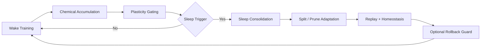
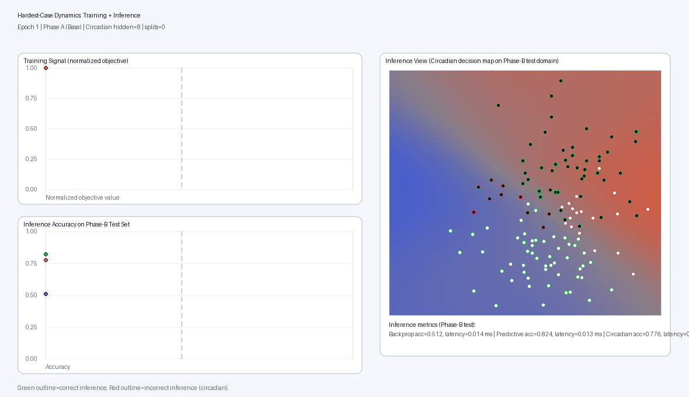
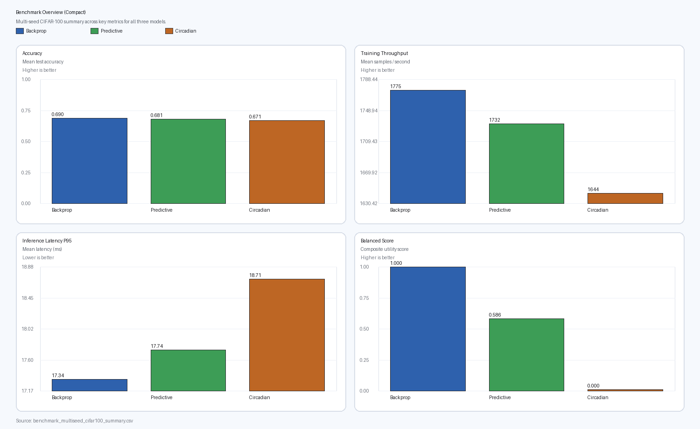

# Circadian Predictive Coding

[](https://github.com/OptimumAF/Circadian-Predictive-Coding/actions/workflows/ci.yml)
[](LICENSE)
[](https://www.python.org/downloads/)
[](https://github.com/OptimumAF/Circadian-Predictive-Coding/releases)

Circadian Predictive Coding is a research-first repository focused on biologically inspired learning where models adapt their own structure over wake and sleep cycles.

## Why This Repo

This project is built around one central idea:

- **Circadian Predictive Coding** should be compared rigorously against
  - traditional backpropagation
  - traditional predictive coding

The baseline models stay in the repo as stable references, while circadian behavior is the primary innovation surface.

## Circadian Loop

The circadian model is the primary focus of this project. Backprop and predictive coding baselines are kept to ensure fair comparison and reproducible evaluation.


```mermaid
flowchart LR
    A[Wake Training] --> B[Chemical Accumulation]
    B --> C[Plasticity Gating]
    C --> D{Sleep Trigger}
    D -- No --> A
    D -- Yes --> E[Sleep Consolidation]
    E --> F[Split / Prune Adaptation]
    F --> G[Replay + Homeostasis]
    G --> H[Optional Rollback Guard]
    H --> A
```

### Hardest-Case Dynamics (Train + Inference)



This checked-in animation is historical. Its generator scored phase-B test
labels at intermediate epochs, and its original execution settings are not
fully recoverable. New runs of `scripts/generate_hardest_mode_dynamics.py`
default to protocol `validation_dynamics_v1`: they reserve deterministic
phase-local validation splits, plot intermediate phase-B **validation**
metrics, and score final test only after training. The default output names
include `validation_v1`, so the historical figures are not overwritten. The
explicit `--protocol-id legacy_test_informed_v0` option preserves the earlier
test-informed behavior for reproduction and also uses distinct output names.
The validation dynamics protocol is an offline visualization: it shows
phase-B validation data during phase A, but those scores do not control
training or sleep. It does not establish a strict-online continual protocol.
New dynamics figures and interactive payloads label their NumPy algorithm
versions and descriptive comparison scope. The default three-hidden-layer
comparison uses unmatched PC and circadian update rules, so its plotted
ranking does not isolate a circadian mechanism. The checked-in historical
animation remains unchanged.

Interactive version (Plotly, with internals replay):

- [Hardest-Case Dynamics Interactive](https://optimumaf.github.io/Circadian-Predictive-Coding/figures/interactive_hardest_mode_dynamics.html)

## Core Idea

The circadian algorithm models wake and sleep phases:

- Wake: train with predictive-coding updates while each neuron accumulates a chemical usage signal.
- Sleep: consolidate with architecture updates (split high-usage neurons, prune low-usage neurons), optional rollback, and homeostatic controls.

This lets model capacity adapt over time instead of staying fixed.

## Features

- NumPy circadian predictive coding baseline for small-scale experiments
- Torch ResNet-50 benchmark pipeline for speed and accuracy comparisons
- Adaptive sleep triggers, adaptive split/prune thresholds, dual-timescale chemical dynamics
- Reward-modulated wake learning and adaptive sleep budget scaling (NumPy + ResNet circadian head)
- Function-preserving split behavior and guarded sleep rollback
- Multi-seed benchmark runner with JSON/CSV output

Sleep defaults to `legacy` budget-gated behavior. Set
`sleep_mode="components"` in a NumPy or Torch circadian config to run
enabled consolidation even with zero split/prune budgets, and use its
component switches for ablations. `sleep_mode="disabled"` makes sleep a
true no-op. NumPy supports replay during sleep; the Torch head does not.
The vision CLI exposes `--circ-sleep-mode` and `--circ-disable-*` switches.
See [ADR-0033](docs/adr/ADR-0033-independent-sleep-components.md).

After a guarded sleep rejection, `components` mode waits one completed
epoch and at least one new successful wake batch before another due sleep
attempt. `legacy` keeps its prior no-cooldown schedule. Set
`--circ-sleep-rollback-cooldown-epochs N` to override either mode (zero
disables the retry gate). Reports include the resolved cooldown, actual
sleep attempts, and due attempts suppressed by cooldown. See
[ADR-0051](docs/adr/ADR-0051-sleep-rollback-retry-gate.md).

An interval schedules a sleep attempt after that many completed runner
epochs. In component mode, adaptive-ready sleep can also be attempted
between intervals; a forced periodic call bypasses the adaptive check.
Disabled mode schedules no attempts. See
[ADR-0034](docs/adr/ADR-0034-sleep-attempt-scheduling.md).

Runners pass completed epochs separately from each model's wake-batch
clock. `get_sleep_clocks()` reports successful wake batches/examples,
replay updates, and performed events; NumPy replay does not advance the
wake clock. See [ADR-0035](docs/adr/ADR-0035-typed-sleep-clocks.md).

NumPy and Torch `sleep_event()` results now include `telemetry` with resolved
core budgets, stable split/prune IDs, chemical summaries, widths, duration,
and an applied or skipped reason. NumPy counts exact replay examples and
updates; Torch reports zero replay. Timing is excluded from sleep-result
equality and model snapshots. The toy NumPy runner now attaches one typed
decision per epoch, including unscheduled and disabled epochs, to its report
and checkpoint. Guarded runner outcomes remain in development; see
[ADR-0088](docs/adr/ADR-0088-numpy-core-sleep-facts.md),
[ADR-0089](docs/adr/ADR-0089-torch-core-sleep-facts.md), and
[ADR-0090](docs/adr/ADR-0090-toy-sleep-event-history.md).

Component-mode adaptive sleep restarts its plateau window after an actual
hidden-width change and uses the minimum structural budget scale while
the new-width window fills. Legacy mode keeps its original history rule.
See [ADR-0036](docs/adr/ADR-0036-width-sensitive-sleep-history.md).

NumPy circadian models can copy and restore their full model-owned state
in memory with `snapshot_state()` and `restore_state(saved)`, including
replay and local random state. This is a correctness primitive for later
guard rollback and checkpoint work. Core sleep and guarded vision sleep
now restore rejected or invalid events; durable checkpoints remain open.
See [ADR-0037](docs/adr/ADR-0037-numpy-in-memory-full-snapshot.md) and
[ADR-0049](docs/adr/ADR-0049-atomic-core-sleep.md).

Torch circadian heads also copy and restore their in-memory adaptive state,
including the model-owned noisy-split generator. The current ResNet sleep
guard still snapshots the head; see
[ADR-0038](docs/adr/ADR-0038-torch-head-snapshot-rng.md).

For a Torch circadian classifier, `snapshot_full_state()` and
`restore_full_state(saved)` additionally copy the backbone's parameters,
buffers, and train/eval modes. This explicit in-memory API leaves the
head-only sleep guard unchanged; see
[ADR-0039](docs/adr/ADR-0039-classifier-full-state-boundary.md).

NumPy external neuron proposals now reject invalid or over-budget
structural requests before changing the model. Explicit prune requests
take precedence over overlapping split candidates; see
[ADR-0040](docs/adr/ADR-0040-numpy-external-proposal-preflight.md).
The same typed policy proposal is checked against the active phase's
split/prune budget: a request for both actions is rejected when either
budget is zero, and can run in a phase that permits both. Scoring,
candidate selection, budget checks, and tensor mutation stay separate;
Torch retains its different post-split prune planner (ADR-0110).

Built-in NumPy sleep proposals are likewise checked together before
structural mutation; overlapping prune requests take precedence and
pending gradual prunes count toward minimum-width protection. See
[ADR-0041](docs/adr/ADR-0041-numpy-builtin-structural-preflight.md).

Torch built-in sleep also checks structural proposals before changing the
live head. A detached candidate preserves its existing post-split prune
selection, including eligible new children; see
[ADR-0042](docs/adr/ADR-0042-torch-post-split-preflight.md).

NumPy and Torch adaptive neurons expose persistent IDs and split-parent
references through `get_neuron_lineage()`. Pruning changes positions while
surviving IDs stay stable; see
[ADR-0043](docs/adr/ADR-0043-numpy-neuron-lineage.md) and
[ADR-0044](docs/adr/ADR-0044-torch-neuron-lineage.md).
Executed sleep results also retain immutable lineage before and after
the event, so removed IDs remain identifiable even when positions shift;
see [ADR-0045](docs/adr/ADR-0045-sleep-event-lineage.md).

Isolated single and repeated splits conserve the represented function
within float64/float32 tolerance when other sleep components are off.
Seeded noisy splits retain outgoing-row conservation; see
[ADR-0046](docs/adr/ADR-0046-isolated-split-conservation.md).

Executed sleep results now separate stable IDs requested for pruning,
marked for gradual removal, and actually removed. NumPy wake results
also report delayed finalization. Existing `pruned_indices` and runner
`total_prunes` counts retain their historical request meaning; see
[ADR-0048](docs/adr/ADR-0048-prune-outcome-timeline.md).

## Visual Results

The figures and result tables below are historical snapshots. The reviewed
vision runner used test labels for early stopping and sleep rollback, and its
backprop/PC heads and backbone states were not matched. The source CSV for
several charts is absent. See [historical benchmark provenance](docs/historical-benchmark-provenance.md)
before interpreting a ranking; these outputs are not corrected-protocol
results. The [development plan](DEVELOPMENT_PLAN.md) tracks the validation and
matched-baseline work.

### Multi-seed CIFAR-100 Snapshot (3 seeds, subset benchmark)



Interactive dashboard:

- [Benchmark Dashboard (GitHub Pages)](https://optimumaf.github.io/Circadian-Predictive-Coding/)
- [Dashboard Source](docs/index.html)

Interactive Plotly chart files:

- [Overview (interactive, compact)](https://optimumaf.github.io/Circadian-Predictive-Coding/figures/interactive_benchmark_overview.html)
- [Accuracy (interactive)](https://optimumaf.github.io/Circadian-Predictive-Coding/figures/interactive_benchmark_accuracy.html)
- [Training speed (interactive)](https://optimumaf.github.io/Circadian-Predictive-Coding/figures/interactive_benchmark_train_speed.html)
- [Inference latency P95 (interactive)](https://optimumaf.github.io/Circadian-Predictive-Coding/figures/interactive_benchmark_inference_latency_p95.html)
- [Interactive chart source files](docs/figures/)

Note: GitHub README pages do not execute custom JavaScript, so Plotly interactivity will not run inline inside README itself.

### Circadian Dynamics (Illustrative)


## Results Snapshot

### Multi-seed subset benchmark (`benchmark_multiseed_cifar100_summary.csv`)

| Model | Accuracy Mean | Train SPS Mean | Inference P95 (ms) |
|---|---:|---:|---:|
| BackpropResNet50 | 0.6901 | 1775.3 | 17.34 |
| PredictiveCodingResNet50 | 0.6810 | 1732.1 | 17.74 |
| CircadianPredictiveCodingResNet50 | 0.6715 | 1643.6 | 18.71 |

### Hard full CIFAR-100 run (single-seed, 48 epochs, 2026-02-27)

| Model | Accuracy | Train SPS | Inference SPS | Notes |
|---|---:|---:|---:|---|
| BackpropResNet50 | 0.706 | 1350.7 | 4672.4 | fixed head |
| PredictiveCodingResNet50 | 0.723 | 2093.4 | 4839.0 | fixed head |
| CircadianPredictiveCodingResNet50 | 0.734 | 2059.9 | 4831.4 | hidden 384->394, splits=12, prunes=2, rollbacks=7 |

### Historical master verification run (single-seed subset, 2026-02-28)

Recorded historical command (running it on the current code will use a new
validation holdout and need not reproduce the table):

```powershell
python resnet50_benchmark.py --dataset-name cifar100 --classes 100 --dataset-train-subset-size 20000 --dataset-test-subset-size 5000 --epochs 12 --device cuda --target-accuracy -1 --backprop-freeze-backbone --backbone-weights imagenet
```

| Model | Accuracy | Cross-Entropy | Train SPS | Inference P95 (ms) | Notes |
|---|---:|---:|---:|---:|---|
| BackpropResNet50 | 0.678 | 1.7144 | 981.3 | 23.03 | fixed head |
| PredictiveCodingResNet50 | 0.692 | 1.1175 | 965.2 | 20.77 | fixed head |
| CircadianPredictiveCodingResNet50 | 0.685 | 1.1082 | 874.2 | 23.27 | hidden 384->384, splits=0, prunes=0, rollbacks=0 |

Raw benchmark output: [`docs/benchmarks/benchmark_master_cifar100_subset_2026-02-28.txt`](docs/benchmarks/benchmark_master_cifar100_subset_2026-02-28.txt)

## Strengths and Weaknesses

Strengths:

- Competitive retention/adaptation behavior under hard continual shift.
- Strong balance in the moderate strength-case stress test (circadian balanced score `0.949` vs predictive coding `0.947` vs backprop `0.946`).
- Sources:
  - [`docs/benchmarks/benchmark_continual_shift_strength_case_2026-02-28.txt`](docs/benchmarks/benchmark_continual_shift_strength_case_2026-02-28.txt)
  - [`docs/benchmarks/benchmark_continual_shift_hardest_case_2026-02-28.txt`](docs/benchmarks/benchmark_continual_shift_hardest_case_2026-02-28.txt)
- Dynamic capacity adaptation is observable and measurable (updated hardest-case: mean splits `48.57`, hidden size `24 -> 72.57`).
- Competitive behavior in moderate continual-shift stress tests with stable multi-seed performance.

Weaknesses:

- Not best on every benchmark; on the latest CIFAR-100 subset master check, predictive coding accuracy (`0.692`) was higher than circadian (`0.685`).
- In the updated ultra-hard hardest-case setting, the margin between circadian and predictive coding is small (`0.812` vs `0.808`) with high variance, so ranking can flip across seeds/configurations.
- Extra algorithmic machinery (sleep scheduling, replay, split/prune controls) adds tuning burden and implementation complexity compared with fixed-width baselines.
- Speed overhead can appear depending on configuration; in the latest CIFAR-100 subset master check, circadian train speed (`874.2` SPS) was lower than predictive coding (`965.2` SPS).
- Results are regime-dependent; claims should be tied to specific benchmark settings and seeds instead of treated as universal.

## Repository Layout

```text
src/
  core/       # Learning rules and model definitions
  app/        # Experiment and benchmark orchestration
  adapters/   # CLI entrypoints
  infra/      # Dataset and dataloader construction
  config/     # Environment-backed defaults
  shared/     # Small cross-cutting runtime helpers
tests/        # Unit/integration tests
docs/
  adr/        # Architecture decision records
  modules/    # Module responsibility docs
  figures/    # Generated and static figures for documentation
scripts/      # Reproducible benchmark scripts
```

## Quickstart

```powershell
py -3.14 -m venv .venv
.\.venv\Scripts\Activate.ps1
pip install -r requirements.txt
```

The current local environments use Python 3.14.7. The original Python 3.11
environments are retained as ignored `*-py311-snapshot` folders for reproducing
older runs. CI continues checking Python 3.11, 3.12, and 3.14; the project’s
minimum syntax and type-check target remains Python 3.11.

Optional torch benchmark dependencies:

```powershell
pip install -r requirements-resnet.txt
```

For NVIDIA GPUs (example CUDA wheels):

```powershell
python -m pip install --upgrade --force-reinstall torch torchvision --index-url https://download.pytorch.org/whl/cu128
```

## Main Commands

Toy baseline:

```powershell
python predictive_coding_experiment.py
```

The NumPy toy API can record and reverse model execution order for a small
reproducibility check:

```python
from src.app.experiment_runner import ExperimentConfig, run_experiment

result = run_experiment(ExperimentConfig(
    sample_count=80, epoch_count=6,
    model_order=("circadian_predictive_coding", "predictive_coding", "backprop"),
))
print(result.training_order, result.split_hashes)
```

The default order and `toy_validation_v1` data roles remain the same.

For a local JSON result with the complete typed sleep decision sequence:

```powershell
python predictive_coding_experiment.py --samples 80 --epochs 4 --json-result toy-result.json
```

The file is written only after training and final-test scoring and must not
already exist. `result.circadian_sleep.events` and the JSON `circadian_sleep.events`
contain one record for each epoch; `event_count` retains the legacy meaning
of sleep events that changed topology. The toy route has no sleep guard.

The toy API can resume all three NumPy models from a trusted local file,
including a partial model-order epoch or a sleep with structural replay:

```python
from src.app.experiment_runner import ExperimentConfig, run_experiment
from src.infra.circadian_checkpoint_files import TrustedLocalToyCheckpointStore

store = TrustedLocalToyCheckpointStore("local-toy.checkpoint")
run_experiment(ExperimentConfig(epoch_count=6), checkpoint_store=store)
# After an interrupted run, use the same config and store:
result = run_experiment(
    ExperimentConfig(epoch_count=6),
    checkpoint_store=store,
    resume_from_checkpoint=True,
)
```

The file binds the training and validation arrays, every runner setting,
the model order, progress counters, and the NumPy/Python random streams.
It also saves the complete typed sleep-event history at wake and sleep
boundaries. This runner payload is now version 2; older version-1 toy
checkpoints are rejected before restoring or training because they cannot
recover the missing earlier decisions.
Only the stateless default adaptation policy is supported for this durable
route. Do not load a pickle checkpoint from an untrusted source. Final-test
scoring still occurs after training. See
[ADR-0055](docs/adr/ADR-0055-toy-runner-file-resume.md).

Toy baseline with review-driven circadian controls:

```powershell
python predictive_coding_experiment.py --adaptive-sleep-trigger --adaptive-sleep-budget --reward-modulated-learning --reward-scale-min 0.8 --reward-scale-max 1.4
```

The reward-named switch uses supervised mean absolute output error
relative to an EMA baseline; it does not observe an environmental reward.
The [fixed signal audit](docs/difficulty-modulation-audit.md) shows that
one flipped label or feature outlier can saturate its update factor.
Clipped error and constructed loss improvement are diagnostic comparisons
only. Run the fixed, globally sealed NumPy/CPU-Torch learning comparison:

```powershell
New-Item -ItemType Directory -Force data | Out-Null
.\.venv\Scripts\python.exe -m scripts.run_difficulty_matched_comparison --result data/difficulty-modulation-v11-result.json
```

Use a new result path for each run; the adapter refuses overwrite. The
[v11 comparison](docs/difficulty-modulation-comparison.md) records all
24 clean/label-flip/feature-outlier trials, equal work, train-only signals,
and held-out accuracy/forgetting. Modulation changed actual scales but no
matched accuracy or forgetting pair on this fixed small budget; no new
heuristic was selected (ADR-0112).

The [structural rank audit](docs/structural-reward-ranking-audit.md)
checks the existing reward-weighted importance EMA at fixed neuron
state and one-change caps in both backends. A changing reward factor can
switch split/prune candidate IDs, while a constant factor leaves the
normalized rank unchanged. The follow-up [v12 structural comparison](docs/structural-ranking-comparison.md)
separates wake scaling, reward weighting of importance history, and use
of importance in ranking. Run its train-only gate before the complete
locally sealed comparison, writing each result to a new path:

```powershell
New-Item -ItemType Directory -Force data | Out-Null
.\.venv\Scripts\python.exe -m scripts.run_structural_rank_comparison --train-only --result data/structural-ranking-v12-train.json
.\.venv\Scripts\python.exe -m scripts.run_structural_rank_comparison --result data/structural-ranking-v12-result.json
```

All 32 fixed cells used equal within-backend work and one split/prune
event. Reward weighting of importance history changed no selected ID or
held-out accuracy/forgetting pair in this small run. Existing importance
scoring changed two prune choices without consistent benefit. No new
reward-ranking heuristic was selected (ADR-0114); the documented weak
learning in some cells limits broader claims.

The [fixed v13 sleep-trigger timing study](docs/sleep-trigger-comparison.md)
compares periodic, unchanged adaptive, and no-sleep controls on
stationary noisy and axis-shifted A→B streams. It keeps model width and
wake work fixed, with chemical-reset-only component sleep. Write each
artifact to a new local path:

```powershell
New-Item -ItemType Directory -Force data | Out-Null
.\.venv\Scripts\python.exe -m scripts.run_sleep_trigger_comparison --train-only --result data/sleep-trigger-v13-train.json
.\.venv\Scripts\python.exe -m scripts.run_sleep_trigger_comparison --result data/sleep-trigger-v13-result.json
```

Use unused filenames when repeating either command; the adapter refuses
to overwrite an existing artifact.

All twelve trials passed train-only preflight before final release.
Periodic sleep executed four times per trial; adaptive executed zero
times under its unchanged thresholds and matched the no-sleep control.
Periodic outcomes were mixed across seeds and metrics. No new trigger
rule was selected, and the broader sleep-component study remains open
(ADR-0115).

The [fixed v14 full-stack trigger protocol](docs/full-stack-trigger-comparison.md)
first records the same prediction-independent replay supply at every
arrived train-only wake epoch for both new seeds. It binds capacity and
guard budgets before model training. Its periodic subset exactly matches
the existing v9 replay schedule; no v14 model outcomes have been scored.
To reproduce this schedule to a new local file:

```powershell
.\.venv\Scripts\python.exe -m scripts.run_continual_trigger_replay_schedule --result data/trigger-replay-v14-opportunities-new.json
```

The adapter refuses to overwrite an existing artifact. Applying replay
only after accepted guarded sleep and globally sealed scoring remains
P4.8b2 (ADR-0116).

Continual shift stress test (retention vs adaptation):

```powershell
python scripts/run_continual_shift_benchmark.py --profile strength-case --seeds 3,7,11,19,23,31,37
```

For a local JSON artifact of a completed v0–v5 continual result, add
`--json-result continual-result.json`. It contains one typed circadian sleep
decision per completed phase A/B epoch for each seed, including skipped
epochs. These historical routes do not pass an inner sleep guard, so their
event `guard` is `null`; arrived v6 now records its own inner-guard history,
while v7 selection propagation remains under development. The existing
`--output-file` continues to write the human
summary, and neither file is overwritten. See
[ADR-0091](docs/adr/ADR-0091-historical-continual-sleep-history.md).

For a small continual order check through the Python API:

```python
from src.app.continual_shift_benchmark import (
    ContinualShiftConfig, run_continual_shift_benchmark,
)

result = run_continual_shift_benchmark(
    ContinualShiftConfig(
        sample_count_phase_a=80, sample_count_phase_b=80,
        phase_a_epochs=3, phase_b_epochs=3,
        model_order=("circadian_predictive_coding", "predictive_coding", "backprop"),
    ),
    seeds=[13],
)
print(result.seed_results[0].training_order)
```

The default order and corrected/legacy data roles are unchanged. This is a
local reproducibility check; it does not make the continual protocol
strict-online.

The continual Python API also accepts a trusted local checkpoint. The
default v1 route binds the ordered seed list, both training phases,
completed seed reports, and the phase-A model copies used for retention
scoring:

```python
from src.infra.circadian_checkpoint_files import TrustedLocalContinualCheckpointStore

config = ContinualShiftConfig(phase_a_epochs=3, phase_b_epochs=3)
seeds = [13, 17]
store = TrustedLocalContinualCheckpointStore("local-continual.checkpoint")
run_continual_shift_benchmark(config, seeds, checkpoint_store=store)
# After an interrupted run, reuse the same config, seeds, and store:
result = run_continual_shift_benchmark(
    config, seeds, checkpoint_store=store, resume_from_checkpoint=True
)
```

The file is a checksummed pickle and must come from a trusted local run.
The v0–v5 checkpoint now carries a separate sleep-history extension version
and complete typed events. Older files without that extension are rejected
before restoration because earlier decisions cannot be reconstructed from
aggregate counters. The protocol IDs and their existing main checkpoint
format numbers remain the same.
Each seed's final tests are scored only after both phases finish; their
content is bound when that seed result is committed. Checkpoint file work
adds runtime overhead and is outside the scientific compute comparison.
The CLI has no checkpoint flag. Fixed-feature and whole-image resume use
their separate runner APIs; see
[ADR-0056](docs/adr/ADR-0056-continual-runner-file-resume.md).

For a checkpoint that does not construct Phase B until Phase A finishes,
use `ContinualShiftConfig(protocol_id="continual_phase_arrival_v2", ...)`
with the same Python checkpoint API and a new trusted checkpoint path. Its
version-2 Phase A file binds only Phase A development roles; the Phase B
file adds Phase B development roles and the combined digest. Final-test
hashes are bound only after both training phases finish. The old v1 checkpoint
route and default remain available. The CLI also accepts
`--protocol-id continual_phase_arrival_v2` for runs without checkpointing.
This route still knows the full A+B sleep schedule and does not report a
retained-memory or label-arrival ledger, so it is not a strict-online result.
See [ADR-0066](docs/adr/ADR-0066-continual-phase-arrival-checkpoints.md).

For the next opt-in schedule-isolation increment, use
`ContinualShiftConfig(protocol_id="continual_phase_local_schedule_v3", ...)`
or `--protocol-id continual_phase_local_schedule_v3`. It inherits v2's
phase-arrival boundary and uses checkpoint format 3. Phase A sleep uses
only the Phase A epoch horizon, so changing the configured Phase B duration
does not change Phase A sleep decisions. Phase B uses its arrived A+B
horizon. This partial route still lacks the declared replay budget,
guard/selection arrival rules, and label/retention ledger required for a
strict-online result. See [ADR-0067](docs/adr/ADR-0067-continual-phase-local-schedule.md).

For bounded observed-example replay, opt in to
`ContinualBoundedReplayConfig(replay_max_examples=4, replay_max_bytes=96, ...)`
with `CircadianConfig(sleep_mode="components", replay_steps=1, ...)`.
For a small local CLI smoke:

```powershell
python scripts/run_continual_shift_benchmark.py --profile strength-case --protocol-id continual_bounded_replay_v4 --sleep-mode components --replay-max-examples 4 --replay-max-bytes 96 --seeds 17 --sample-count-phase-a 40 --sample-count-phase-b 40 --phase-a-epochs 2 --phase-b-epochs 2 --hidden-dim 4
```

V4 inherits the phase-local schedule and
phase-arrival boundary, uses checkpoint format 4, and reports retained
content IDs, example count, and copied input/label array bytes at both
phase boundaries. Its deterministic hash retention can keep an uneven
phase mix. It does not yet supply guard/outer-selection arrival or a
full label ledger, so its scores are not full strict-online evidence.
See [ADR-0068](docs/adr/ADR-0068-continual-bounded-observed-replay.md)
and the [fixed-data replay-retention audit](docs/replay-retention-audit.md)
for actual legacy batch/example/byte counts, priority aging, and A→B
content-ID survival under the current policies.
The NumPy core also has opt-in bounded `recent_fifo` and seeded bottom-k
`seeded_reservoir` retention controls for local comparison. They are not
selected by the existing v4 runner or CLI; see the
[core module example](docs/modules/core.md) and [ADR-0102](docs/adr/ADR-0102-opt-in-bounded-replay-policies.md).
In both v4 execution paths, final-test roles are hashed and scored only
after Phase B training ends. The v4 splitter also defers reading the
source's test fields until that boundary. The synthetic generator still
constructs their arrays earlier, and each seed is scored before later
seeds train. Global setting freeze and separate guard/outer selection
roles remain open; see [ADR-0069](docs/adr/ADR-0069-continual-final-label-seal.md)
and [ADR-0070](docs/adr/ADR-0070-defer-continual-source-test-release.md).

For an opt-in run that waits for every configured seed
before any final-test read, use `ContinualGlobalSealConfig(...)` or the
CLI protocol `continual_global_test_seal_v5` with the same replay flags.
V5 holds pending model states in memory until scoring, so memory grows
with the seed count. The Python checkpoint API uses format 5 to persist
trained, unscored seed states; after interruption, resume with the same
config, seed list, and trusted local store. The saved file has no
final-test hashes or scores. Guard and outer-selection roles, setting
selection, and label-arrival reporting remain open; these scores are
descriptive rather than full strict-online evidence. See
[ADR-0071](docs/adr/ADR-0071-continual-run-level-test-seal.md) and
[ADR-0072](docs/adr/ADR-0072-continual-unscored-checkpoints.md).

The four-role source splitter in `src/infra/continual_roles.py` declares
separate phase-local train, inner-guard, and outer-selection identities and
defers final-test field reads to an explicit release call. The opt-in
ordinary Python runner `continual_arrived_roles_v6` uses those roles and
checks each attempted circadian sleep on the arrived inner guard. It
records role access, source/label release, guard decisions, and each
method's available phase information; final tests are released after all
configured seeds train. Run its fixed two-seed audit smoke from the
repository root:

```powershell
python -m scripts.run_continual_arrived_smoke
```

Each v6 per-seed circadian report and the smoke JSON now includes one typed
sleep decision per phase A/B epoch. Attempted events include the inner-guard
role hash, pre/post accuracy, tolerance, scored-example count, core proposal,
and total attempt duration. Cross-entropy is absent because this guard does
not evaluate it. A rejected event keeps proposed structure and replay work
but records no applied changes after restoration. A failed guard or core
attempt restores the model, records known facts with an `error` reason, and
raises. A successful retry keeps that failed event followed by the final
decision for the same epoch. The existing guard ledger and all-seed
final-test release rules still apply. V7 selection propagation remains
open; see [ADR-0092](docs/adr/ADR-0092-arrived-guarded-sleep-history.md)
and [ADR-0093](docs/adr/ADR-0093-arrived-failed-sleep-attempts.md).

Ordinary v6 raises on sleep errors by default. For a bounded local retry of
typed guard/core failures, use `sleep_error_retries=1` with
`run_continual_arrived_benchmark(config, [17, 19], sleep_error_retries=1)`.
The retry repeats only the restored sleep attempt, not wake training. If
the limit is exhausted, the original exception still raises. Checkpointed
runs use the explicit resume call below and do not combine it with local
retries.

V6 changes training data and is not score-equivalent to v5. For trusted
local checkpoint recovery through the Python API, pass a
`TrustedLocalArrivedCheckpointStore(path)` as `checkpoint_store`, then
repeat the same config and seed list with `resume_from_checkpoint=True`.
With a fixed `ContinualArrivedRolesConfig` named `config`:

```python
from src.app.continual_arrived_benchmark import run_continual_arrived_benchmark
from src.infra.circadian_checkpoint_files import TrustedLocalArrivedCheckpointStore

store = TrustedLocalArrivedCheckpointStore("local-arrived-v6.checkpoint")
run_continual_arrived_benchmark(config, [17, 19], checkpoint_store=store)
result = run_continual_arrived_benchmark(
    config, [17, 19], checkpoint_store=store, resume_from_checkpoint=True
)
```

Format 6 stores unscored completed seeds and the active A/B model, role,
guard, and event cursor after each model or sleep transaction. Its versioned
sleep-history extension validates active and completed attempts, including
multiple errors at a retryable `before_sleep` epoch, and their phase role
binding before restoration. Resume also validates arrived
development roles and replay provenance before the next
update; final tests remain sealed until all seeds finish. The outer role
is reserved but no setting search exists in this v6 API, so its scores are
descriptive. See
[ADR-0073](docs/adr/ADR-0073-continual-four-role-source-contract.md),
[ADR-0074](docs/adr/ADR-0074-ordinary-arrived-role-guard.md),
[ADR-0075](docs/adr/ADR-0075-arrived-continual-unscored-seeds.md), and
[ADR-0076](docs/adr/ADR-0076-arrived-continual-active-transactions.md).

The separate ordinary `continual_arrived_outer_selection_v7` Python API
predeclares two to four equal-work configurations, changing only each
method's learning rate. It trains every candidate and seed before scoring
the disjoint A/B outer roles, selects one setting per method by mean outer
balanced accuracy, and freezes all three choices before opening any final
source field. An exact tie chooses the first declared candidate. The
result retains the full candidate configs, every method/candidate/seed
trial, role IDs/hashes and access events, guard/outer exposure counts,
replay retention, the selection digest, and selected final scores. At most
eight candidate-seed trials per method are allowed. Run the fixed tiny
two-candidate example from the repository root:

```powershell
python -m scripts.run_continual_arrived_selection_smoke
```

`candidate_sleep_histories` exposes the typed phase A/B sleep attempts for
every candidate and seed. The selected final seed metric carries the history
of its chosen circadian candidate. Each circadian trial also carries that
history and a digest bound to the candidate's role ledger; baseline trials
have empty sleep histories. The freeze carries a separate digest of the
ordered candidate/seed histories. The local example prints these fields in
strict JSON. Measured durations are excluded from report equality, and the
original outer trial and choice digests still describe only score/work
facts. Ordinary v7 may opt into a nonnegative bounded
`sleep_error_retries` value; checkpointed v7 records a failed attempt and
requires an explicit later resume.

For a trusted local candidate-manifest checkpoint, use the distinct
format-8 store. With an ordered tuple of `ArrivedSelectionCandidate`
values named `candidates`:

```python
from src.app.continual_arrived_selection import run_arrived_outer_selection
from src.infra.circadian_checkpoint_files import TrustedLocalArrivedSelectionCheckpointStore

store = TrustedLocalArrivedSelectionCheckpointStore("local-selection-v8.checkpoint")
run_arrived_outer_selection(candidates, [17, 19], checkpoint_store=store)
result = run_arrived_outer_selection(
    candidates, [17, 19], checkpoint_store=store, resume_from_checkpoint=True
)
```

Format 8 stores the ordered candidate configs/seeds, unscored completed
models, all outer trial and exposure rows, a nested active v6 transaction,
and the frozen choice. It validates the manifest, arrived development
roles, replay, event cursor, trial/choice, and independent sleep-history
provenance against recomputation before another update or final release.
Earlier format-7 files are rejected because they lack that provenance.
Final values, hashes, and scores
stay outside the file. Use the single-setting v6 store only for the v6
API. The example's final scores are descriptive synthetic results; bounded
strict-online confirmation is available as a separate fixed local study.
Prepare its ignored request first, then run the unchanged request from the
repository root:

```powershell
python -m scripts.run_continual_arrived_confirmation prepare --request data/continual_arrived_confirmation_v1_request.json
python -m scripts.run_continual_arrived_confirmation run --request data/continual_arrived_confirmation_v1_request.json --result data/continual_arrived_confirmation_v1_result.json --checkpoint-dir data/continual_arrived_confirmation_v1_checkpoints
```

The runner refuses changed requests and existing result/checkpoint paths. It
uses the fixed two-candidate, two-seed, one-epoch-per-phase fixture, runs
both model orders, interrupts and resumes A/B wake checkpoints, asserts the
final source seal and state/order equality, and saves every outer trial and
signed final-score difference. Run it once per fresh artifact path. This is
a tiny synthetic protocol check, not a representative accuracy ranking. See
[ADR-0077](docs/adr/ADR-0077-arrived-outer-selection-before-final-release.md)
through [ADR-0079](docs/adr/ADR-0079-bounded-strict-online-confirmation.md).

The separate ordinary `continual_replay_policy_comparison_v8` API fixes one
arrived v6 role/training configuration, ordered seeds, and FIFO plus seeded
bottom-k reservoir policies before any source access. It trains every
policy/seed before opening either phase's final-test source fields. The local
result keeps all scores, role IDs/hashes and access events, policy identity,
declared replay caps, retained IDs/bytes at A and B, duplicate wake IDs,
distinct applied replay IDs, actual replay updates, and baseline state
hashes. Run the small fixed two-seed comparison from the repository root:

```powershell
python -m scripts.run_continual_replay_policy_smoke --result data/continual_replay_policy_v8_smoke.json
```

The writer refuses an existing result path. The checked local artifact has
different retained/exposed IDs but identical balanced scores for FIFO and
reservoir on both seeds; it is a tiny synthetic null result, not a policy
ranking. The audit's observed/exposed ID sets are reporting memory outside
the retained-array byte cap. The earlier v6/v7 config and checkpoint formats
keep their original meaning (ADR-0103). Replay-capable PC/backprop controls
remain P4.4.

For trusted local continuation inside an active A/B trial or after a
completed v8 policy/seed trial, use its separate format-9 store with a fixed
`manifest`:

```python
from src.app.continual_replay_policy_comparison import run_replay_policy_comparison
from src.infra.circadian_checkpoint_files import TrustedLocalReplayPolicyCheckpointStore

store = TrustedLocalReplayPolicyCheckpointStore("local-replay-policy-v9.checkpoint")
run_replay_policy_comparison(manifest, checkpoint_store=store)
result = run_replay_policy_comparison(
    manifest, checkpoint_store=store, resume_from_checkpoint=True
)
```

The file binds the full policy/seed manifest, completed unscored trials, and
at most one active A/B cursor. Resume checks the policy, model order, arrived
development roles, model/sleep progress, retention, duplicate and
replay-exposure provenance before another update or final release. A saved
wake, before-sleep, or after-sleep cursor resumes only its remaining work;
the final-test fields remain sealed until all trials finish (ADRs 0104–0105).
Only load a checkpoint file from a trusted local source because it contains
pickle.
For the fixed local example, write a fresh checkpointed result and then
verify terminal resume into a second new result path:

```powershell
python -m scripts.run_continual_replay_policy_smoke --checkpoint data/continual_replay_policy_v9_terminal.ckpt --result data/continual_replay_policy_v9_fresh.json
python -m scripts.run_continual_replay_policy_smoke --checkpoint data/continual_replay_policy_v9_terminal.ckpt --resume --result data/continual_replay_policy_v9_resumed.json
```

For the matched replay-control track, a separate schedule-only v9
protocol plans the same retained rows and newest-retained selection for
circadian, PC, and backprop. It requires unprioritized periodic replay and
keeps Phase B closed until the Phase A schedule completes. The plan records
selected content IDs, both retention caps, and separate planned optimizer
and inference work. Run its bounded two-seed FIFO/reservoir check:

```powershell
python -m scripts.run_continual_matched_replay_schedule_smoke --result data/continual_matched_replay_schedule_v9_smoke.json
```

This artifact has no model training or scores. The separate train-only v9
runner now applies the same selected rows to PC and backprop after each
accepted circadian sleep. It checks retained IDs, order, caps, selected
contents, wake clocks, and no-refill behavior, and reports applied examples,
optimizer calls, and distinct PC/circadian inference iterations. A rejected
or failed guarded sleep leaves the baselines without replay. Run the fixed,
unscored two-seed/two-policy trace locally:

```powershell
python -m scripts.run_continual_matched_replay_training_smoke --result data/continual_matched_replay_training_v9_smoke.json
```

The train-only trace contains no outcomes. A separate v9 outcome runner
finishes both policies and both seeds, audits their applied work, releases
the same A/B final roles across policies, and scores all three methods
using the existing continual-shift metrics. Run the fixed local comparison:

```powershell
python -m scripts.run_continual_matched_replay_outcomes --result data/continual_matched_replay_outcomes_v9_smoke.json
```

This two-seed NumPy result is a bounded comparison, not a general model
ranking. Its JSON keeps every policy/seed score and separate replay work.
Circadian's aggregate balanced score is lower than both baselines under
both policies in this fixed run. No seed, baseline, metric, or guard
tolerance was changed in response (ADRs 0107–0108).

The [NumPy replay side-effect audit](docs/replay-side-effect-audit.md)
records which adaptive states replay currently advances and which clocks
remain wake-only. The opt-in `wake_only_adaptive_v1` policy keeps those
adaptive states fixed during replay while still updating weights and
train-row exposure. Historical runs remain the default. Run the fixed
two-seed, two-retention-policy ablation locally:

```powershell
.\.venv\Scripts\python.exe -m scripts.run_continual_replay_side_effect_ablation --result data/continual_replay_side_effect_ablation_v10_resolved.json
```

The v10 runner trains and audits all eight trials before final scoring.
Historical rows equal v9; the wake-only policy leaves this small study's
balanced scores unchanged (circadian 0.20, PC 0.625, backprop 0.65/0.70).
It does not select a policy or change the existing v9 result. See
[ADR-0109](docs/adr/ADR-0109-opt-in-replay-side-effect-policy.md).

Hardest continual-shift stress test (expanded hidden capacity + very heavy drift):

```powershell
python scripts/run_continual_shift_benchmark.py --profile hardest-case --seeds 3,7,11,19,23,31,37
```

The toy and continual commands now default to `toy_validation_v1` and
`continual_validation_v1`. Each reserves 20% of the original NumPy training
split for validation and reports split hashes; the phase-B training fraction
is applied after that reservation. This changes training-set sizes relative
to historical runs. Use `--protocol-id toy_legacy_train_test_v0` on the toy
command or `--protocol-id continual_legacy_train_test_v0` on the continual
command to reproduce the former train/test routing. The continual output
command refuses to overwrite an existing file. Validation data in these
small NumPy runners are descriptive; their current sleep decisions use only
training-derived state. A strict-online continual protocol remains open.
New toy, in-depth, and continual outputs also report NumPy algorithm IDs
and comparison scope without changing their evaluation protocol IDs.
One-hidden runs are descriptive because model seeds and controls differ;
multi-hidden runs additionally use unmatched PC and circadian update rules.
See the [NumPy scope contract](docs/evaluation-protocols.md#numpy-algorithm-and-comparison-scope).

The [cross-backend fixture](docs/evaluation-protocols.md#cross-backend-numerical-fixture)
maps a NumPy binary output to a Torch two-class output and confirms a
one-step hidden/chemistry boundary. It also finds a factor-two difference
in the equal-rate output-margin update, so the production trainers are not
declared numerically identical.

NumPy binary training calls now reject malformed, empty, nonfinite, or
out-of-range batches before changing model state; finite soft labels in
`[0,1]` remain accepted. The [input contract](docs/adr/ADR-0026-numpy-binary-training-input-contract.md)
describes the boundary.

Torch PC/circadian heads likewise reject malformed feature or class-index
batches before changing adaptive state; see the [Torch input contract](docs/adr/ADR-0027-torch-head-training-input-contract.md).

ResNet benchmark (all 3 models):

```powershell
python resnet50_benchmark.py --dataset-name cifar100 --classes 100 --dataset-train-subset-size 20000 --dataset-test-subset-size 5000 --epochs 12 --device cuda
```

The vision runner defaults to `vision_guard_separated_unmatched_v2`. It uses
disjoint training, guard, outer validation, and final test roles. Epoch
stopping and sleep rollback use guard labels; outer validation is measured
after training and used for tuning selection. The synthetic guard is an
independent generated set (`--guard-samples`, default 64). CIFAR reserves
`--dataset-guard-subset-size` examples (default 1,000) from the official
training source in addition to the 1,000 outer validation examples; both
holdouts use deterministic evaluation transforms. With a full CIFAR training
source, reserving the guard reduces the training count. Split hashes appear
in the report. `--protocol-id vision_validation_unmatched_v1` reproduces the
previous corrected route in which stopping, rollback, and selection shared
validation examples. Both current routes still compare unmatched heads and
backbone states, so their accuracy deltas are descriptive. Neither route is
the older test-informed historical protocol. The [evaluation protocol
contract](docs/evaluation-protocols.md) records label timing and guard cost.

Use `--protocol-id vision_guard_separated_seeded_unmatched_v3` for the
order-controlled image-level reference. It keeps the four split roles and
resets each model's initialization, training shuffle, and augmentation
streams; results record training order and trained-model hashes. A budgeted
CPU forward/reverse check matched state hashes and metrics within `1e-7`.
The v2 default remains available unchanged for reproduction. v3 still uses
unmatched heads and separately initialized backbones, so its deltas remain
descriptive. A local two-worker stochastic-image fixture replayed Torch,
NumPy, and Python draws; CIFAR-transform and GPU reproducibility remain open.
The internal v3 training loader can also resume a bounded epoch/batch cursor
with zero or two workers, preserving the subsequent augmentation and process
draws (ADR-0057). The Python runner can persist the complete seeded v3 CPU
run, including all three models and mid-wake/pre-/post-sleep circadian state:

```python
from src.app.resnet50_benchmark import (
    ResNet50BenchmarkConfig,
    VISION_SEEDED_UNMATCHED_PROTOCOL,
    run_resnet50_benchmark,
)
from src.infra.circadian_checkpoint_files import TrustedLocalVisionCheckpointStore

config = ResNet50BenchmarkConfig(
    protocol_id=VISION_SEEDED_UNMATCHED_PROTOCOL,
    device="cpu", train_samples=8, guard_samples=8, validation_samples=8,
    test_samples=8, image_size=32, batch_size=4, epochs=1,
    target_accuracy=None, inference_batches=1, warmup_batches=0,
    backprop_freeze_backbone=True,
    predictive_head_hidden_dim=16, circadian_head_hidden_dim=16,
    circadian_min_hidden_dim=16, circadian_max_hidden_dim=32,
)
store = TrustedLocalVisionCheckpointStore("local-vision.checkpoint")
run_resnet50_benchmark(config, checkpoint_store=store)
# After an interrupted run, reuse the same config and trusted local file:
result = run_resnet50_benchmark(
    config, checkpoint_store=store, resume_from_checkpoint=True
)
```

Each unmatched-vision circadian report carries typed `sleep_events` for
scheduling decisions; baseline reports carry empty histories. A
guarded event records its selected accuracy or cross-entropy delta, both
measured scores, exact scored examples, attempt time, and the core proposal
even when the guard rolls it back. The v1 protocol labels its repeated
validation guard as `validation`; v2/v3 label the disjoint guard as
`inner_guard`. The role hash names the selected split, while the checkpoint's
development-data digest binds the underlying examples. Format-2 trusted
vision checkpoints preserve the ordered history across completed and active
CPU/CUDA cursors and reject incompatible format-1 files. A failed pre-guard,
core, or post-guard attempt records a typed error with completed guard-batch
exposure and any returned proposal, restores the head and process random
streams, and re-raises. Explicit resume retries sleep in the same epoch
without repeating wake; checkpoint preflight rejects malformed error history
before restore. The same typed history and process/head random-stream
continuation have been checked with `.venv-cuda` on an RTX 3080 across
v1/v2/v3 accepted, rejected, and failed attempts (ADR-0098–0100).

The checkpoint binds train, guard, and validation content plus config and
model order. It does not score final test until all training completes. Do not
load a pickle file from an untrusted source. File writes and loader replay add
wall time but do not count as active circadian training time. The same Python
API also accepts the older v1/v2 unmatched protocols on CPU or CUDA and
resumes their original shared loader stream; v1 still aliases validation as
its guard. On CUDA, set `device="cuda:0"` and use a CUDA-capable Torch runtime.
The file binds that device's process CUDA stream and the circadian head's
local split generator. Seeded v3 also retains the outer CUDA stream restored
when its model-local RNG fork exits. A bounded RTX 3080 gate verifies wake,
accepted/rejected sleep, preflight rejection, and one fresh-process resume
with a small synthetic classifier; it is not a full ResNet performance run. See
[ADR-0058](docs/adr/ADR-0058-seeded-vision-runner-file-resume.md) and
[ADR-0059](docs/adr/ADR-0059-shared-vision-loader-resume.md), plus
[ADR-0086](docs/adr/ADR-0086-cuda-unmatched-vision-checkpoint.md).

For a bounded actual-CIFAR loader check, place a complete torchvision CIFAR-10
cache under `data/cifar-10-batches-py` and run
`python scripts/verify_cifar_loader_order.py --data-root data`. The script
sets `download=False`, uses seed 73 and eight training examples, compares
zero- and two-worker seeded train views under forward/reversed model order,
and checks disjoint role IDs. It does not train or score final test by default.
Add `--check-training-seal` for one tiny CPU epoch with all three model families;
this checks that the real final-test loader is iterated only after training.
The verified local run used the 170,498,071-byte CIFAR-10 archive with MD5
`c58f30108f718f92721af3b95e74349a`; its ignored JSON evidence is at
`data/cifar-loader-seed73.json`. This is a loader/isolation check on a random
feature control, not an accuracy comparison (P1.7e).

The circadian-policy and Pareto tuning scripts write outer-validation-only
candidate reports with split hashes and validation inference speed. They use
separate guard examples for repeated sleep decisions and never score candidate
trials on final test data. A selected configuration still needs a separate,
frozen final-test confirmation. The matched-representation routes below use
a separate protocol and are not pooled with these reference results.

A staged two-head fixed-feature gate is available through
`src.app.matched_head_benchmark.run_two_head_fixed_feature_benchmark`.
It caches one frozen ResNet representation and trains equally initialized
backprop MLP and PC heads on the same feature batches. Its protocol is
`vision_two_head_fixed_feature_v1`; the result records backbone, feature,
and initialization hashes. `backbone_weights=none` is a random-feature
control, and the reported head training time excludes feature extraction.
The three-head route, `run_three_head_fixed_feature_benchmark`, adds a
circadian head with the same starting tensors and feature bank. It requires
the predictive and circadian hidden widths to match; sleep and rollback use
only inner guard examples. The existing `BackpropResNet50` report is the
legacy **linear-head reference** and remains in its separate unmatched
protocol. Fixed-feature head times exclude backbone extraction. Reports also
count wake batches, per-batch latent relaxation iterations, repeated guard
example evaluations, sleep calls, and replay examples (zero in this track).
A reversed three-head CPU run reproduces adaptive-state hashes and metrics
at a declared absolute tolerance of `1e-7`; broader random-stream audits
remain open. Initial hashes compare parameter tensors; trained hashes also
cover PC traffic and circadian adaptive/structural RNG state.
The ordinary CPU or CUDA fixed-epoch three-head route can persist and resume its
circadian head from a trusted local file. Pass
`checkpoint_store=TrustedLocalCircadianCheckpointStore(path)` to
`run_three_head_fixed_feature_benchmark`; on a later invocation pass the
same store and `resume_from_checkpoint=True`. Import the store from
`src.infra.circadian_checkpoint_files`. For CUDA, use `device="cuda:0"`
with the CUDA environment. It checks cached training-role
features, runner config, initial head, batch cursor, sleep stage, and
report counters before restoration. Do not load a pickle checkpoint from
an untrusted source. Fixed-epoch checkpoint and resume timing includes
persistence work and should not be used for equal-time head comparisons.
The circadian head report includes typed `sleep_events` with the scheduled
trigger, core proposal, inner-guard scores and exact completed-pass exposure,
selected rollback delta, retained changes, and attempt duration. Backprop
and ordinary PC reports have empty histories. The trusted fixed-feature
checkpoint uses format 2 to carry completed and failed attempts across resume;
older format-1 files must be regenerated. Its guard role hash covers the
cached guard feature/label batches. A `null` sleep time limit means no
per-sleep cap; the wall-time route's per-head deadline is reported separately.
Failed guarded calls still raise after restoring the head and process random
streams. With a trusted local checkpoint store, each failed attempt is saved
at a retryable `before_sleep` cursor; an explicit resume preserves the error
event and retries that epoch's sleep without repeating wake training. Error
records include completed guard-batch exposure, known pre/post scores, and a
completed core proposal when one exists. The historical guard-exposure
counter continues to count completed two-pass decisions only. Accepted,
rejected, and failed CUDA checkpoint histories, local JSON, process/head
random streams, and allocator-memory modes have been checked on an RTX 3080
(ADR-0096/0097/0100).
The CPU or CUDA wall-time route also accepts the same store arguments; it carries
remaining active training seconds across resume and excludes file I/O
from that deadline. Its active-time report is separate from end-to-end
elapsed time. On CPU or CUDA, `measure_memory=True` can accompany a checkpoint
store on the fixed-epoch or wall-time route. CPU uses distinct checkpoint
protocols with per-process RSS segments. CUDA uses distinct device-specific
checkpoint-memory protocols with both RSS and PyTorch allocator segments.
Each CUDA segment records its PID, device, allocated/reserved starts, and
absolute peaks; the circadian report takes the maximum absolute peak across
the saved and completing processes, with no aggregate start. Baselines have
one segment from the completing process. The original memory protocols keep
their existing meaning. See
[ADR-0053](docs/adr/ADR-0053-fixed-feature-circadian-file-resume.md) and
[ADR-0054](docs/adr/ADR-0054-fixed-feature-wall-time-resume.md), plus
[ADR-0061](docs/adr/ADR-0061-checkpointed-cpu-rss-segments.md) for RSS scope
and [ADR-0084](docs/adr/ADR-0084-cuda-fixed-feature-checkpoint-rng.md) for
CUDA RNG state, plus [ADR-0085](docs/adr/ADR-0085-cuda-checkpoint-allocator-segments.md)
for allocator boundaries. The [fairness budget contract](docs/evaluation-protocols.md#fairness-budget-contract-p18-scoped-confirmation-complete)
defines fixed-data, wall-time, and capacity/memory scopes. Call
`run_three_head_fixed_feature_wall_time_benchmark` with
`wall_time_budget_seconds` for the versioned per-head deadline route.
Set `target_accuracy=None` and an epoch safety cap high enough for all
heads to reach the deadline. Reports include completed/partial work,
stop reason, and deadline overrun; the runner fails before final test if
the epoch cap ends a head early. The [decision record](docs/adr/ADR-0013-matched-head-wall-time-budget.md)
defines its timing scope. The later scoped real-CUDA confirmation is
reported below.
Pass `measure_memory=True` to either three-head route for a separately
versioned memory-enabled protocol. Reports then include sampled process RSS
start/observed peak and sample count on Windows/Linux, with PyTorch allocator
peaks for CUDA runs. Default runs retain their prior protocol IDs and timing
behavior. These values include shared in-process state and can miss transient
allocations; [ADR-0014](docs/adr/ADR-0014-observed-memory-telemetry.md)
records the limits. The isolated observation below has a separate scope.

`run_three_head_fixed_width_capacity_benchmark` adds a separate
`vision_three_head_fixed_width_capacity_memory_v1` control. It requires
the backprop, PC, and circadian heads to start with equal widths and
parameter counts; circadian minimum and maximum widths equal the initial
width. Scheduled forced sleep and guard rollback remain active. The route
checks unchanged head parameter counts, no splits/prunes, and a guarded
sleep attempt before final test, and records the invariant in
`result.capacity_control`. Without a checkpoint store it reports observed
memory separately from cached `feature_bytes`. Passing a trusted local
`TrustedLocalCircadianCheckpointStore` through `checkpoint_store=store` selects
`vision_three_head_fixed_width_capacity_checkpoint_v1`; resume with the same
store and `resume_from_checkpoint=True`. This CPU or CUDA path checks the same
capacity and guarded-sleep invariants but sets `memory_telemetry_enabled=False`
and leaves RSS/allocator fields empty. Pass `checkpoint_memory=True` with the
same store to opt into the separate CPU
`vision_three_head_fixed_width_capacity_checkpoint_memory_v1` or CUDA
`vision_three_head_fixed_width_capacity_cuda_checkpoint_memory_v2` protocol.
Resume with both flags. The checkpoint records per-invocation RSS observations; the
result lists PID, start, observed peak, and sample count for each segment.
The circadian aggregate peak is the maximum absolute observed RSS across
segments, with sample counts summed and no single aggregate start value.
Baseline heads each have one segment from the completing invocation. Sampling
starts after shared feature setup, repeats every 5 ms plus checkpoint/finish
samples, and covers training, guard/validation, and checkpoint persistence.
An interrupted segment contributes observations through its last saved
checkpoint. RSS includes shared process state, may miss brief allocations,
and does not attribute bytes to a head; checkpoint overhead and baseline
retraining make this a descriptive recovery report, not a fair memory ranking.
CUDA allocator fields remain empty on CPU. Sequential process RSS is still
affected by shared state and order; the process-isolated scope below provides
a separate descriptive observation.
[ADR-0016](docs/adr/ADR-0016-fixed-width-capacity-control.md) records
the control scope; [ADR-0060](docs/adr/ADR-0060-capacity-checkpoint-without-memory-claim.md)
records the capacity-only resume boundary, and ADR-0061 records the RSS contract.

`src.app.isolated_head_memory.run_process_isolated_fixed_width_memory`
adds the synthetic `vision_three_head_fixed_width_process_memory_v1` and
local-CIFAR `vision_three_head_fixed_width_cifar10_process_memory_v2`
observations.
Each head trains alone in a fresh spawned process using the same frozen
train, guard, and validation feature hashes and initial tensors. The parent
verifies those hashes before returning. Each report separates setup RSS,
cached feature bytes, and trainer RSS/CUDA allocator observations. This
memory-only route never opens final test. The local gate requires an
explicit CPU/CUDA device and zero loader workers. CIFAR-10 also requires a
complete local cache with `dataset_download=False`; unsupported datasets
and implicit downloads fail before spawning. It does
not establish a memory winner; imports precede the setup RSS window and
the observed peaks can miss brief allocations. Run its fixed tiny CPU
check with `python scripts/run_isolated_head_memory_smoke.py`. See
[ADR-0017](docs/adr/ADR-0017-process-isolated-head-memory.md).

`src.app.matched_head_tuning.run_matched_head_tuning` adds a bounded
validation-selected search for the three frozen shared-feature heads. Give
each head the same candidate count and seed tuple. It caches train, guard,
and outer-validation features once per seed, records every attempt in
`result.attempts`, full successful configs and guard/validation work in
`result.trials`, and selects each head by mean
validation accuracy. Only then does it read final test for the selected
heads; `result.confirmations` is separate from the trial ledger. Candidates
may change only their own learning rates, inference steps, or backprop
momentum. The route caps candidate-by-seed trials at eight per head and is
for correctness checks before larger experiments. It does not establish a
head-family ranking; larger-data confirmation remains open.
[ADR-0015](docs/adr/ADR-0015-matched-head-tuning-ledger.md)
records the selection and test-sealing rules.

`src.app.practical_backprop_benchmark.run_practical_backprop_benchmark`
provides the separate `vision_end_to_end_backprop_v1` practical track with a
trainable ResNet and linear head. Pass a guarded `ResNet50BenchmarkConfig` with
`backprop_freeze_backbone=False`. Both tracks report backbone trainability,
pretraining, head type, and parameter counts. The practical result is not a
learning-rule attribution baseline; fairness budgets and larger experiments
remain open.

For a budgeted local check:

```python
from src.app.matched_head_benchmark import run_two_head_fixed_feature_benchmark
from src.app.resnet50_benchmark import ResNet50BenchmarkConfig

result = run_two_head_fixed_feature_benchmark(
    ResNet50BenchmarkConfig(
        train_samples=8, guard_samples=8, validation_samples=8,
        test_samples=8, num_classes=3, image_size=32, batch_size=4,
        epochs=1, device="cpu", backprop_freeze_backbone=True,
        predictive_head_hidden_dim=16, predictive_inference_steps=2,
        target_accuracy=None,
    )
)
print(result.protocol_id, result.feature_hashes)
```

For an equal-trial tuning check, start with a guarded frozen-backbone config
whose predictive and circadian widths match and `target_accuracy=None`:

```python
from dataclasses import replace
from src.app.matched_head_tuning import HeadTuningCandidate, run_matched_head_tuning
from src.app.resnet50_benchmark import ResNet50BenchmarkConfig

base = ResNet50BenchmarkConfig(
    train_samples=8, guard_samples=8, validation_samples=8, test_samples=8,
    num_classes=3, image_size=32, batch_size=4, epochs=1, seed=47,
    device="cpu", target_accuracy=None, backprop_freeze_backbone=True,
    predictive_head_hidden_dim=16, circadian_head_hidden_dim=16,
    circadian_min_hidden_dim=16, circadian_max_hidden_dim=16,
    predictive_inference_steps=1, circadian_inference_steps=1,
    circadian_sleep_interval=0, circadian_use_adaptive_sleep_trigger=False,
)

fields = {
    "backprop_mlp": "backprop_learning_rate",
    "predictive_coding": "predictive_learning_rate",
    "circadian_predictive_coding": "circadian_learning_rate",
}
candidates = {
    head: (
        HeadTuningCandidate("a", base),
        HeadTuningCandidate("b", replace(base, **{field: getattr(base, field) * 0.8})),
    )
    for head, field in fields.items()
}
result = run_matched_head_tuning(base, candidates, seeds=(47,), candidates_per_head=2)
print(result.trials_per_head, len(result.attempts), result.selections)
```

The same small `base` can exercise the fixed-width control by enabling a
guarded sleep at epoch one:

```python
from src.app.matched_head_benchmark import run_three_head_fixed_width_capacity_benchmark

capacity = run_three_head_fixed_width_capacity_benchmark(replace(
    base, circadian_sleep_interval=1, circadian_force_sleep=True,
    circadian_sleep_warmup_steps=0,
))
print(capacity.protocol_id, capacity.capacity_control)
```

For a predeclared three-seed local CPU confirmation of validation-selected,
fixed-width heads:

```powershell
python scripts/run_repeated_confirmation_smoke.py
```

The script writes selection and manifest JSON before reading any final-test
labels, then writes every fixed-data, wall-time, and process-isolated memory
result under `artifacts/`. It refuses to overwrite those files. The run uses
tiny synthetic random features and is a reproducibility check, not a model
ranking. Its original seed-53/59/61 fixed-data accuracies tie across heads;
under the separate 0.05-second wall-time budget the circadian head scores
lower than both baselines. See `docs/adr/ADR-0018-predeclared-repeated-head-confirmation.md`
for the scope and limitations.

For the bounded real-CIFAR CPU check, first verify the archive and loader as
described above, then run:

```powershell
python scripts/run_cifar_matched_validation.py
python scripts/verify_cifar_isolated_memory.py
python scripts/run_cifar_matched_confirmation.py
```

The validation command saves its request, six equal-trial selection records,
and a digested manifest before final test. The separate confirmation command
restores that exact manifest and uses its predeclared seeds 83/89/97 across
fixed-data, wall-time, and process-isolated memory scopes. It refuses to
overwrite results or failure records. The retained `artifacts/benchmark_cifar_v2_*_smoke.json`
files include the first synthetic-only-memory failure and successful retry.
With 32 training and 16 final-test examples per seed, a random frozen
backbone, and one epoch, the observed scores are descriptive pipeline evidence.
The separately predeclared pretrained CPU/CUDA continuations and later
larger-subset confirmation are described below. See
[ADR-0062](docs/adr/ADR-0062-local-cifar-matched-confirmation.md).

To budget the next larger-data study without reading test labels, run
`python scripts/profile_cifar_feature_setup.py` after caching ImageNet
ResNet-50 V2 weights. Its one CPU setup uses seed 101 and 128/64/64
train/guard/validation examples; the local result took 1.875 seconds and
records weight, backbone, split, and feature hashes in ignored `data/`
JSON. It trains no heads and does not score test.

For that bounded pretrained continuation, the verified local CIFAR-10 archive
and the cached ImageNet ResNet-50 V2 checkpoint are required. The scripts
verify both files and never download them. In order, run:

```powershell
python scripts/run_cifar_pretrained_validation.py
python scripts/run_cifar_pretrained_confirmation.py
```

The first command writes a request before training and seals final test. It
uses 1,024/256/256/512 train/guard/validation/test examples, selection seed
113, and two equal optimization candidates per head. The second restores its
saved manifest for seeds 127/131/137 and separate one-epoch, 0.5-second
per-head, and isolated-memory scopes. Both scripts refuse to overwrite their
ignored `artifacts/benchmark_cifar_pretrained_v1_*_smoke.json` records. The
local confirmation finished in 100.11 seconds. One-epoch mean test accuracy
was 0.406 backprop, 0.178 PC, and 0.152 circadian; under equal wall-time it
was 0.579, 0.507, and 0.389. The circadian model did not lead either scope.
All per-seed scores, work counts, observed process RSS, and dispersion are in
the result JSON. These 32-pixel, 1,024-example CPU results are limited to the
declared protocol; the CUDA result is described below, and no full-data
ranking has been established. See
[ADR-0063](docs/adr/ADR-0063-pretrained-cifar-matched-budgets.md).

For an isolated local CUDA environment, the verified CPU `.venv` can stay in
place. The historical P1.7f smoke used Python 3.11; the current local CUDA
environments use Python 3.14.7 and matching
[PyTorch 2.14 CUDA 13.0 wheels](https://pytorch.org/blog/pytorch-2-14-release-blog/).
Create a fresh CUDA environment with:

```powershell
py -3.14 -m venv .venv-cuda
.\.venv-cuda\Scripts\python.exe -m pip install -r requirements.txt
.\.venv-cuda\Scripts\python.exe -m pip install --index-url https://download.pytorch.org/whl/cu130 "torch==2.14.0+cu130" "torchvision==0.29.0+cu130"
.\.venv-cuda\Scripts\python.exe scripts/verify_cuda_environment.py
```

The CUDA wheel is about 2 GB. `.venv-cuda/` is ignored by Git. The smoke
uses synthetic tensors only; its seed-109 retry completed a convolution
forward/backward and untrained ResNet-50 forward on the local RTX 3080. The
first telemetry-only failure and successful retry are retained in ignored
`data/cuda-env-seed109*.json` files. The next gates use the verified local
CIFAR-10 cache and refuse to overwrite their saved artifacts:

```powershell
.\.venv-cuda\Scripts\python.exe scripts/verify_cuda_vision_order.py
.\.venv-cuda\Scripts\python.exe scripts/run_cifar_pretrained_cuda_validation.py
.\.venv-cuda\Scripts\python.exe scripts/run_cifar_pretrained_cuda_confirmation.py --preflight
.\.venv-cuda\Scripts\python.exe scripts/run_cifar_pretrained_cuda_confirmation.py
```

The seed-149 actual-CIFAR order reversal matched all role and trained-model
hashes exactly, with zero difference in the declared metrics and final test
sealed through training. The separate seed-151 matched-head selection made
six equal validation trials, opened no final-test batches, and froze seeds
157/163/167 in a manifest. The confirmation command requires three GPU
readings five seconds apart, each at most 10% utilization with at least
5 GiB free. A busy window writes a deferred JSON record and exits before
final test. The first launch was deferred at 30%/27%/37% utilization. A later
unchanged-manifest launch passed at 3%/3%/2% and completed all nine
fixed-data, nine deadline-limited wall-time, and nine process-isolated memory
reports in 98.172 seconds. Fixed-data mean accuracy was 0.449 backprop,
0.182 PC, and 0.160 circadian; wall-time means were 0.594, 0.410, and
0.271. All per-seed scores, work, overshoot, dispersion, CUDA allocator
peaks, and observed RSS are in the ignored result JSON. The GPU measured 51%
utilization after completion, so background activity during timing remains
an environment limit. The 1,024-example, 32-pixel setting is also limited;
no general architecture ranking is claimed. See
[ADR-0064](docs/adr/ADR-0064-cuda-evaluation-gates.md).

For the next larger matched study, first measure development feature cost
without constructing the CIFAR final-test source. The probe has fixed
224-pixel, 4,096/512/512 train/guard/validation roles, a quiet GPU gate,
and a 120-second worker timeout. From the repository root:

```powershell
.\.venv-cuda\Scripts\python.exe -m scripts.profile_cifar_representative_feasibility prepare
.\.venv-cuda\Scripts\python.exe -m scripts.profile_cifar_representative_feasibility run
.\.venv-cuda\Scripts\python.exe -m scripts.prepare_cifar_representative_study
.\.venv-cuda\Scripts\python.exe -m scripts.run_cifar_representative_selection run
```

Each command refuses to overwrite its ignored `data/` artifact. The local
probe took 9.522 seconds and recorded 128/16/16 feature batches, source and
feature hashes, 1.56 GB observed worker RSS, and a 448 MB CUDA allocator
peak. The preparation command saved a 224-pixel matched-study request with
16,384/2,048/2,048 development roles, 4,096 reserved final examples, one
equal two-candidate grid, fixed selection/confirmation seeds, and separate
fixed-data, wall-time, and isolated-memory budgets. The last command restored
that exact request and selected six seed-179 candidates in 47.551 seconds
under a quiet GPU gate and 180-second cap. It saved a result, durable attempt
journal, and digest-checked confirmation manifest under ignored `data/`
paths. It constructed no CIFAR final source, exposed no final label, and
computed no final score. The selected candidate is `a` for each head; outer
accuracies were 0.8662 backprop, 0.7773 predictive, and 0.7168 circadian.
These are validation scores on a subset with a frozen backbone, not final
accuracy. The later confirmation used only the frozen seeds 181/191/193. See
[ADR-0080](docs/adr/ADR-0080-development-only-feature-feasibility.md) and
[ADR-0081](docs/adr/ADR-0081-frozen-representative-validation-selection.md).

To verify the unchanged saved request, source files, six trials, attempt
journal, and both manifest digests without final-test access:

```powershell
.\.venv-cuda\Scripts\python.exe -m scripts.restore_cifar_representative_selection --preflight
```

The read-only preflight does not load CIFAR examples or score final test.
The one-shot bounded confirmation command was:

```powershell
.\.venv-cuda\Scripts\python.exe -m scripts.run_cifar_representative_confirmation run
```

It saved `data/cifar-representative-confirmation-v1-result.json` and the
per-scope ignored artifacts. Exact-artifact restore, a 2%/3%/8% quiet GPU
gate, 240/240/600-second scope caps, and a 1,080-second total cap were
enforced. Fixed-data, wall-time, and fresh-child memory completed in
142.232, 178.568, and 356.843 seconds (677.735 seconds total). The three
fixed-data mean final accuracies were 0.8793 backprop, 0.7749 predictive
coding, and 0.7087 circadian; five-second wall-time means were 0.8934,
0.8757, and 0.8040. Every head had 32,954 parameters, and nine separate
memory-child processes reported RSS and CUDA allocator peaks. Per-seed scores,
dispersion, work, and memory scopes are in the result. The circadian result
was lower without retuning. This is a frozen-feature comparison on a
16,384-example CIFAR-10 training subset, not an end-to-end or full-data
ranking. See [ADR-0082](docs/adr/ADR-0082-restore-selection-before-representative-confirmation.md)
and [ADR-0083](docs/adr/ADR-0083-bounded-representative-matched-confirmation.md).

Multi-seed benchmark export:

```powershell
python scripts/run_multiseed_resnet_benchmark.py --dataset-name cifar100 --seeds 7,13,29 --dataset-train-subset-size 20000 --dataset-test-subset-size 5000 --epochs 12 --device cuda --output-prefix benchmark_multiseed_cifar100
```

Generate protocol-labeled charts in a new directory:

```powershell
python scripts/generate_readme_figures.py --summary-csv benchmark_multiseed_cifar100_summary.csv
```

The figure generator verifies the CSV against its paired
`benchmark_multiseed_cifar100.json`, then writes under
`docs/figures/<protocol-id>/` with a provenance manifest. It refuses to
overwrite any existing chart. The checked-in README figures remain historical;
their missing source CSV prevents verified regeneration from this checkout.
For an unversioned CSV from outside this checkout, use the explicit
`--legacy-unversioned` flag; the output is labeled `historical_unknown_v0`.

Deploy dashboard via GitHub Pages:

- Workflow: `.github/workflows/pages.yml`
- Hosted entrypoint: `docs/index.html`

## Quality Commands

```powershell
ruff check .
mypy src tests scripts
pytest -q
```

## Open Source Standards

- License: [MIT](LICENSE)
- Contributing: [CONTRIBUTING.md](CONTRIBUTING.md)
- Architecture: [ARCHITECTURE.md](ARCHITECTURE.md)
- Changelog: [CHANGELOG.md](CHANGELOG.md)
- Security policy: [SECURITY.md](SECURITY.md)
- Code of conduct: [CODE_OF_CONDUCT.md](CODE_OF_CONDUCT.md)
- Governance: [GOVERNANCE.md](GOVERNANCE.md)
- Support process: [SUPPORT.md](SUPPORT.md)
- Model Card: [docs/model-card.md](docs/model-card.md)
- Learning mathematics: [docs/learning-mathematics.md](docs/learning-mathematics.md)
- Review Notes: [docs/circadian-model-review-notes.md](docs/circadian-model-review-notes.md)

## Citation

If this repository contributes to your work, cite it using [CITATION.cff](CITATION.cff).
