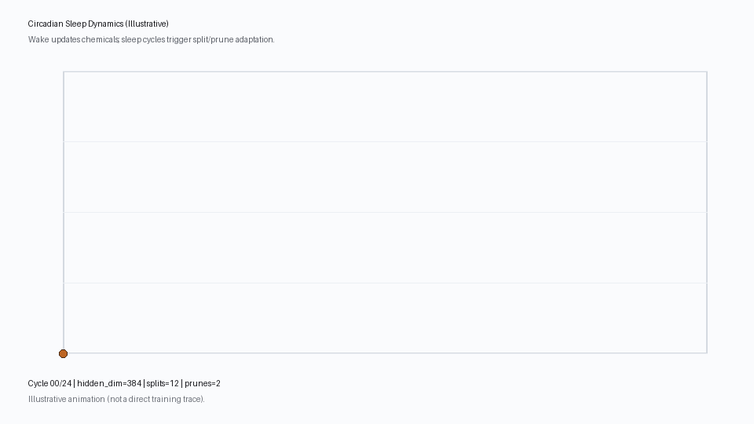

# Original circadian illustration validation


## P9.5b23 — original circadian illustration validation (2026-10-06)

Completed saved illustration validation only. Original GIF86,555 bytes/SHA256
`5f822b2c117df2a2cd955a9330b17fd6f3ecf11352a6d016c861265ba567dbae`,
whole five metadata bodies/source bound before decode; entry1025 files/25packages/
HEAD182077 exactly matches b22 terminal. Full AGENTS/plan/log read and frozen.
Registry `illustrative-circadian` kind `illustration_not_experiment`, explicitly
not observed sleep telemetry. No scientific runtime, result or admission evidence.

All25 frames decoded960x540 RGB; complete raw GIF structure consumed through
terminal trailer, all image extents/subblocks/control durations/disposal values
checked against decoded frames. Every duration260ms/loop0 are encoding facts,
not training runtime. All25 full original RGB PNG copies and three complete
contact sheets have exact independently checked source/thumbnail pixels. Every
full original frame and all contact sheets visually inspected.25 literal label
rows manually read from originals, not inferred from producer defaults. Endpoint
pixels match original drawing positions and observed labels; no new line rendered.

Observed hidden labels by cycles00–24:
[384,384,384,385,385,386,387,387,388,387,388,388,389,390,390,391,390,391,391,
392,393,393,394,394,394]. Negative steps at9(388→387) and16(391→390) retained.
All frames display splits12/prunes2, including cycle0: these are constant
illustration totals, not live cumulative counters. Title explicitly says
Illustrative; footer says not a direct training trace. Subtitle claims wake
updates chemicals, but no observed chemical/plasticity/model/dataset/seed/protocol/
resource/attempt/failure telemetry is supplied. Axes have no numeric tick labels;
original coordinates are drawing geometry, not a measured scientific time axis.
Small labels are legible in original-size copies; thumbnails are for overview.

Read-only Git context proves the GIF bytes equal the blob at its addition commit
7289dbb83ec13e3caacdfe3f2cbb36172887e498. Full historical producer11018bytes/SHA256
d9dfbeb33a42ea4098a754b553538f93b4fe1a0279c2aca6e3e1c04a9b548437
bound/read as text/AST, never imported or invoked. It builds scheduled synthetic
split/prune deltas and hidden series, defaults384/24cycles/12splits/2prunes.
Current complete producer and provenance/figure guidance also copied and byte-bound
against entry. Defaults and an addition commit do not prove exact original
invocation/parameters or generation/execution commit, interpreter/library/font/
host environment. The missing benchmark summary CSV belongs to the separate
legacy chart workflow; it is not recovered or substituted as illustration data.
Full semantic/provenance gaps remain. No performance/baseline/winner/replication
claim or experiment record created; original illustration remains unchanged.

Seven malformed-stream refusal controls pass: invalid header, missing trailer,
trailing data, truncation, oversized image extent, invalid LZW minimum size and
malformed graphics control size. Original structure/source rechecked afterward.
Six owned helpers pass Ruffcheck/formatcheck/py_compile and full pre/postformatter
AST equality. No failed captured commands. Evidence:
`docs/circadian-illustration-validation.md`;
`artifacts/runs/p95-circadian-illustration-20261006/` whole metadata/original/context/
historical Git bodies, view, all-observed-labels,25fullframe PNGs/three contact
sheets and visual-review/readback/static-validation/acceptance/coverage-delta/
terminal/final-accounting receipts.

Prospective engineering scope600aggregate seconds/hard60child/64MiB owned,
fixed160manual/discovery/visual/closing reserve plus all captures. Final accounting
reserves own full60second cap; not whole-session time or processRSS. Previously
spent science350.7925872/360 and runtime168.7993043/180 unchanged, no reset.
Full pytest/native/Torch/CI/mypy/clean-clone and original scientific-reader gates
skipped for ignored inspection helpers/additive docs; original gates stay open.
Existing Pillow only, no dependency/download/model/dataset/device/browser/sweep/
publication. New guide/seven reversible additive docs only; all unrelated original
files/task rows/HEAD/packages preserved. Owning-with j6c stays human-deferred;
P9.5/P9.5b/G0/R0.3/fullR3.1 and missing-source tasks remain open.

Why this increment: validate communication artwork as artwork, preserve every
frame/negative step and avoid promoting a generated illustration to telemetry.
Documentation appendices use short guide references where full repeated evidence
adds no value; plan/log/coverage/guide preserve full acceptance and handoff facts.
No acceptance criterion or unfinished task removed/weakened. Next arrived-v1
request/result is a separately registered corrected-development fixture; current
illustration neither validates nor supplies its evaluation evidence.

Exact next P9.5b24: bind complete arrived-v1 publication/coverage metadata and whole data/continual_arrived_confirmation_v1_request.json plus data/continual_arrived_confirmation_v1_result.json before parsing under a fresh small engineering scope. Inspect every original request/result configuration, role/label-arrival, selection/freeze, seed/model-order/history/negative/outcome/unknown/resource/failure field and registered figure. Independently validate saved claims and present genuinely uncovered views, retaining fixture-scale and incomplete execution provenance limits. No defaults backfill, source borrowing, favorable selection, model/original scientific-reader/dataset/CI dispatch or inferred scientific admission.

## All manually observed original labels

| Original frame/cycle | Observed hidden label | Observed split label (constant) | Observed prune label (constant) |
|---|---|---|---|
| 00/24 | 384 | 12 | 2 |
| 01/24 | 384 | 12 | 2 |
| 02/24 | 384 | 12 | 2 |
| 03/24 | 385 | 12 | 2 |
| 04/24 | 385 | 12 | 2 |
| 05/24 | 386 | 12 | 2 |
| 06/24 | 387 | 12 | 2 |
| 07/24 | 387 | 12 | 2 |
| 08/24 | 388 | 12 | 2 |
| 09/24 | 387 | 12 | 2 |
| 10/24 | 388 | 12 | 2 |
| 11/24 | 388 | 12 | 2 |
| 12/24 | 389 | 12 | 2 |
| 13/24 | 390 | 12 | 2 |
| 14/24 | 390 | 12 | 2 |
| 15/24 | 391 | 12 | 2 |
| 16/24 | 390 | 12 | 2 |
| 17/24 | 391 | 12 | 2 |
| 18/24 | 391 | 12 | 2 |
| 19/24 | 392 | 12 | 2 |
| 20/24 | 393 | 12 | 2 |
| 21/24 | 393 | 12 | 2 |
| 22/24 | 394 | 12 | 2 |
| 23/24 | 394 | 12 | 2 |
| 24/24 | 394 | 12 | 2 |

## Original illustration and complete inspection overview




Full-size exact original RGB copies for every cycle00–24 are saved as `original-frame-NN.png`; all were individually inspected.

## Owned structure and verification

```text
artifacts/runs/p95-circadian-illustration-20261006/
  run.py, prepare.py, render.py, audit.py, validate_static.py, finish.py
  metadata/           five complete original metadata bodies
  next-inputs/        exact whole illustration GIF
  context-inputs/     full current producer/provenance/figure guidance
  historical-context/ complete historical Git producer and original GIF blob
  static-before/      six full helpers before formatter
  command-NNN.*       exact argv/cwd/outcome/time/stdout/stderr
  view.json, all-observed-labels.md, historical-context.json
  original-frame-00..24.png, all-frames-{1,2,3}.png
  scope/inputs/visual-review/readback/static-validation/acceptance/terminal/final-accounting.json
```

Inspection outputs are write-once. Use a fresh independently bound scope and
separate ignored inspection/audit modules for the next family; keep experiment
interfaces unchanged. Artwork defaults must not backfill experiment provenance.


Completed ID: P9.5b23 after all sequential close gates.
Exact argv/cwd/status/seconds/stdout/stderr retained by `.venv/Scripts/python.exe -X utf8 artifacts/runs/p95-circadian-illustration-20261006/run.py ...`.
001 prepare exit0: full checkout/AGENTS/plan/log/five metadata/whole original source.
002 inline inventory exit0: GIF size/count/metadata and active handoff read.
003 full current-context text copy/read exit0;004 full historical Git producer/GIF
blob read and byte binding exit0, no original producer import/invocation.
005 render exit0: complete GIF structure/all25RGB/fullframe and contact copies.
006 audit exit0: source/metadata/current-context/historical-byte/AST-default/
structure/allpixels/25manual-label/table/endpoint and seven refusals; original
structure rechecked. All25fulloriginals/threecontactsheet visual reviews accepted.
007 Ruffformat exit0(two formatted/four unchanged);008 static exit0(all six helper
Ruffcheck/formatcheck/compile/full AST equality). Required sequential009 finish
prepare,010 finish close,011 scoped git diff --check,012 final whole terminal/
metadata/source/output/AST/task/budget check must exit0; actual receipts govern.
Close verifies1025 prior nonignored files plus guide,432 original task rows
preserved except own b23 checkbox plus one unchecked b24 row; HEAD/packages/source/
unrelated bytes exact. Skips/budget/blockers/next action above. Broad goal incomplete.
